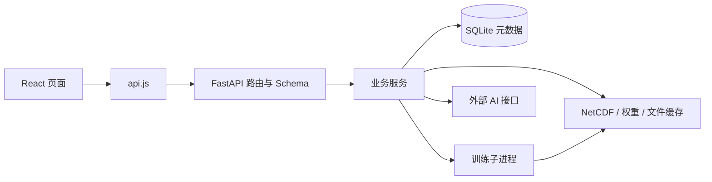

# AstraAtmos 行星大气实验室

<div align="center">
  <picture>
    <source media="(prefers-color-scheme: dark)" srcset="./assets/brand/astraatmos/astraatmos-mark-dark.png" />
    
  </picture>
  <p><strong>Planetary Atmosphere Prediction & Experiment Platform</strong><br />面向多行星大气数据分析、模型训练与时空预测实验的平台</p>
</div>

[项目仓库](https://github.com/Kafuu7No/AresVision) · [自定义模型接入](docs/uploaded-model-training.md) · [Linux 部署](scripts/deploy/README_DEPLOY_CN.md) · [Windows 分发](scripts/release/README_CN.md)

## 项目简介

AstraAtmos（行星大气实验室）定位为行星大气预测实验平台，从火星臭氧研究起步，以 OpenMARS 再分析数据、MCD 气候模拟数据和地球 MERRA-2 数据为当前数据基础，将数据管理、模型训练、预测、模型对比和三维可视化整合到同一个 Web 平台。当前已开放火星臭氧训练与预测、地球数据分析；地球网页训练与预测，以及更多行星和变量预测任务仍属后续扩展。

产品原名为 AresVision（智绘赤星）。目录、仓库地址、启动脚本、`ARESVISION_*` 环境变量、数据库与浏览器存储键、数据格式标识沿用原名称以兼容已有部署；改名无需迁移数据或配置。

AstraAtmos 使用「大气之 A / Atmospheric A」作为正式标志：冰蓝 A 字母、上扬的弧形大气流线与橙色观测点。全站导航、首页强调色、关于页、页脚与浏览器图标已统一使用该标志，深浅主题分别使用对应配色。品牌组件为 [BrandMark.jsx](frontend/src/components/BrandMark.jsx)，资产规范与文件清单见[标识设计与使用说明](assets/brand/astraatmos/README.md)，接入范围见[品牌接入方案](docs/plans/2026-09-24-atmospheric-a-brand-integration.md)。

平台提供 PredRNNv2、ConvLSTM、SimVP 及多种时间序列模型，也支持接入自定义 PyTorch 模型。预测结果可与数据集参考值进行对比，结合残差、误差分布和逐步指标评估模型表现。实际预测效果取决于数据质量、训练配置和模型权重。

## 快速接手：先读这一节

文档最近核对日期：**2026-09-26**。本轮核对主题组合看板、单图放大、观测图例、来源与图层控件、条件切换和错误恢复，以及**观测轨刻度口径改为每轨独立**（全球均值曲线不再随取点变形）与**曲线下方按数值填充颜色**；验证为前端 Node 测试（498 项）、生产构建与浏览器交互。以下为 2026-09-25 的后端核对摘要：**默认 PredRNNv2 预测子系统下线**：移除 `core/predict_inference.py`、`core/predict_transforms.py`、`services/predict_service.py`、`services/predict_data_service.py` 与 `/predict/ablation`、`/predict/model-info`、`/predict/prewarm`、`/predict/performance`、`/predict/performance-compare` 端点，`/predict/run`、`/metrics`、`/error-distribution`、`/permutation-importance` 改为强制要求 `training_task_id`，并删除 `models/predrnnv2/`（190 MB）与 `data/perf_cache/`（44 MB）。验证范围为后端导入与逐文件 pytest、前端 `node --test` 与生产构建、注册路由清单；重构前的核对范围见下方历史条目与对应专题文档。Earth 网页训练与预测仍未开放。分支、未提交修改、运行进程和数据是否齐备属于实时状态，每次接手都应重新检查。

2026-09-25 还完成两项预测子系统修复，摘要如下，细节见对应章节：

- **并发读 NetCDF 的线程安全修复**：新增 `services/netcdf_read_lock.py` 提供进程级可重入读锁，官方模型、上传模型与 MOLA 地形三处读取改为共用该锁；预测路由兜底分支改为 `logger.exception` 记录完整堆栈。验证范围为 `tests/test_netcdf_read_lock_contract.py`、`tests/test_inference_netcdf_thread_safety.py`、`tests/test_mola_topography.py`、`tests/test_mcd_file_consumers.py` 与相关上传模型/推理契约测试（逐文件运行全部通过）。
- **预测数据准备优化**：新增 `services/prediction_volume_cache.py` 缓存标准化体积，预测路径改为按需切窗（`prepare_tensors(..., return_scaled_volume=True)`、`_load_official_task_volume` / `_prepare_uploaded_task_volume`、`_window_slice` / `_window_stack`）。验证范围为 `tests/test_prediction_volume_cache.py`、`tests/test_uploaded_model_ls_inference.py`、`tests/test_uploaded_model_runner.py`、`tests/test_training_personal_inference_env.py`、`tests/test_prediction_analysis_cache_integration.py` 逐文件运行（11 个文件合计 145 passed），以及体积切片与逐样本展开的逐元素等价性比对（bitwise）和对运行中后端的实测延迟（上传模型冷启动 6.3 s / 官方模型 4.8 s，缓存命中 0.1–0.2 s；改造前为 20–24 s）。

| 需要先知道的事 | 当前约定 |
| --- | --- |
| 项目形态 | React 单页前端 + FastAPI 后端 + Python 训练子进程；开发时前后端分别启动，构建后可由后端托管页面 |
| 前端页面 | 使用 hash 路由，入口为 `frontend/src/App.jsx`，并非 React Router 路由表 |
| 当前预测入口 | 只支持已训练模型：`trained` 与 `trained_compare`；预测分析请求必须携带 `training_task_id` |
| 数据边界 | 上传数据主要用于数据总览；训练、预测使用服务器管理的数据，不能把上传成功等同于加入训练集 |
| 模型边界 | `model_source=official/uploaded` 表示模型实现来源；`training_dataset` 表示训练数据集，两者不同 |
| 持久化 | SQLite 保存用户、任务与缓存索引，文件系统保存数据、模型、日志和缓存载荷 |
| 运行前提 | 仓库代码不含完整运行数据和权重；缺失文件需查日志及路径配置 |
| 修改顺序 | 页面 → API 封装 → 路由/Schema → 服务 → 数据或模型实现 → 对应测试 |

推荐接手顺序：

1. 阅读本节、下方“模块与代码入口”“关键业务链路”“当前功能边界”。
2. 执行 `git status --short`、`git branch --show-current` 和 `git log -5 --oneline`，识别既有修改与近期变更。
3. 根据任务只深入相关模块；用代码、测试与实际日志验证 README 中涉及该任务的描述。
4. 修改完成后按“README 维护约定”同步文档，并报告实际执行的验证。

快速导航：[功能](#主要功能) · [模块入口](#模块与代码入口) · [业务链路](#关键业务链路) · [功能边界](#当前功能边界) · [启动](#本地启动) · [测试](#测试与构建) · [排查](#常见问题与排查入口) · [维护约定](#readme-维护约定)

## 主要功能

### 首页与实验入口

- 首页采用左右分栏：平台介绍与操作入口、三维地球纹理预览；960px 及以下改为上下排列，较矮桌面屏幕压缩主体留白，放大文字时操作入口可换行。
- 首页导航在 1100px 及以下使用上下两行，链接行可横向滚动，导航高度随文字缩放增加，避免英文或大字号挤压登录入口。关闭的偏好设置面板不进入键盘焦点顺序，打开后恢复交互。
- 全站导航左侧为「大气之 A」品牌图形（[BrandMark.jsx](frontend/src/components/BrandMark.jsx)）、`AstraAtmos` 字标与多语言副标题，整块为语义按钮，可用 Tab 聚焦并通过 Enter / Space 返回首页。
- 预览使用 NASA Blue Marble 地球影像、柔和补光与薄层冰蓝大气边缘，外侧轨道装饰圈保持低对比；大气边缘仅为视觉示意，不请求大气分析接口，也不代表实时数据或预测结果。预览遵循系统减少动态效果设置，星球固定为地球、不传递到数据总览。
- 首页主标题为中英文名两行锁定：中文名 `行星大气实验室`（`frontend/src/i18n/zh.js` 的 `home.lab.titleFirst`）在上、英文名 `AstraAtmos`（`titleSecond`）在下并沿用强调色；语言切换英文界面时上行改为 `Planetary Atmosphere Lab`，英文名一行保持不变。标题第二行、主按钮与装饰线使用品牌强调色变量 `--brand-primary` / `--brand-on-primary`（定义在 `frontend/src/components/brand.css`），随深浅主题切换。
- 首页引导文案围绕从地球到火星的大气规律探索、数据启发与实验验证展开；主按钮为“进入分析工作台”，描边次按钮为“训练火星模型”，明确当前训练对象。底部“分析大气数据”“训练预测模型”“比较实验结果”分别进入数据总览、模型训练和预测分析，点击区域至少 44px 高，窄屏允许换行。中英文文案、深浅主题与文字缩放使用同一套布局。
- 首页不提供预览星球切换与旋转开关，也不展示预览说明、数据范围等辅助小字；地球训练与预测尚未开放这一边界以当前功能边界章节为准。
- 首页提供两类轻量交互，全部集中在表现层：① 分层鼠标视差，指针在首页内移动时背景星点、轨道装饰圈与地球分别产生约 4px、8px、5px 的 `translate3d` 位移，标题、按钮与说明文字不参与位移；② 地球拖拽旋转，按住地球左右拖动改变朝向（水平灵敏度约 0.005 rad / CSS px，垂直限制 ±0.35 rad），拖拽期间暂停自动旋转，松手保留约 0.3 秒惯性旋转，方向键可旋转，Escape 立即停止惯性。
- 交互降级与边界：只响应主鼠标与触控笔，触屏触摸保持页面正常纵向滚动，地球交互区使用 `touch-action: pan-y pinch-zoom`；粗指针设备关闭视差与拖拽并保留键盘操作；系统开启“减少动态效果”时视差与惯性关闭，拖拽与键盘旋转仍可用。规则由 [homePointerInteraction.js](frontend/src/pages/HomePage/homePointerInteraction.js) 的能力判断和 [homePage.css](frontend/src/pages/HomePage/homePage.css) 的媒体查询共同保证，两处需一起修改。
- 首页交互不请求任何分析接口，也不改变 WebGL 回退与资源清理行为：视差只写 CSS 自定义属性，指针移动不触发 React 重新渲染；WebGL 不可用时仍显示 CSS 星球。
- 页面布局与预览实现见 [HomePage.jsx](frontend/src/pages/HomePage.jsx)、[homePage.css](frontend/src/pages/HomePage/homePage.css) 和 [PlanetPreview.jsx](frontend/src/pages/HomePage/PlanetPreview.jsx)，交互参数与纯函数见 [homePointerInteraction.js](frontend/src/pages/HomePage/homePointerInteraction.js)（测试同目录 `homePointerInteraction.test.js`）。

### 数据总览与三维交互

- 在三维火星球面上展示臭氧及气象变量，支持 Ls（太阳黄经）时间轴播放、色带与单位设置。
- 火星观测档左侧为竖向 Ls 时间轴与当前变量的 MCD 全球均值曲线，右侧为球面所选网格点的全年曲线；两条曲线下方按数值填充颜色（取该变量色带、按**本轨数值范围**铺满，因此颜色如实反映年内起伏，但不可跨轨比较绝对值），点选暂停播放并留在观测档。两条曲线共用 Ls 时间轴，但**数值刻度各用本轨极值**（曲线形状不随对侧取点变化，代价是两轨只能比起伏、不能比绝对高度）。火星均值为有效网格等权均值，未按面积加权；窄屏将两条轨并排放到球体下方。
- 提供球面点位探查、季节变化、极区动力学、变量相关性及波动诊断等分析视图。
- 火星 MCD / 多源 / 验证 / 差值臭氧显示方式与 OpenMARS、NOMAD 来源选择集中在“数据源”；“图层”统一控制数据场、经纬网和星球底图，“显示”管理旋转等交互。
- 地球观测图例与火星采用相同紧凑圆角样式，展示变量、单位、有效格点数、色带和最小/中间/最大值；地球保留原始物理单位和对应数据场色带。
- 地球两侧观测轨沿用火星的读数卡片、细曲线、数值填充与播放按钮样式：左侧为日期滑块和面积加权全球均值，右侧为单点年变化，两轨共用日期轴，数值刻度各自独立（同火星口径，避免选点改变全球均值曲线形状）。保留年份选择、闰日处理和从首日重播，窄屏两轨并排放在球体下方；实现见 [EarthObservationRail.jsx](frontend/src/pages/DataOverviewPage/workbench/EarthObservationRail.jsx)，填充取色见 [railCurveFill.js](frontend/src/pages/DataOverviewPage/workbench/railCurveFill.js)。
- 支持手势交互、全屏展示及中英文界面。
- 地球三维底球使用随项目提供的 NASA Blue Marble 彩色影像，呈现海洋、陆地与冰雪，并可通过海岸线开关控制轮廓叠加；影像仅作地理参考，来源与许可见 [地球底图资源](frontend/public/earth/README.md)。
- 数据总览顶部可切换“火星 / 地球”，两者互斥挂载，共用行星观测台外壳。地球默认观测档：球体两侧分别为日期刻度与点位年变化。分析档默认展示“主题组合看板”：宽屏左侧选择主题、年份和适用变量/纬带，右侧一张主图与两张辅助图同屏展示季节变化、变量关系或空间诊断；每张图可放大，返回或按 Escape 回到原组合，窄屏顺序排列。左侧“单项深入分析”和右上“单项分析”保留原有全部图表与 AI 解读，火星主题与单项分别记住变量条件。逐日读数、点位序列、球体工具和播放放在观测档，切入分析暂停播放；仅火星单项昼夜变化显示 Ls 选择。图表加载失败提供保留条件的重试，空数据另行提示。控件位置、统计口径与能力边界见[共用分析工作台](docs/earth-analysis-workbench.md)。

### 数据管理

- 读取、对齐 OpenMARS 与 MCD 数据，管理原始 NetCDF 文件、上传记录及派生缓存。
- 支持 `.nc`、`.nc4`、`.netcdf` 文件上传、校验，以及数据贡献审核。
- 区分默认数据、用户上传数据与管理员数据治理入口；训练使用服务器管理的数据集。
- 包含 MCD 总览数据、NOMAD 网格数据和 MOLA 地形资源的构建脚本。
- 提供 MERRA-2 地球臭氧日数据的小包构建、独立读取、预览和训练冒烟脚本；见 [地球小数据包](docs/earth-compact-dataset.md)。
- 已注册服务器数据集目录：`GET /api/datasets` 与 `GET /api/datasets/{dataset_id}` 返回四个固定数据集（`openmars_mcd`、`mcd_overview`、`earth_merra2_daily_v1`、`earth_merra2_daily_v2`）的元数据、版本、发布指纹、可用状态与能力声明。约定与状态解释见 [数据集注册表](docs/dataset-registry.md)。
- 数据总览支持“火星 / 地球”切换：地球场景按真实日期查看 MERRA-2 五个变量的三维全球球体、逐日播放、点位时间序列与全球单元面积加权均值，见 [二维地球数据总览](docs/earth-overview.md) 与 [共用分析工作台](docs/earth-analysis-workbench.md)。
- 地球年度分析按 2020、2021 分开计算，覆盖季节结构、年内变化、季节极值、环境因子、辐射/温度与臭氧关系、变量相关、空间距平与极区统计；昼夜变化卡片固定显示“日平均数据没有日内采样”的能力说明，不请求火星昼夜接口。
- 后续扩展见 [火星 / 地球共用分析工作台方案](docs/plans/2026-09-23-earth-shared-analysis-workbench.md)；其首期范围（共用工作台、三维地球、年度分析、极区、图表 AI 解读）已实现，手势交互与跨星球数值比较仍属后续计划。

### 模型训练

- 内置 PredRNNv2、PredRNN++、ConvLSTM、SimVP、DLinear、PatchTST、TimeMixer、Earthformer 等模型及实验变体，完整注册表见 [model_zoo.py](AresVision_backend/backend/training_backbones/model_zoo.py)。
- 按模型配置输入窗口、输出步长、气象通道和超参数，查看训练进度、Loss 曲线、日志与测试指标。
- 支持迁移学习、权重加载、冻结策略和训练结果重命名；训练失败时提供通知，包括 CUDA 显存不足提示。
- 支持上传单文件 PyTorch 模型，由平台统一负责数据加载、训练循环、评估和权重保存。
- 支持账号私有的多标签分组：启动训练时选择标签，历史记录中搜索、按标签交集筛选，单条或批量添加、移除标签；标签可新建、重命名与删除。操作说明与接口见 [训练模型标签](docs/training-model-tags.md)。
- 训练历史默认以摘要卡片展示关键参数；完整超参数按记录展开查看，长的自定义参数以键值列表呈现，避免单条记录占满页面。
- Earth 训练的下一步见 [DLinear 地球训练接入实施方案](docs/plans/2026-09-23-earth-dlinear-training.md)：过去 7 天预测未来 3 天、训练任务复用及完整 checkpoint 契约；这是待实施计划，不代表地球训练已开放。

### 预测与模型对比

- 提供参考值、预测场和残差展示，以及误差分布、置换重要性、逐步指标等分析。
- 支持选择已训练模型进行预测，也可比较多个训练结果。
- 单模型选择与多模型对比支持按标签筛选，筛选保留已有选择；对比的“全选当前结果”追加当前可见模型，并显示筛选外的已选数量。
- 已训练模型的请求步长范围为 `1–30`，且不能超过该模型训练时的输出步长。多模型对比采用所选模型输出步长的最小值作为上限。
- 预测输入完整基础为 **6 通道**：臭氧、纬向风、经向风、温度、沙尘光学厚度和太阳下行辐射通量；具体通道组合由所选模型的训练配置决定。
- 提供预测请求协调、用户会话缓存隔离和预测分析持久化缓存。

### AI 助手与用户功能

- 提供 AI 对话及结合当前数据视图的 Copilot 解读，通过可配置的外部模型接口生成回答。
- 未配置 `AI_API_KEY` 时，AI 对话服务使用内置兜底回答。
- 包含账号认证、邮件验证码、站内通知、反馈和管理员审核功能。

### 界面品牌与浏览器图标

- 品牌图形由唯一的 [BrandMark.jsx](frontend/src/components/BrandMark.jsx) 组件绘制，几何与 `assets/brand/astraatmos/` 的矢量交付一致：A 字母骨架、上扬弧形流线与橙色观测点；支持完整、单色（`mono`）和小尺寸简化（`compact`，省略观测点并加粗流线）三种形态。
- 深浅主题配色定义在 [brand.css](frontend/src/components/brand.css)：深色背景使用冰蓝 `#9AD9EF` 与橙色 `#F19A78`，浅色背景使用深蓝 `#236387` 与赤陶色 `#C76543`。仅品牌与首页强调区域使用该配色，三维行星预览、科学图表色带与业务状态色保持原样。
- 关于页标题上方使用 72 px 完整标志，页脚版权文字前使用 24 px 单色简化标志；图形为静态，无自转、呼吸或发光动效。
- 浏览器图标为 `frontend/public/favicon.svg`（带深色圆角底的简化 A）、`favicon-32.png` 与 `favicon.ico`，`frontend/index.html` 以 `?v=atmospheric-a-1` 声明以替换旧火星图标缓存。

## 技术栈

| 层级 | 技术 |
| --- | --- |
| 前端 | React 19、Vite 6、MUI 7、Tailwind CSS、Three.js、Plotly、MediaPipe |
| 后端 | FastAPI、Uvicorn、Pydantic、SQLAlchemy 异步会话 |
| 模型 | PyTorch 2.5.1、多模型训练与推理 |
| 数据处理 | NumPy、SciPy、xarray、netCDF4、scikit-learn |
| 数据存储 | SQLite / aiosqlite，NetCDF 数据与文件缓存 |
| 测试 | Node.js 内置测试运行器、pytest |

前端依赖见 [package.json](frontend/package.json)，后端依赖见 [requirements.txt](AresVision_backend/backend/requirements.txt)。

## 项目结构

```text
AresVision/
├── AresVision_backend/backend/
│   ├── main.py                # FastAPI 入口、生命周期、服务装配
│   ├── config.py              # 路径、数据、模型及环境配置
│   ├── auth/                  # 认证与访问依赖
│   ├── core/                  # 数据变换、预测模型与评估指标
│   ├── routers/               # 数据、预测、训练、数据集目录、AI、用户等 API
│   ├── schemas/               # 请求与响应结构
│   ├── services/              # 业务编排、任务、数据集注册、缓存和数据治理
│   ├── training_backbones/    # 模型注册、自定义模型执行器和实验架构
│   ├── database/              # 数据模型、初始化与增量迁移
│   ├── scripts/               # 数据导入与资源构建
│   ├── tests/                 # 后端回归测试
│   ├── data/                  # 运行时数据、上传文件与缓存
│   └── models/                # 训练脚本、模型权重与训练产物
├── frontend/
│   ├── src/
│   │   ├── App.jsx            # 页面路由和应用框架
│   │   ├── pages/             # 总览、数据管理、预测、训练、AI 等页面
│   │   ├── components/        # 三维渲染、图表与公共组件
│   │   ├── contexts/          # 认证、训练、设置等状态
│   │   ├── services/          # 后端 API 调用
│   │   ├── stores/            # 预测缓存与会话状态
│   │   └── i18n/              # 中英文文案
│   └── vite.config.js         # 开发服务及 API 代理
├── docs/                      # 专题说明；plans/ 实施方案，specs/ 设计文档
├── scripts/deploy/            # Linux 部署
├── scripts/release/           # Windows 分发
└── assets/                    # 项目标识与静态资源
```

## 模块与代码入口

下表是按任务定位的入口索引，文件链接相对仓库根目录；完整接口结构以启动后的 `/docs` 为准。

| 任务 | 前端入口 | 后端入口 |
| --- | --- | --- |
| 页面路由、导航 | [App.jsx](frontend/src/App.jsx)、[Navbar.jsx](frontend/src/components/Navbar.jsx) | [main.py](AresVision_backend/backend/main.py) 注册 API 与静态文件服务 |
| 首页布局与轻量交互 | [HomePage.jsx](frontend/src/pages/HomePage.jsx)、[PlanetPreview.jsx](frontend/src/pages/HomePage/PlanetPreview.jsx)、[homePointerInteraction.js](frontend/src/pages/HomePage/homePointerInteraction.js)、[homePage.css](frontend/src/pages/HomePage/homePage.css) | — |
| 品牌标识与浏览器图标 | [BrandMark.jsx](frontend/src/components/BrandMark.jsx)、[brand.css](frontend/src/components/brand.css)、`frontend/public/favicon.svg`、`frontend/public/favicon-32.png`、`frontend/public/favicon.ico`、`frontend/public/brand/` | — |
| 数据总览、球面与时间轴 | [DataOverviewPage.jsx](frontend/src/pages/DataOverviewPage.jsx)、[SphericalFieldCanvas.jsx](frontend/src/components/SphericalFieldCanvas.jsx) | [analysis.py](AresVision_backend/backend/routers/analysis.py)、[mcd_overview_data_service.py](AresVision_backend/backend/services/mcd_overview_data_service.py) |
| 二维地球总览 | [EarthOverviewScene.jsx](frontend/src/pages/DataOverviewPage/EarthOverview/EarthOverviewScene.jsx)、[EarthMap2D.jsx](frontend/src/pages/DataOverviewPage/EarthOverview/EarthMap2D.jsx)、[PlanetSceneSwitch.jsx](frontend/src/pages/DataOverviewPage/PlanetSceneSwitch.jsx) | [earth_overview.py](AresVision_backend/backend/routers/earth_overview.py)、[earth_overview_service.py](AresVision_backend/backend/services/earth_overview_service.py) |
| 行星观测台外壳与布局契约（Mars 与 Earth 共用） | [workbench/](frontend/src/pages/DataOverviewPage/workbench/OverviewShell.jsx)（`OverviewShell`、`observatoryLayout.js`、`overviewVisualContract.js`、`ObservatoryToolbar.jsx`、`ObservatoryTools.jsx`、`ObservatoryToolParts.jsx`、`AnalysisDock.jsx`、`OverviewCard.jsx`、`OverviewScene.jsx`、`useOverviewController.js`、`OverviewAdapter.js` 与两个 adapter、请求协调器） | — |
| Mars 观测台控件 | [ObservatoryMars.jsx](frontend/src/pages/DataOverviewPage/ObservatoryMars.jsx)（条件栏槽位与数据源/图层/显示/点位面板）、[MarsSourceControls.jsx](frontend/src/pages/DataOverviewPage/MarsSourceControls.jsx)（官方与个人 MCD、OpenMARS、NOMAD）、[PointProbeContent.jsx](frontend/src/pages/DataOverviewPage/PointProbeContent.jsx) | — |
| 三维地球观测台与年度分析 | [EarthWorkbenchScene.jsx](frontend/src/pages/DataOverviewPage/EarthOverview/EarthWorkbenchScene.jsx)、[EarthResearchViews.jsx](frontend/src/pages/DataOverviewPage/EarthOverview/EarthResearchViews.jsx)、[earthResearchModel.js](frontend/src/pages/DataOverviewPage/EarthOverview/earthResearchModel.js)、[sphericalRegionalGrid.js](frontend/src/components/sphericalRegionalGrid.js) | [earth_analysis.py](AresVision_backend/backend/routers/earth_analysis.py)、[earth_research_service.py](AresVision_backend/backend/services/earth_research_service.py)、[earth_research.py](AresVision_backend/backend/schemas/earth_research.py) |
| 主题组合看板与单图放大 | [AnalysisBoard.jsx](frontend/src/pages/DataOverviewPage/workbench/AnalysisBoard.jsx)、[earthAnalysisBoardModel.js](frontend/src/pages/DataOverviewPage/EarthOverview/earthAnalysisBoardModel.js)、[MarsAnalysisBoard.jsx](frontend/src/pages/DataOverviewPage/OverviewCharts/MarsAnalysisBoard.jsx)、[marsAnalysisBoardModel.js](frontend/src/pages/DataOverviewPage/OverviewCharts/marsAnalysisBoardModel.js) | 复用 Earth 年度/空间响应与 Mars 热力图响应，不新增接口 |
| 数据集注册与查询 | — | [datasets.py](AresVision_backend/backend/routers/datasets.py)、[dataset_registry.py](AresVision_backend/backend/services/dataset_registry.py)、[dataset_identity.py](AresVision_backend/backend/services/dataset_identity.py)、[earth_dataset_metadata.py](AresVision_backend/backend/services/earth_dataset_metadata.py) |
| 上传数据、来源切换、治理 | [ExplorePage.jsx](frontend/src/pages/ExplorePage.jsx)、[rawDatasetUsage.js](frontend/src/pages/ExplorePage/rawDatasetUsage.js) | [upload.py](AresVision_backend/backend/routers/upload.py)、[user_overview_source_service.py](AresVision_backend/backend/services/user_overview_source_service.py)、[data_governance_service.py](AresVision_backend/backend/services/data_governance_service.py) |
| 模型训练与任务管理 | [ModelTrainingPage.jsx](frontend/src/pages/ModelTrainingPage.jsx)、[TrainingContext.jsx](frontend/src/contexts/TrainingContext.jsx) | [training.py](AresVision_backend/backend/routers/training.py)、[training_service.py](AresVision_backend/backend/services/training_service.py) |
| 模型架构、训练参数 | [DynamicModelParamsForm.jsx](frontend/src/pages/ModelTrainingPage/DynamicModelParamsForm.jsx) | [model_zoo.py](AresVision_backend/backend/training_backbones/model_zoo.py)、[training_channels.py](AresVision_backend/backend/services/training_channels.py) |
| 自定义模型接入 | [UploadedModelPanel.jsx](frontend/src/pages/ModelTrainingPage/UploadedModelPanel.jsx) | [user_models.py](AresVision_backend/backend/routers/user_models.py)、[uploaded_model_contract.py](AresVision_backend/backend/training_backbones/uploaded_model_contract.py)、[user_model_runner.py](AresVision_backend/backend/training_backbones/user_model_runner.py) |
| 预测与模型比较 | [PredictPage.jsx](frontend/src/pages/PredictPage.jsx)、[CompareTrainingModelsPanel.jsx](frontend/src/pages/PredictPage/CompareTrainingModels/CompareTrainingModelsPanel.jsx) | [predict.py](AresVision_backend/backend/routers/predict.py)、[inference_service.py](AresVision_backend/backend/services/inference_service.py) |
| 预测请求与缓存 | [predictRequestCoordinator.js](frontend/src/pages/PredictPage/predictRequestCoordinator.js)、[predictCache.js](frontend/src/stores/predictCache.js) | [prediction_analysis_cache.py](AresVision_backend/backend/services/prediction_analysis_cache.py)、[prediction_volume_cache.py](AresVision_backend/backend/services/prediction_volume_cache.py)（标准化体积缓存与按需切窗）、[netcdf_read_lock.py](AresVision_backend/backend/services/netcdf_read_lock.py)（NetCDF 读取串行化） |
| AI 对话、总览 Copilot | [AIPage.jsx](frontend/src/pages/AIPage.jsx)、[AICopilotWidget.jsx](frontend/src/pages/DataOverviewPage/AICopilotWidget.jsx) | [ai_service.py](AresVision_backend/backend/services/ai_service.py)、[copilot_service.py](AresVision_backend/backend/services/copilot_service.py) |
| 登录、会话和权限 | [AuthContext.jsx](frontend/src/contexts/AuthContext.jsx)、[api.js](frontend/src/services/api.js) | [auth.py](AresVision_backend/backend/routers/auth.py)、[dependencies.py](AresVision_backend/backend/auth/dependencies.py) |
| 持久化和初始化 | — | [models.py](AresVision_backend/backend/database/models.py)、[init_db.py](AresVision_backend/backend/database/init_db.py)、[engine.py](AresVision_backend/backend/database/engine.py) |

页面地址为 `#/`、`#/overview`、`#/explore`、`#/predict`、`#/training`、`#/ai` 和 `#/about`。全局设置与翻译分别位于 `frontend/src/contexts/SettingsContext.jsx` 和 `frontend/src/i18n/`。

## 关键业务链路

### 应用启动与服务装配

`main.py` 的 lifespan 初始化数据库、数据服务、上传与缓存服务、分析和推理服务，并通过 `app.state` 提供给路由。MCD 缓存和个人缓存预热存在后台任务；退出时清理任务及 AI 客户端。排查启动慢或数据不可用时，先看初始化阶段日志，再定位对应服务。



### 数据总览与上传数据

1. `ExplorePage` 管理上传文件；后端对文件类型、字段与总览数据契约进行校验。
2. 总览请求经 `api.js` 传递 `mcd_upload_id`、`openmars_upload_id`、`nomad_upload_id` 等来源选择。
3. `/api/explore/overview/*` 路由解析来源，由总览服务提供球面、点位与图表数据。
4. 三维球面、时间轴覆盖范围、图表和 AI 快照按当前选择更新。

上传 MCD 可驱动总览整页；上传 OpenMARS 与 NOMAD 主要作为三维臭氧图层。NOMAD 网格数据还包含观测计数。详细校验入口为 [overview_upload_contract.py](AresVision_backend/backend/services/overview_upload_contract.py)，不要只凭文件扩展名判断用途。

时间与单位是跨模块约定：MY 表示火星年，Ls 表示太阳黄经，跨年会从接近 360° 回到 0°；处理时要保留年份与样本关系。臭氧换算集中在 [ozone_units.py](AresVision_backend/backend/services/ozone_units.py)，其目标单位为 `um-atm`。修改排序、坐标或单位时，应同时核对球面、时间轴、图表和预测输入。

### 训练与模型产物

1. 页面提交模型名称、`model_source`、超参数与服务器数据源；`training_channels.py` 规范化参数。
2. 官方模型使用统一训练入口 `models/training_scripts/demo3.py`；上传模型使用 `training_backbones/user_model_runner.py`。
3. `TrainingService` 创建 `ModelTrainingTask` 并启动训练子进程；解释器由 `TRAINING_PYTHON_PATH` 决定。
4. 任务进度、Loss、日志及产物路径写入任务记录；前端 `TrainingContext` 通过轮询与 WebSocket 接收更新。
5. 训练完成后还需存在有效权重文件才会标记模型可用；预测使用任务元数据还原模型配置。

`training_dataset` 当前区分 `openmars_mcd` 与 `mcd_overview`。请求可用顶层 `dataset_id` 或旧字段 `hyperparameters.training_dataset` 指定；两处冲突、未知 ID 和非字符串值在创建任务前拒绝，Earth 训练返回 409。迁移学习来源可为已有任务或上传权重，冻结策略为 `none`、`backbone`、`head`。参数兼容性以规范化逻辑和加载器为准，不能仅替换权重路径。

### 数据集注册表与训练任务身份

1. `main.py` 在 lifespan 中装配 `DatasetRegistry`；构造不读取文件，`GET /api/datasets` 首次查询时才校验已注册小包。
2. Earth 描述符由 manifest 与 NetCDF 实际内容计算，并与固定发布指纹比对；不匹配时返回 `invalid` 状态而不是报错。
3. 训练请求先解析并校验数据集身份，再执行数据库写入、上传模型加载和子进程调度；被拒绝的请求没有副作用。
4. 任务身份写入 `model_training_tasks` 的五个独立列，不并入超参数，因此不会进入训练 CLI 参数。
5. 旧任务在启动迁移中一次性回填来源与状态，已有绑定与旧 JSON 不被改写。

固定 ID、状态含义、错误码与迁移规则见 [数据集注册表](docs/dataset-registry.md)。

### 行星观测台与场景切换

1. `#/overview` 顶部持有 `planet` 选择，按钮按“地球 / 火星”排列，首次进入或刷新默认地球；火星与地球**互斥挂载**，地球不加载火星三维背景、纹理、摄像头或查询组件。
2. 页面同时持有 `observatoryView`（`observe` / `analyze`）与 `openPanel`（`null` / `source` / `layers` / `display` / `point`）两个界面状态；布局状态不进入后端请求 key，刷新回到默认观测档。两个星球都经 `OverviewShell` 组装条件栏、画布、时间轨道与分析区；差异全部由 adapter 与星球专属槽位声明，共用组件不读取任何星球数据。
3. 分析区由 `AnalysisDock` 承载主题、条件和组合/单项入口；`AnalysisBoard` 共用三图排布与放大交互。Earth controller 按主题复用一份年度 suite 或空间响应；Mars 看板请求当前主题所需的热力图，用请求身份拒绝过期响应。放大不触发请求。Mars 用 `MarsAnalysisProvider` 分别保存主题与单项的变量/纬带，`MarsAnalysisConditions` 在左栏展示适用条件。失败可重试、空数据单独显示，Earth 昼夜单项展示能力原因。看板变化曲线展示所选变量原始单位；单项“年内全球变化”保留多变量 Z-score/原始单位比较。Earth 点位与逐日数据统一由观测档承载，单项分析保留按需展开的 AI 解读。
4. 地球由 `earthOverviewAdapter` 先查 `GET /api/datasets/earth_merra2_daily_v2` 取发布指纹与日期范围，再查 `/api/analysis/earth/overview/context` 取几何、能力与极区范围；区域场、区域序列与点位序列继续使用已实现的 `/overview/*` 接口。
5. 年度分析走 Earth 专用接口 `/api/analysis/earth/overview/*`：`useEarthResearch`/`earthResearchClient` 按 `(fingerprint, year[, variable])` 去重缓存，多张卡片共享一次请求，逐日播放不重发年度数据。
6. `SphericalFieldCanvas` 接收显式 `planet`/`field`/`geometry`/`selection`/`lighting` 与共享粒子视觉参数：地球用 v2 真实单元边界采样 2592 个单元粒子（不跨经度接缝、封盖两极），默认自动旋转，并按当前场值更新粒子径向高度；火星保持原有纹理、粒子与太阳光照；两者共享相机、粒子密度/尺寸、面板锚点与暗/亮 surface 语义。画布尺寸只由外壳实测的窗格决定，模式切换不重建三维实例。
7. 切星球时按固定顺序重置：取消旧星球请求 → 清空场/曲线/播放/选点 → 载入新星球默认变量与时间 → 重置相机与几何；回包需同时通过 epoch、通道 token 与请求身份检查。
8. 日期、变量与点位选择保存在页面层，Earth → Mars → Earth 保留各自选择；火星手势选点按画布真实矩形（`sceneRef.getBoundingClientRect()`）映射，不再按窗口宽度减栏宽推算。

接口、年度统计公式、极区范围、能力限制与控件新位置见 [共用分析工作台](docs/earth-analysis-workbench.md)；二维基础协议见 [二维地球数据总览](docs/earth-overview.md)。

### 已训练模型预测与缓存

1. 用户选择任务及预测条件；前端从任务元数据读取输出步长，并协调并发请求。
2. `/api/predict/run` 要求请求携带 `training_task_id`（缺失返回 400）与有效认证，随后交给 `InferenceService.predict_task`。
3. 推理服务读取任务配置与权重、准备数据、执行推理并返回预测场、参考场、残差及指标。
4. 多模型比较通过 `/api/predict/training-models/compare` 等专用接口执行；各面板是否显示由 `predictAnalysisVisibility.js` 决定。

前端内存缓存与后端持久化缓存是两层机制。前者通过用户会话作用域隔离，退出登录或 API 返回 401 时清理；后者结合任务、分析类型、请求参数及产物指纹定位结果。产物指纹包含模型文件、超参数与数据文件信息，缓存实现支持 `prediction`、`metrics`、`error_distribution`、`pfi`。

NetCDF 读取必须串行：netCDF4 背后的 HDF5 C 库不是线程安全的，而推理在 `asyncio.to_thread` 线程池中执行，并发读取同一批 OpenMARS/MCD/MOLA 文件会间歇性抛出 `NetCDF: Can't open HDF5 attribute`，表现为预测接口 500。官方模型（`services/inference_service.py`）、上传模型数据加载（`training_backbones/user_model_runner.py`）与地形资源（`training_backbones/mola_topography.py`）三处共用在 [netcdf_read_lock.py](AresVision_backend/backend/services/netcdf_read_lock.py) 中定义的可重入锁；锁挂在该模块属性上，因为 `config.py` 会改写 `sys.path`，同一模块可能被加载两次，只有进程级单例才能真正互斥。新增 NetCDF 读取点必须写成 `with netcdf_read_lock(), netCDF4.Dataset(...) as dataset:`。

预测路由的兜底分支会通过 `logger.exception` 记录完整堆栈，接口只向客户端返回简要 `detail`；排查 500 时以服务端日志为准，不要只依据响应体。

**单次预测的数据准备已按需求切窗，不再为整条时间轴物化全部滑窗。** 训练用的数据准备函数仍会加载全部 OpenMARS/MCD 文件并拟合标准化参数，这部分产物（连续体积与统计量）与 `window`/`horizon` 无关，因此由 [prediction_volume_cache.py](AresVision_backend/backend/services/prediction_volume_cache.py) 在进程内按「目录身份 + 文件清单 + 文件大小与修改时间 + 通道 + 数据集」缓存；预测路径拿到体积后只切出自己需要的滑窗：

- 上传模型：`InferenceService._prepare_uploaded_task_volume` + `_window_slice` / `_window_stack`
- 官方模型：`InferenceService._load_official_task_volume` + 同一组切窗方法
- `prepare_tensors(..., return_scaled_volume=True)` 返回 `ScaledVolume`，供上述调用方使用；默认模式仍返回逐样本张量，训练路径不受影响

实测该环境（OpenMARS 27 文件 / 6480 时间步、36 × 72 网格、`window=20`、`horizon=20`）：

| 场景 | 开销 |
| --- | --- |
| 改造前：每条未命中的预测请求 | 物化约 6441 个滑窗，`x_torch` 约 4.97 GB（4 通道）/ 6.2 GB（5 通道），耗时约 20–24 s |
| 改造后：缓存未命中（首次） | 上传模型任务约 6.3 s；官方模型任务（SimVP）约 4.8 s |
| 改造后：体积缓存命中 | 毫秒级切窗；叠加后端持久化缓存命中时接口实测 0.1–0.2 s |

内存占用不再随滑窗数量放大，回到体积量级（6480 × 36 × 72 × C × 4B）。数值行为未变：体积切片与逐样本展开逐元素一致，由 `tests/test_prediction_volume_cache.py` 以 bitwise 断言守住，并对运行中后端同时验证了上传模型与官方模型两条预测路径。缓存上限为 4 条，超出按 LRU 淘汰；使用 `data_dirs` 指定的个人/临时数据源目录不进入该缓存，避免目录被清理后复用过期体积。缓存实现仍是数据准备层面的优化，不替代后端持久化分析缓存。

调整模型、数据选择或分析参数时，必须检查缓存键、指纹和请求过期判断。否则可能出现切换模型后显示旧结果，或先发出的慢请求覆盖新结果。并发预测仍受显存限制：8 GB 显存下并发执行会以 CUDA OOM 失败，并可能把该进程的 CUDA 上下文置于不可用状态（后续请求持续报 `CUDA error: invalid resource handle`），此时需重启后端。

### 数据库中的主要对象

| 对象 | 作用 |
| --- | --- |
| `User`、`Notification`、`Feedback` | 用户、站内消息和反馈 |
| `UploadRecord` | 上传文件与审核状态 |
| `McdCacheJob`、`McdCacheArtifact` | MCD 缓存构建任务和产物索引 |
| `DatasetLineageEvent`、`DatasetQualitySnapshot` | 数据血缘与质量记录 |
| `UserModelPackage`、`TrainingWeightFile` | 自定义模型包与上传权重 |
| `ModelTrainingTask` | 训练配置、状态、指标、日志、权重路径及数据集身份五列（`dataset_id`、`dataset_version`、`dataset_fingerprint`、`dataset_identity_status`、`dataset_snapshot`） |
| `TrainingModelTag`、`TrainingTaskTag` | 账号私有标签及其与训练任务的多对多关联，不属于模型超参数或预测缓存身份 |
| `PredictionAnalysisCache` | 预测分析缓存索引与计算状态 |
| `PersonalSourceBuildState` | 个人数据源构建状态 |

数据库记录和实际文件共同构成运行状态。备份、迁移或排查模型不可用时，应一起检查数据库、权重、上传数据与相关路径。

## 当前功能边界

- **预测只走已训练模型。** [predictModelModes.js](frontend/src/pages/PredictPage/predictModelModes.js) 只定义已训练模型与多模型对比两种模式；`/api/predict/run`、`/metrics`、`/error-distribution`、`/permutation-importance` 缺少 `training_task_id` 时返回 400。原先「不训练直接用官方预训练基线」的默认 PredRNNv2 链路及其 `/predict/ablation`、`/predict/model-info`、`/predict/prewarm`、`/predict/performance`、`/predict/performance-compare` 端点已下线，`models/predrnnv2/` 权重与本地产物 `data/perf_cache/` 不再需要。
- **个人上传不是训练入口。** 当前训练请求固定使用服务器管理的数据源；预测的数据源校验也拒绝 `personal`。总览可使用上传来源，不代表同一来源可直接用于训练或预测。
- **组合看板按主题组织真实图表。** Earth 全球和纬带统计使用后端单元面积权重；Mars 看板使用有效纬度行等权均值并明确标注，不能直接当作面积加权全球均值。观测档两条竖轨使用各自独立的数值刻度（共用日期/Ls 轴），因此左右曲线可直接比起伏、不能比绝对高度；需要绝对对比时用读数卡片或单项分析。关系图用于探索关联，恒定序列没有标准化值或相关系数；看板暂不提供跨图刷选、自由拖动或多图综合 AI，原有图表 AI 在单项分析中使用。
- **火星观测曲线使用当前 MCD 主源。** 左轨复用点位接口中的全球有效网格等权均值，右轨使用最近有效网格点的全年序列，均按现有显示单位换算、保留缺测断点；OpenMARS/NOMAD 叠加或差值场不改变两轨数据来源。切换年份、变量或 MCD 来源会清除旧点位；当前读数注明实际采样 Ls，曲线不新增平滑或插值。
- **地球已开放三维日数据分析观测台，但训练与预测仍未接通。** 数据总览可切换地球，按 ISO 日期使用与火星共用的行星观测台查看全球 36 × 72 三维球体、逐日播放（2020-01-01 ~ 2021-12-31）、五变量原始单位、经纬度点选与点位曲线、全球单元面积加权均值，以及 2020/2021 年度分析、极区统计（`|latitude| >= 60°`）和图表 AI 解读。**没有**的是：地球昼夜变化（数据是 UTC 日平均，卡片固定显示能力说明）、地球训练入口、地球预测入口、Earth/Mars 数值叠加或跨星球比较、自选多边形区域、重网格、平滑/插值、臭氧单位换算与导出。首期手势交互未接入摄像头识别，仅预留动作接口；火星的手势选点已按画布真实矩形映射。默认 v2 的全球均值按球面单元面积加权，旧 v1 仍保留区域抽样语义。地球日历、真实网格坐标和 DU 单位须保留，不能直接套用 MY/Ls 与火星单位。边界详情与控件新位置见 [共用分析工作台](docs/earth-analysis-workbench.md) 与 [二维地球数据总览](docs/earth-overview.md)。
- **首页交互只作用于装饰性预览。** 视差、地球拖拽旋转与惯性不读取数据、不请求分析接口，也不影响数据总览的三维球体、相机与时间轴；触屏触摸与粗指针设备按设计不提供拖拽与视差，键盘方向键与 Escape 面向桌面键盘场景。首页预览仍固定为地球，不承载任何测量结果。
- **标签按账号私有。** 管理员可用自己的标签整理可访问任务，其他用户看不到这些标记。删除标签只移除该标签及关联，保留训练记录、参数、日志和权重；标签功能不提供参数预设、多级文件夹或共享标签。
- **官方数据发布尚未启用。** 当前装配的是 `DisabledOfficialMcdSourcePublisher`；上传、审核与发布为官方 MCD 数据是不同阶段。
- **以实际渲染为准。** 多模型比较的显示范围由可见性配置控制，存在比较接口或图表文件不代表所有面板均已在 UI 开放。
- **解释分析以当前实现为准。** 当前相关解释分析为置换重要性（PFI），不要将旧设计或历史文字中的其他归因方法当作现有能力。
- **数据库实现按 SQLite 配置。** `DATABASE_URL` 可配置不代表 PostgreSQL 已完成适配；当前引擎仍包含 SQLite 专用连接参数。
- **预测数据准备已缓存体积并按需切窗，但仍非零成本。** 单次预测不再物化整条时间轴的滑窗（改造前约 20–24 s、5–7.5 GB），改为按数据集缓存标准化体积（约 27 MB 级）后再切出所需窗口；首次未命中：上传模型约 6.3 s、官方模型约 4.8 s，体积缓存命中为毫秒级切窗。仍未做的是：不缓存按样本展开的滑窗张量，因此测试集指标、置换重要性等按分区使用的路径仍会物化其分区的滑窗；缓存为进程内 LRU（上限 4 条），多进程部署不共享，且 `data_dirs` 指定的个人/临时目录不进入缓存。显存与内存不足时的表现见排查表。
- **AI 能力依赖接口配置。** 当前文档不承诺 RAG 知识库、实时卫星接入、VR 或特定预测精度；若新增这些能力，需同时提供实现入口和验证依据。

## 本地启动

### 1. 准备环境与数据

建议使用 Python 3.11 和 Node.js 22 LTS。后端启动需要安装 PyTorch；训练可使用 CPU，也可按显卡驱动选择适配的 CUDA 版本。

**克隆代码不会自动获得运行数据和预训练权重。** 主要数据目录、权重及训练产物已被 `.gitignore` 排除，需要另行准备与加载器兼容的文件：

| 内容 | 默认位置（相对后端目录） | 说明 |
| --- | --- | --- |
| OpenMARS | `data/openmars/` | 默认加载 MY27、MY28；分析加载器匹配 `*my27*ls*.nc` 等文件名，读取 `o3col`、`Ls`、`lat`、`lon` 等字段 |
| MCD | `data/mcd/` | 兼容已有 `data/MCD/`；NetCDF 文件名需包含可识别的火星年标记，如 `MY27` |
| MCD 原始数据 | `data/MCD_Output_global_10m_ls_lst/` | 可通过 `MCD_RAW_3H_DIR` 指向外部目录 |
| 预处理张量 | `data/processed_tensors.pt` | 可选；缺失时预测数据加载回退读取原始 NetCDF |
| 训练产物 | `models/training_results/` | 训练任务生成；已训练模型预测依赖有效权重和任务元数据 |
| 地球臭氧小包 | `data/earth/merra2_daily_v2/` | 默认 Earth 发布；从 MERRA-2 原始 SLV/RAD 全量计算 UTC 日均与球面单元面积聚合。旧 `merra2_daily_v1/` 原样保留，Earth 训练与预测尚未接通；数据文件不在 Git 中 |

具体字段与读取规则见 [数据服务](AresVision_backend/backend/services/data_service.py) 与 [训练模型推理服务](AresVision_backend/backend/services/inference_service.py)。文件名符合规则不代表数据结构一定兼容。

默认 Earth v2 保留 2020–2021 年 731 天、36 × 72 全球 5° 网格的臭氧、风、温度与短波辐射，使用真实日期与原始物理单位。构建命令、范围限制、训练划分和校验入口见 [地球小数据包](docs/earth-compact-dataset.md)。

### 2. 启动后端

从仓库根目录进入后端，创建虚拟环境：

```bash
cd AresVision_backend/backend
python -m venv .venv
```

Windows PowerShell 激活：

```powershell
.\.venv\Scripts\Activate.ps1
```

Linux / macOS 激活：

```bash
source .venv/bin/activate
```

安装依赖：

```bash
python -m pip install -r requirements.txt
```

将后端目录中的 `.env.example` 复制为 `.env`（已有配置时保留原文件）：

```powershell
# Windows PowerShell
Copy-Item .env.example .env
```

```bash
# Linux / macOS
cp .env.example .env
```

按下文填写配置，然后在该目录启动：

```bash
python -m uvicorn main:app --reload --host 127.0.0.1 --port 8000
```

- API 文档：<http://localhost:8000/docs>
- 健康检查：<http://localhost:8000/health>

`/health` 仅返回服务健康标记，不验证数据、权重或外部 AI 接口是否可用；相关状态需结合启动日志和具体功能请求检查。

### 3. 启动前端

另开一个终端，从仓库根目录执行：

```bash
cd frontend
npm ci
npm run dev
```

访问 <http://localhost:5173>。Vite 将 `/api` 请求代理到 `http://localhost:8000`，开发时需同时运行前后端。

### Windows 一键启动

工作区根目录提供 `start-aresvision.cmd` / `start-aresvision.ps1`，可一次启动后端和前端并打开浏览器。默认使用生产前端服务：它从 `frontend/dist` 提供静态文件，并将 `/api` 转发到后端 `8000` 端口；修改前端源码后先在 `frontend/` 执行 `npm run build`。需要热更新时使用：

```powershell
.\start-aresvision.ps1 -FrontendMode Dev
```

生产模式使用 `frontend/dist`，开发模式使用 Vite 源码服务；两种模式的访问地址都是 `http://127.0.0.1:5173`。

## 环境配置

配置文件位于 `AresVision_backend/backend/.env`，实际读取规则以 [config.py](AresVision_backend/backend/config.py) 为准。

| 变量 | 用途 |
| --- | --- |
| `JWT_SECRET_KEY` | JWT 签名密钥；固定设置可避免重启时随机密钥变化导致原令牌失效 |
| `DEFAULT_ADMIN_EMAIL`、`DEFAULT_ADMIN_PASSWORD` | 初始化默认管理员账号时使用，首次部署前设置 |
| `DATABASE_URL` | 默认指向 `data/aresvision.db` 的 SQLite 异步连接 |
| `AI_API_KEY` | 外部 AI 接口密钥 |
| `AI_API_URL`、`AI_MODEL_NAME` | AI 聊天接口完整地址及模型名称，需与服务商配置一致 |
| `SMTP_HOST`、`SMTP_PORT`、`SMTP_USER`、`SMTP_PASSWORD` | 邮件验证码服务配置 |
| `ARESVISION_MCD_DIR` | 覆盖常规 MCD 数据目录 |
| `MCD_RAW_3H_DIR` | MCD 原始数据目录 |
| `ARESVISION_EARTH_MERRA2_V1_DIR` | 旧 v1 兼容包目录，默认 `data/earth/merra2_daily_v1`；不会重定向到 v2 |
| `ARESVISION_EARTH_MERRA2_DIR` | 覆盖已注册的 Earth MERRA-2 小包目录，默认 `data/earth/merra2_daily_v2`；相对路径相对后端启动目录 |
| `TRAINING_PYTHON_PATH` | 训练子进程使用的 Python，默认使用后端当前解释器 |
| `ARESVISION_MOLA_TOPOGRAPHY_PATH` | MOLA 地形 NetCDF 路径，默认使用平台地形资源 |
| `ARESVISION_MAX_UPLOAD_SIZE_MB` | 数据上传大小上限，默认 512 MB |
| `ARESVISION_FRONTEND_DIST` | 指定后端托管的前端构建目录 |

## 自定义模型

自定义模型文件需导出 `MODEL_SPEC` 和 `build_model(config)`。基本张量约定为：

```text
输入：[batch, window, channels, height, width]
输出：[batch, horizon, 1, height, width]
```

平台负责数据预处理、训练、指标、日志和检查点；模型文件负责网络结构及参数声明。需要历史 Ls 等辅助输入时，按接入协议显式声明。

- [自定义模型接入说明](docs/uploaded-model-training.md)
- [模型模板](docs/uploaded-model-template.py)
- [MOLA 地形资源来源与构建](docs/mola-topography-asset.md)

## 测试与构建

前端使用 Node.js 内置测试运行器。从 `frontend/` 执行：

```bash
node --test
npm run build
```

后端使用 pytest。在已安装后端依赖的虚拟环境中，从 `AresVision_backend/backend/` 执行：

```bash
python -m pip install pytest pytest-asyncio
python -m pytest tests
```

`tests/` 中有相当一部分是 `async def` 测试（预测与训练契约、用户模型等），**只装 `pytest` 会全部报 “async def functions are not natively supported” 而失败**，必须同时装 `pytest-asyncio`。

测试覆盖数据读取与对齐、模型接入、训练配置、预测步长、缓存隔离、请求一致性及前端交互逻辑。运行所需数据或依赖以各测试为准。首页交互工具函数测试为 `frontend/src/pages/HomePage/homePointerInteraction.test.js`，覆盖指针坐标归一化、分层视差幅度与边界、鼠标/触控笔/触屏判断、`prefers-reduced-motion`、地球水平与垂直旋转限制、惯性阻尼与键盘按键映射。

NetCDF 并发读锁由 `tests/test_netcdf_read_lock_contract.py` 覆盖：断言官方模型、上传模型与 MOLA 地形三处共用同一把进程级锁、两个加载器并发执行时 `Dataset` 打开区间不重叠、锁被占用时上传模型读取会等待，并静态检查每个 `Dataset` 构造点都包在 `netcdf_read_lock()` 内。`tests/test_inference_netcdf_thread_safety.py` 覆盖官方模型数据准备路径的串行化。

预测体积缓存由 `tests/test_prediction_volume_cache.py` 覆盖：断言 `return_scaled_volume` 切窗与逐样本展开路径逐元素一致（bitwise）、测试集分区滑窗与展开切片一致、第二次调用命中缓存返回同一对象、文件变化后缓存签名失效。`tests/test_uploaded_model_ls_inference.py` 的夹具已改为按 `ScaledVolume` 提供数据，继续断言各上传推理路径收到的 Ls 与历史窗口一致。

数据集注册相关测试为 `tests/test_dataset_identity.py`、`tests/test_dataset_registry.py`、`tests/test_dataset_routes.py`、`tests/test_training_dataset_identity_migration.py` 和 `tests/test_training_dataset_identity.py`；地球总览与分析为 `tests/test_earth_overview_service.py`、`tests/test_earth_overview_routes.py`、`tests/test_earth_research_service.py` 与 `tests/test_earth_research_routes.py`。共用工作台前端测试位于 `frontend/src/pages/DataOverviewPage/workbench/` 与 `frontend/src/pages/DataOverviewPage/EarthOverview/`。`tests/conftest.py` 提供显式引用的临时 Earth 发布 fixture（`earth_release`、`earth_spatial_release`、`earth_global_release`），不读取生产数据；该文件在 Windows 上把 `tempfile` 临时目录的 POSIX 权限位从 `0o700` 放宽到 `0o777`（POSIX 行为不变），否则受限文件策略会拒绝写入 `tmp_path`。这些测试需要新的纯英文临时目录（`--basetemp`），并应避免在同一 pytest 会话中一次性收集全部测试文件：`tests/test_trained_model_predict_contract.py` 通过 `sys.path` 注入模块桩后，同一会话内再收集 `tests/test_uploaded_training_contract.py` 会报 `ImportError: cannot import name ... from 'database.models' (unknown location)`，两者分开运行均通过。

## 部署与分发

- **单服务部署**：执行前端 `npm run build` 后，重新启动后端。后端可检测 `frontend/dist` 并托管静态页面，此时通过 `8000` 端口访问完整应用。
- **Linux 服务器**：提供安装、更新、日志、健康检查与备份脚本，详见 [Linux 部署说明](scripts/deploy/README_DEPLOY_CN.md)。
- **Windows 分发**：提供便携包构建、运行环境修复和启动脚本，详见 [Windows 分发说明](scripts/release/README_CN.md)。

## 参与开发

新增功能时同步维护中英文文案、API 数据结构和相关回归测试。数据、权重、缓存、真实 `.env` 与本地运行产物按 `.gitignore` 管理；提交前检查变更范围，并运行与修改相关的测试。

## 常见问题与排查入口

| 现象 | 优先检查 |
| --- | --- |
| 页面能打开，但没有数据 | 后端启动日志、MY 与文件命名、`config.py` 路径、总览来源及可用覆盖范围；`/health` 不能代替数据验证 |
| 上传成功但训练看不到文件 | 核对用途边界；上传用于总览，训练数据由服务器管理 |
| 已完成训练的模型不可选 | 任务状态、`output_model_path` 文件是否有效、当前用户访问权限及任务超参数 |
| 请求预测步长报错 | `services/prediction_horizon.py` 与前端 `predictionHorizon.js`；请求不得超过训练输出长度 |
| 切换模型后仍显示旧结果 | 请求协调器、任务选择、登录作用域、前后端缓存键与产物指纹 |
| 单个已训练模型预测返回 500 且提示 `NetCDF: Can't open HDF5 attribute` | 并发读 NetCDF 的线程安全缺陷；核对三处读取是否都走 `services/netcdf_read_lock.py` 的共享锁（`tests/test_netcdf_read_lock_contract.py`），并确认服务端日志中的堆栈 |
| 预测返回 500 但响应体只有一句 detail | 兜底分支已用 `logger.exception` 记录堆栈，去后端日志查完整 traceback；响应体不含堆栈 |
| 并发预测后所有请求都报 `CUDA error: invalid resource handle` | 并发/超显存运行破坏了该进程的 CUDA 上下文，重启后端恢复；单次预测本身可能申请数 GB 张量，8 GB 显存不宜并发 |
| 跨年时间轴或球面样本不一致 | MY/Ls 的对应关系、数据源覆盖区间、排序与跨 360° 回绕逻辑 |
| 训练立即失败或显存不足 | 训练日志、训练解释器与 PyTorch 环境、输入尺寸和 batch size；失败分类在 `training_failures.py` |
| 训练请求返回 400/409 且提示数据集 | 顶层 `dataset_id` 与 `hyperparameters.training_dataset` 是否冲突、ID 是否已注册、是否请求了尚未开放的 Earth 训练；见 [数据集注册表](docs/dataset-registry.md) |
| `/api/datasets` 中 Earth 不是 `available` | 检查默认 v2 的 `ARESVISION_EARTH_MERRA2_DIR`（旧 v1 为 `ARESVISION_EARTH_MERRA2_V1_DIR`）、目录内的 `manifest.json` 与 `earth_merra2_daily.nc`，以及 `availability_reason` 错误码 |
| 地球地图只有区域一块着色 | 默认 v2 应覆盖全球；若仍显示 ±60°/±120°，检查是否访问旧 v1 或未重建前端。v1 区域边界保持原义 |
| 地球三维球体空白或只有底球 | WebGL 是否可用（不可用会自动切二维并给出说明）、`/api/analysis/earth/overview/context` 是否返回 200、`geometry` 是否含 36/72 个单元中心 |
| 地球年度卡片一直加载 | `/api/analysis/earth/overview/research-suite`（或 `spatial-diagnostics`、`polar-dynamics`）的年份是否在发布范围内、`dataset_id` 与 `expected_fingerprint` 是否与当前描述符一致 |
| 地球昼夜卡片显示不可用 | 预期行为：日平均数据没有日内采样，原因码为 `daily_data_has_no_diurnal_samples`，不会回退到火星昼夜接口 |
| 地球请求出现火星接口或火星纹理 | 场景切换未清理旧请求或页面未重建；核对 `planet` 与 `useOverviewController` 的取消流程，以及 `SphericalFieldCanvas` 的 `planet` 参数 |
| 地球页面提示版本已变化 | 数据包被替换过；刷新页面重新读取元信息与指纹，不要手工拼接旧链接 |
| 地球日期播放不前进 | 场仍在加载或已到最后一天；确认 `/api/datasets/earth_merra2_daily_v2/overview/field` 是否返回 200 |
| 地球底图缺失但数据仍在 | 本地 `frontend/public/earth/ne_110m_coastline.geojson` 是否可访问；底图失败不影响日期与数据查询 |
| 首页鼠标移动没有视差、地球拖不动 | 预期降级：触屏触摸、粗指针设备与“减少动态效果”按设计关闭视差/拖拽/惯性；桌面端再检查 `homePointerInteraction.js` 的能力判断与 `homePage.css` 的媒体查询是否一致 |
| 旧训练任务缺少数据集身份 | 启动日志中的身份迁移记录；迁移失败会中止启动，修复数据库后可重试 |
| 登录重启后失效、验证码失败 | 固定 `JWT_SECRET_KEY`，核对 SMTP 配置及具体接口错误 |
| AI 仅返回固定回答 | `AI_API_KEY`、`AI_API_URL`、`AI_MODEL_NAME` 与外部接口响应 |
| 部署后仍是旧页面 | 是否重新构建 `frontend/dist`、重启后端，以及 `ARESVISION_FRONTEND_DIST` 是否指向另一目录 |
| 重新构建后页面全白、控制台报模块 MIME 为 `text/html` | `scripts/serve-prod.mjs` 的压缩缓存需带文件修改时间：若新旧 `index.html` 字节数相同，只按路径与大小做键会把上一版的 gzip 结果发给浏览器，页面仍引用已删除的哈希资源。该脚本已按 `路径:大小:mtime` 缓存并清理旧键；如仍复现，确认服务已重启且 `index.html` 已更新 |

选择测试时优先定位受影响模块，而不是只运行结构检查：预测变更参考 `test_trained_model_predict_contract.py`、`test_prediction_horizon_contract.py` 与 `predictRequestCoordinator.test.js`；总览变更参考 `test_analysis_overview_uploaded_sources.py`、`test_mcd_overview_service.py`；模型接入变更参考 `test_uploaded_model_runner.py`、`test_uploaded_model_ls_inference.py`。这些测试分别位于后端 `tests/` 和对应前端模块目录，完整测试命令见上文。

## README 维护约定

README 是项目当前行为的接手入口，设计稿记录方案背景，源码与测试用于核实实现。三者冲突时先核对实际代码与运行证据，再修正文档；未完成的计划不能写成已实现功能。

| 发生的变更 | 同步维护的位置 |
| --- | --- |
| 新增、移除或限制用户功能 | “主要功能”“当前功能边界”及必要的页面入口 |
| 页面、服务或目录职责变化 | “项目结构”“模块与代码入口”“关键业务链路” |
| 模型架构、输入输出、预测步长变化 | 模型训练、预测、自定义模型章节及对应协议文档 |
| 数据来源、字段、单位、年份或缓存约定变化 | 业务链路、数据准备、功能边界与排查表 |
| 环境变量、依赖、启动、测试或部署变化 | 技术栈、启动、配置、测试及部署说明 |
| 仅局部实现修复，外部行为和接手信息不变 | 检查 README 是否仍准确；无需为了留痕添加无关说明 |

每次相关代码变更应在**同一任务、同一提交或 PR** 中同步文档，无需等待单独的文档更新请求。完成前检查：

1. 阅读实际 diff，按上表识别受影响章节，同时删除已失效的旧说法。
2. 核对新增链接、参数名、命令执行目录和示例；保持细节有代码或专题文档入口可追溯。
3. 若重新核实了接手摘要，更新顶部核对日期，并准确说明验证范围；不得把文档检查写成测试或联调通过。
4. 执行 `git diff --check`，运行与实现变化相关的检查；纯文档变更检查链接和内容即可。
5. 在交付说明中简述文档同步内容；若无需更新，简述原因。

避免把分支名、未提交文件清单、运行端口占用、临时日志或一次性测试数量长期写入 README。详细实验记录与长篇设计放入专题文档，README 保留稳定结论和入口。

本地工作区 `D:\_Aresvision` 的智能体接手与维护规则放在父目录 `AGENTS.md`，该文件不随此 Git 仓库克隆分发。在其他工作区使用本仓库时，应将本节纳入该工作区的智能体指令。此约定要求执行代码变更的开发者或智能体同步维护，不是已经安装的文件监控器或定时自动化。
