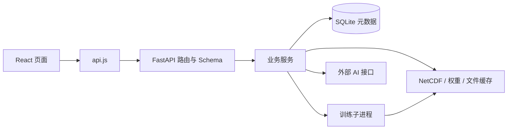

# AstraAtmos 行星大气实验室

<div align="center">
  <picture>
    <source media="(prefers-color-scheme: dark)" srcset="./assets/brand/astraatmos/astraatmos-mark-dark.png" />
    
  </picture>
  <p><strong>Planetary Atmosphere Prediction & Experiment Platform</strong><br />面向多行星大气数据分析、模型训练与时空预测实验的平台</p>
</div>

[项目仓库](https://github.com/ZongAn-W/Aresvision) · [自定义模型接入](docs/uploaded-model-training.md) · [Linux 部署](scripts/deploy/README_DEPLOY_CN.md) · [Windows 分发](scripts/release/README_CN.md)

## 项目简介

AstraAtmos（行星大气实验室）定位为行星大气预测实验平台，从火星臭氧研究起步，以 OpenMARS 再分析数据、MCD 气候模拟数据和地球 MERRA-2 三小时数据为当前数据基础，将数据管理、模型训练、预测、模型对比和三维可视化整合到同一个 Web 平台。当前已开放火星臭氧训练与预测，以及地球三小时数据总览、官方 DLinear 和独立契约上传模型的训练与历史回测；日频地球数据集已停用，更多行星和变量预测任务仍属后续扩展。

产品原名为 AresVision（智绘赤星）。目录、仓库地址、启动脚本、`ARESVISION_*` 环境变量、数据库与浏览器存储键、数据格式标识沿用原名称以兼容已有部署；改名无需迁移数据或配置。

前端视觉令牌与基础控件集中在 `frontend/src/index.css` 和 `frontend/src/components/ui/`；深色模式的模型训练和预测分析复用首页星空背景，面板、输入和图表保留实色，数据总览仍采用实色工作台。浅色主题不显示星点，鼠标视差与地球交互仅作用于首页。深浅主题、字号缩放及弹窗键盘焦点约定见[前端样式说明](frontend/README.md#界面样式与可访问性)。

桌面工作台中，单模型预测无结果时显示紧凑准备面板，提供选择模型或进入训练的入口，并在禁用预测按钮旁说明原因；结果出现后恢复原有图表与导出。训练固定运行条按实际高度预留正文空间，访客的实验登录主入口集中在底栏。数据总览以数据集、变量和时间读数为主，辅助文字不低于 12px；当前导航使用冰蓝文字和底部强调线。

AstraAtmos 使用「大气之 A / Atmospheric A」作为正式标志：冰蓝 A 字母、上扬的弧形大气流线与橙色观测点。全站导航、首页强调色、关于页、页脚与浏览器图标已统一使用该标志，深浅主题分别使用对应配色。品牌组件为 [BrandMark.jsx](frontend/src/components/BrandMark.jsx)，资产规范与文件清单见[标识设计与使用说明](assets/brand/astraatmos/README.md)，接入范围见[品牌接入方案](docs/plans/2026-09-24-atmospheric-a-brand-integration.md)。

平台提供 PredRNNv2、ConvLSTM、SimVP 及多种时间序列模型，也支持接入自定义 PyTorch 模型。预测结果可与数据集参考值进行对比，结合残差、误差分布和逐步指标评估模型表现。实际预测效果取决于数据质量、训练配置和模型权重。

## 快速接手：先读这一节

2026-10-10 地球与火星单模型预测使用同一套[单模型预测工作台](docs/shared-single-model-prediction.md)：模型侧栏、参考/预测/残差三联图与单图、时间步、指标、诊断图表外壳及全屏操作共用组件；无模型且无结果时显示紧凑准备面板，可进入模型选择或训练，已有结果但指标尚未取得时显示 `--`，实际 Earth 响应缺项仍显示“未提供”。行星适配层保留各自 API、时间轴、坐标、单位、评价范围和导出能力。Earth 每次运行完整任务 horizon，展示步只改变查看内容，保持 UTC/DU、独立手动抽样诊断、ΔRMSE PFI 和地球地图全屏；Mars 保持 Ls、训练步长上限、ΔR² PFI 与球面。验证包含前端测试/生产构建、合成浏览器桌面与 390px 交互，以及后端契约回归；既有 Mars 坐标失败单独列出，不代表真实训练精度或全分辨率浏览器性能验收。

2026-10-09 地球训练链路补强了任务恢复和上传模型契约：新任务保存独立划分策略标记，缺失冻结划分时拒绝恢复及产物读取；兼容未带新标记但已有 task split 的任务，真正旧任务继续使用 manifest。上传模型的构建、训练与重载统一初始化为 CPU float32，再迁移到运行设备；eval 必须通过单样本/合批、顺序、其他样本及重复调用一致性检查，覆盖实际任务 batch size，且不能修改参数/缓冲区；checkpoint 加载权重后再次核验。旧上传校验报告缺少新验证证据时需重新校验。实现与边界见[任务级划分](docs/earth-task-splits.md)和[上传模型契约](docs/earth-3hourly-uploaded-model.md)。

Earth 官方 DLinear 与独立契约上传模型统一支持 MSE、RMSE、MAE、R²、MAPE、SMAPE。六项基于反归一化 TO3（DU），保持预测起点 × 提前步 × 格点等权；新任务/checkpoint 保存完整 v2 指标契约及单位，旧三小时 RMSE/MAE 产物继续读取和预测，缺项显示“未提供”。结果与矩阵默认读取完整测试集，验证集和本次回测分开标注；比较消费已保存 test 指标。训练结果页的 Earth `action=test` 和预测页共用测试分区诊断：默认 4 个窗口、5,000 个散点、40 个残差分箱、seed 42、PFI 3 次，DU 残差定义为 prediction-reference，PFI 为置换后 RMSE 减基线 RMSE 并保留负值；页面诊断图暂不开放科研导出。公式、流式统计、缓存与兼容规则见[地球评价指标](docs/earth-evaluation-metrics.md)和[地球训练后诊断](docs/earth-post-training-diagnostics.md)。验证使用合成数据，不代表真实精度验收。

2026-10-08 地球数据入口统一为 `earth_merra2_3hourly_v1`：总览、训练和预测只使用三小时发布，开发与生产默认一致。日频 v1/v2 不再出现在目录及选择器，直接请求其元信息、数据、训练或历史预测返回 409 `dataset_retired`。旧任务、权重和数据文件保留，不自动迁移，也不再用于运行；年度图表由三小时源聚合日均，不读取日频数据包。详见[日频数据集停用约定](docs/earth-dataset-retirement.md)。下方日频接入和测试数量属于历史记录。

2026-10-08 新增预测分析[科研图导出](docs/research-figure-export.md)：Mars/Earth 当前步三联图、Mars 当前步普通散点、Mars/Earth 多模型完整测试集逐步曲线与 Mars 单模型抽样 PFI，提供 PDF/SVG/300–600 DPI PNG、毫米尺寸预览及 MATLAB 数据/脚本包。导出仅消费账号私有的已有结果快照，下载前后复核模型/数据身份；不训练、不重新推理。已检查合成文件布局、导出契约、相关路由与前端构建；真实模型精度和 MATLAB 脚本执行未验收。既有 Mars 坐标回归有 7 项失败，原始提交实现也复现，具体范围见专题。

2026-10-08 地球训练新增[任务级自定义数据划分](docs/earth-task-splits.md)：官方 DLinear 与独立契约上传模型共用完整原始 UTC 三小时时间轴的连续划分，默认 70/20/10，三项均大于 0。先确定原始分区，再在分区内部生成完整窗口；各区至少包含输入窗口 + 输出窗口个时间步。服务器持久化请求比例、策略版本和实际边界，normalization 仅拟合当前任务 train，缓存检查任务划分。新 checkpoint 严格核对划分与指标；旧三小时任务继续使用发布 manifest，不自动迁移，日频仍停用。合成数据用于训练链路回归，未执行完整真实两年训练。

文档最近核对日期：**2026-10-10**（本轮范围包含共用单模型预测空状态、Earth/Mars 观测台文字与图例收口、训练草稿切换、Earth 训练回归及后端测试隔离）。地球唯一活动数据集 `earth_merra2_3hourly_v1` 是 3 小时 UTC、240×480 全球五变量数据，官方 DLinear 与符合独立 v1 契约的上传模型均支持按任务配置输入/输出窗口（默认 56→24）训练和历史回测。上传兼容性按具体 dataset_id 校验，未知或 dry-run 失败不能训练；服务器固定数据身份和源码版本。实际模型调用使用 24×48 空间块、float32 BTCHW，上传模型不使用 Mars 字段或假设。训练只用 train split 拟合 normalization，产物发布前 strict reload。完整两年数据包已独立验证；已有合成训练/回测记录不代表真实训练结果或预测精度验收。入口见 [三小时专题](docs/earth-merra2-3hourly.md)及[独立上传契约与模板](docs/earth-3hourly-uploaded-model.md)。

Earth 默认入口由 `GET /api/datasets` 的 `default_earth_dataset_id` 决定，固定支持 `earth_merra2_3hourly_v1`，见[生产默认值模板](AresVision_backend/backend/.env.production.example)。`ARESVISION_EARTH_MERRA2_3HOURLY_DIR` 应指向已验证的完整发布目录；三小时包缺失会显示不可用，不回退到日频。旧配置若将 `ARESVISION_DEFAULT_EARTH_DATASET_ID` 设为日频，应改为三小时或移除该项；日频默认值会在启动时明确拒绝。

本次 2026-10-07 核对复查了源码、相关测试和全量发布验证报告；真实包没有用于训练或预测验收。完整发布与独立数据验证记录见专题文档；合成训练/回测 smoke 仍仅作为模型链路记录，不等同于真实两年训练结果。

2026-10-06 的既有接手记录核对了**地球 MERRA-2 v2 的官方 DLinear 网页训练与历史日期预测**：训练页新增 `earth_merra2_daily_v2` 数据集选项（固定过去 7 天 → 未来 3 天、TO3 必选加四个可选辅助输入、只用训练期拟合归一化、完成前 CPU 严格重载校验单文件 checkpoint、保存 DU 指标），预测页新增独立的「地球历史预测」模式（按历史起点回测随后 3 天的预测/参考/残差场与指标）；Earth 使用独立的数据准备、训练与推理路径，并在火星推理、比较、PFI、`action=test` 与迁移来源路径上明确 409，不回退到火星。Earth 起点范围为 `2020-01-07` 至 `2021-12-28`，共 722 个起点；响应返回 `origin_split` 标记起点属于 train、validation 或 test。Earth 只接受发布 manifest 固定的 train / validation / test 日期块，前端比例为只读兼容值，不发送自定义比例。Mars 新训练按完整合并时间轴生成可跨 MY 的窗口，严格按配置比例分配保留窗口并保存 split 元数据；归一化只使用训练分区，Mars 缺测、NaN、Inf 会在数据准备阶段明确拒绝。相关实现见[实验中心](docs/experiment-center.md)和[地球训练与历史预测](docs/earth-training.md)。

2026-09-27 的既有接手记录核对了**实验中心布局与配置交互**：顶部固定视图栏在「配置实验」（画布 + 检查器）与「训练监控」（目录 + 画布）之间切换；目录与检查器在桌面端吸附于导航下方，底部操作条固定于视口。上传模型为默认主入口，官方模型及全部超参数继续保留。此次精修移除双重页边距、标题额外留白、重复的上传空态报错和检查器阻塞提示，修正未登录时的参数绿色勾选，编辑自定义参数会滚动到对应页签；设置浮钮避让底部操作条。后续八处小改：上传卡片不再重复放「编辑自定义参数」（入口只在右侧检查器），训练数据集改为把选项直接列出（不再用原生下拉，选项行只给名称、没有小字说明；本轮加入地球数据集后为三项），画布第 04 分区「专家参数」更名为「超参数」（英文 `Hyperparameters`），输入与预测、训练参数并入超参数模块成为它的头两个页签（默认打开输入与预测），六个页签统一为同一套三列字段块（载荷胶囊、参数矩阵、专家字段、自定义参数表单与标签选择器同度量），上传卡片的「替换文件」「管理上传模型」更名为「上传模型」「管理模型」，训练页三个阶段的实验目录都默认展开（手动收起后本次会话保持），画布拆成 01 模型名称 / 02 数据集 / 03 模型 / 04 超参数四个部分（每段一张同款卡片：左侧 38px 编号轨道 + 13px 圆角 + 细描边，段间留 14px 画布底色；卡内不再重复「训练数据集」「模型来源」小标签，训练参数格只剩标签与数值、不再有量纲小字）。生产站点使用 `frontend/dist`，源码修改后必须在 `frontend/` 执行 `npm run build`，已打开的页面需要完整刷新才能加载新资源。实现边界与验证范围见[实验中心](docs/experiment-center.md)；本文不将旧轮次的验收数量作为本轮验证结论。

2026-09-27 的既有接手记录还核对了组合看板、单图放大、观测图例、来源与图层控件、条件切换和错误恢复，以及**观测轨刻度口径改为每轨独立**（全球均值曲线不再随取点变形）与**曲线下方按数值填充颜色**。以下为 2026-09-25 的后端核对摘要：**默认 PredRNNv2 预测子系统下线**：移除 `core/predict_inference.py`、`core/predict_transforms.py`、`services/predict_service.py`、`services/predict_data_service.py` 与 `/predict/ablation`、`/predict/model-info`、`/predict/prewarm`、`/predict/performance`、`/predict/performance-compare` 端点，`/predict/run`、`/metrics`、`/error-distribution`、`/permutation-importance` 改为强制要求 `training_task_id`，并删除 `models/predrnnv2/`（190 MB）与 `data/perf_cache/`（44 MB）。验证范围为后端导入与逐文件 pytest、前端 `node --test` 与生产构建、注册路由清单；重构前的核对范围见下方历史条目与对应专题文档。分支、未提交修改、运行进程和数据是否齐备属于实时状态，每次接手都应重新检查。

2026-09-25 还完成两项预测子系统修复，摘要如下，细节见对应章节：

- **并发读 NetCDF 的线程安全修复**：新增 `services/netcdf_read_lock.py` 提供进程级可重入读锁，官方模型、上传模型与 MOLA 地形三处读取改为共用该锁；预测路由兜底分支改为 `logger.exception` 记录完整堆栈。验证范围为 `tests/test_netcdf_read_lock_contract.py`、`tests/test_inference_netcdf_thread_safety.py`、`tests/test_mola_topography.py`、`tests/test_mcd_file_consumers.py` 与相关上传模型/推理契约测试（逐文件运行全部通过）。
- **预测数据准备优化**：新增 `services/prediction_volume_cache.py` 缓存标准化体积，预测路径改为按需切窗（`prepare_tensors(..., return_scaled_volume=True)`、`_load_official_task_volume` / `_prepare_uploaded_task_volume`、`_window_slice` / `_window_stack`）。验证范围为 `tests/test_prediction_volume_cache.py`、`tests/test_uploaded_model_ls_inference.py`、`tests/test_uploaded_model_runner.py`、`tests/test_training_personal_inference_env.py`、`tests/test_prediction_analysis_cache_integration.py` 逐文件运行（11 个文件合计 145 passed），以及体积切片与逐样本展开的逐元素等价性比对（bitwise）和对运行中后端的实测延迟（上传模型冷启动 6.3 s / 官方模型 4.8 s，缓存命中 0.1–0.2 s；改造前为 20–24 s）。

| 需要先知道的事 | 当前约定 |
| --- | --- |
| 项目形态 | React 单页前端 + FastAPI 后端 + Python 训练子进程；开发时前后端分别启动，构建后可由后端托管页面 |
| 前端页面 | 使用 hash 路由，入口为 `frontend/src/App.jsx`，并非 React Router 路由表 |
| 当前预测入口 | 先选择地球/火星，再选择单模型/多模型；兼容 `trained`、`trained_compare`、`earth`、`earth_compare` 链接。单模型携带任务 ID，多模型携带任务 ID 列表 |
| 地球训练与预测 | 仅三小时官方/独立契约上传模型、总览与历史回测；新实验默认采用设置中的 Earth 输入/输出窗口（默认 56→24），任务按自身窗口运行；日频返回 `dataset_retired`。未知兼容性或缺包不能训练；Earth 不进入火星推理/比较/PFI/迁移，`action=test` 分流到 Earth 专用诊断 |
| 数据边界 | 上传数据主要用于数据总览；训练、预测使用服务器管理的数据，不能把上传成功等同于加入训练集 |
| 模型边界 | `model_source=official/uploaded` 表示模型实现来源；`training_dataset` 表示训练数据集，两者不同 |
| 持久化 | SQLite 保存用户、任务与缓存索引，文件系统保存数据、模型、日志和缓存载荷 |
| 运行前提 | 仓库代码不含完整运行数据和权重；缺失文件需查日志及路径配置 |
| 修改顺序 | 页面 → API 封装 → 路由/Schema → 服务 → 数据或模型实现 → 对应测试 |

推荐接手顺序：

1. 阅读本节、下方“模块与代码入口”“关键业务链路”“当前功能边界”。
2. 执行 `git status --short`、`git branch --show-current` 和 `git log -5 --oneline`，识别既有修改与近期变更。
3. 根据任务只深入相关模块；用代码、测试与实际日志验证 README 中涉及该任务的描述。
4. 修改完成后按“README 维护约定”同步文档，并报告实际执行的验证。

快速导航：[功能](#主要功能) · [模块入口](#模块与代码入口) · [业务链路](#关键业务链路) · [功能边界](#当前功能边界) · [启动](#本地启动) · [测试](#测试与构建) · [排查](#常见问题与排查入口) · [维护约定](#readme-维护约定)

## 主要功能

### 首页与实验入口

- 首页采用左右分栏：平台介绍与操作入口、三维地球纹理预览；960px 及以下改为上下排列，较矮桌面屏幕压缩主体留白，放大文字时操作入口可换行。
- 首页导航在 1100px 及以下使用上下两行，链接行可横向滚动，导航高度随文字缩放增加，避免英文或大字号挤压登录入口。关闭的偏好设置面板不进入键盘焦点顺序，打开后恢复交互。
- 全站导航左侧为「大气之 A」品牌图形（[BrandMark.jsx](frontend/src/components/BrandMark.jsx)）、`AstraAtmos` 字标与多语言副标题，整块为语义按钮，可用 Tab 聚焦并通过 Enter / Space 返回首页。
- 预览使用 NASA Blue Marble 地球影像、柔和补光与薄层冰蓝大气边缘，外侧轨道装饰圈保持低对比；大气边缘仅为视觉示意，不请求大气分析接口，也不代表实时数据或预测结果。预览遵循系统减少动态效果设置，星球固定为地球、不传递到数据总览。
- 首页主标题为中英文名两行锁定：中文名 `行星大气实验室`（`frontend/src/i18n/zh.js` 的 `home.lab.titleFirst`）在上、英文名 `AstraAtmos`（`titleSecond`）在下并沿用强调色；语言切换英文界面时上行改为 `Planetary Atmosphere Lab`，英文名一行保持不变。标题第二行、主按钮与装饰线使用品牌强调色变量 `--brand-primary` / `--brand-on-primary`（定义在 `frontend/src/components/brand.css`），随深浅主题切换。
- 首页引导文案围绕从地球到火星的大气规律探索、数据启发与实验验证展开；主按钮为“进入分析工作台”，描边次按钮为“训练火星模型”，明确当前训练对象。底部“分析大气数据”“训练预测模型”“比较实验结果”分别进入数据总览、模型训练和预测分析，点击区域至少 44px 高，窄屏允许换行。中英文文案、深浅主题与文字缩放使用同一套布局。
- 首页不提供预览星球切换与旋转开关，也不展示预览说明、数据范围等辅助小字；地球三小时能力以当前功能边界章节为准。
- 首页提供两类轻量交互，全部集中在表现层：① 分层鼠标视差，指针在首页内移动时背景星点、轨道装饰圈与地球分别产生约 4px、8px、5px 的 `translate3d` 位移，标题、按钮与说明文字不参与位移；② 地球拖拽旋转，按住地球左右拖动改变朝向（水平灵敏度约 0.005 rad / CSS px，垂直限制 ±0.35 rad），拖拽期间暂停自动旋转，松手保留约 0.3 秒惯性旋转，方向键可旋转，Escape 立即停止惯性。
- 交互降级与边界：只响应主鼠标与触控笔，触屏触摸保持页面正常纵向滚动，地球交互区使用 `touch-action: pan-y pinch-zoom`；粗指针设备关闭视差与拖拽并保留键盘操作；系统开启“减少动态效果”时视差与惯性关闭，拖拽与键盘旋转仍可用。规则由 [homePointerInteraction.js](frontend/src/pages/HomePage/homePointerInteraction.js) 的能力判断和 [homePage.css](frontend/src/pages/HomePage/homePage.css) 的媒体查询共同保证，两处需一起修改。
- 首页交互不请求任何分析接口，也不改变 WebGL 回退与资源清理行为：视差只写 CSS 自定义属性，指针移动不触发 React 重新渲染；WebGL 不可用时仍显示 CSS 星球。
- 页面布局与预览实现见 [HomePage.jsx](frontend/src/pages/HomePage.jsx)、[homePage.css](frontend/src/pages/HomePage/homePage.css) 和 [PlanetPreview.jsx](frontend/src/pages/HomePage/PlanetPreview.jsx)，交互参数与纯函数见 [homePointerInteraction.js](frontend/src/pages/HomePage/homePointerInteraction.js)（测试同目录 `homePointerInteraction.test.js`）。

### 数据总览与三维交互

- 在三维火星球面上展示臭氧及气象变量，支持 Ls（太阳黄经）时间轴播放、色带与单位设置。
- 火星观测档左侧为竖向 Ls 时间轴与当前变量的 MCD 全球均值曲线，右侧为球面所选网格点的全年曲线；两条曲线下方按数值填充颜色（取该变量色带、按**本轨数值范围**铺满，因此颜色如实反映年内起伏，但不可跨轨比较绝对值），点选暂停播放并留在观测档。两条曲线共用 Ls 时间轴，但**数值刻度各用本轨极值**（曲线形状不随对侧取点变化，代价是两轨只能比起伏、不能比绝对高度）。火星均值为有效网格等权均值，未按面积加权；窄屏将两条轨并排放到球体下方。
- 提供球面点位探查、季节变化、极区动力学、变量相关性及波动诊断等分析视图。
- 火星 MCD / 多源 / 验证 / 差值臭氧显示方式与 OpenMARS、NOMAD 来源选择集中在“数据源”；“图层”统一控制数据场、经纬网和星球底图，“显示”管理旋转等交互。
- 地球观测图例与火星采用相同紧凑圆角样式，展示变量、单位、有效格点数、色带和最小/中间/最大值；地球保留原始物理单位和对应数据场色带。
- 地球两侧观测轨沿用火星的读数卡片、细曲线、数值填充与播放按钮样式：左侧为日期滑块和面积加权全球均值，右侧为单点年变化，两轨共用日期轴，数值刻度各自独立（同火星口径，避免选点改变全球均值曲线形状）。三小时 UTC 日期与时间控件使用紧凑样式，两侧读数区随文字缩放预留同等高度，保持曲线对齐；高度不足时两侧观测轨同步纵向滚动。保留年份选择、闰日处理和从首日重播，窄屏两轨并排放在球体下方；实现见 [EarthObservationRail.jsx](frontend/src/pages/DataOverviewPage/workbench/EarthObservationRail.jsx)，填充取色见 [railCurveFill.js](frontend/src/pages/DataOverviewPage/workbench/railCurveFill.js)。
- 支持手势交互、全屏展示及中英文界面。
- 地球观测档首次打开或刷新时默认显示三维球体；“显示”面板可手动切换二维地图，WebGL 不可用时自动回退二维。三维底球使用随项目提供的 NASA Blue Marble 彩色影像，呈现海洋、陆地与冰雪，并可通过海岸线开关控制轮廓叠加；影像仅作地理参考，来源与许可见 [地球底图资源](frontend/public/earth/README.md)。
- 三维球体图层可按需叠加五类分析辅助层：六级等值线、当前场相对球面面积加权均值的距平、由 U/V 场组成的风向量、太阳参考时刻对应的昼夜分界线，以及可调强度的地理参考底图。距平会同步替换球体和图例的显示场，原始点位读数与观测轨保持原值；地球场使用 UTC 三小时数据，年度统计按完整 UTC 日聚合，昼夜线使用显式参考时刻作示意，火星使用 Ls 与本初子午线地方太阳时，均不代表新增的亚日观测数据。底图纹理是地理参照，不是地形高度数据；数据质量图层暂未开放。
- 数据总览顶部可切换“火星 / 地球”，两者互斥挂载，共用行星观测台外壳。地球默认观测档：球体两侧分别为 UTC 时间刻度与点位时间序列。分析档默认展示“主题组合看板”：宽屏左侧选择主题、年份和适用变量/纬带，右侧一张主图与两张辅助图同屏展示季节变化、变量关系或空间诊断；每张图可放大，返回或按 Escape 回到原组合，窄屏顺序排列。左侧“单项深入分析”和右上“单项分析”保留原有全部图表与 AI 解读，火星主题与单项分别记住变量条件。逐时间步读数、点位序列、球体工具和播放放在观测档，切入分析暂停播放；仅火星单项昼夜变化显示 Ls 选择。图表加载失败提供保留条件的重试，空数据另行提示。控件位置、统计口径与能力边界见[共用分析工作台](docs/earth-analysis-workbench.md)。

### 数据管理

- 读取、对齐 OpenMARS 与 MCD 数据，管理原始 NetCDF 文件、上传记录及派生缓存。
- 支持 `.nc`、`.nc4`、`.netcdf` 文件上传、校验，以及数据贡献审核。
- 区分默认数据、用户上传数据与管理员数据治理入口；训练使用服务器管理的数据集。
- 包含 MCD 总览数据、NOMAD 网格数据和 MOLA 地形资源的构建脚本。
- 保留历史 MERRA-2 地球臭氧日数据小包的构建、独立读取、预览和训练冒烟脚本；日频运行入口已停用，见 [地球小数据包](docs/earth-compact-dataset.md)。
- 提供独立的 Earth MERRA-2 三小时离线构建与验证脚本：SLV/RAD 五变量连续三个小时真实平均、01:30 等 UTC 中心标签、全球 240×480 保守球面重网格和显式缺失掩码；数据写入 Git checkout 外的目录，支持 7–30 天 smoke 与完整两年处理。产品已接入注册、分块校验、官方 DLinear / 独立契约上传模型训练与历史回测 API，总览已适配 UTC timestamp、服务端 60×120 面积降采样地图、原生点位与后端日聚合；训练/预测前端已支持 56→24 与 UTC 回测，见 [三小时数据构建、训练与历史回测](docs/earth-merra2-3hourly.md)。
- 服务器数据集目录：`GET /api/datasets` 列出三个活动数据集（`openmars_mcd`、`mcd_overview`、`earth_merra2_3hourly_v1`）及三小时默认 Earth ID；详情返回元数据、版本、发布指纹、可用状态和能力声明。日频详情返回 409 `dataset_retired`；缺少三小时包不阻断启动，也不回退到日频。约定与状态解释见[数据集注册表](docs/dataset-registry.md)。
- 数据总览支持“火星 / 地球”切换：地球场景按 UTC 三小时时间步查看 MERRA-2 五个变量的三维全球球体、播放、点位时间序列与全球单元面积加权均值，见 [二维地球数据总览](docs/earth-overview.md) 与 [共用分析工作台](docs/earth-analysis-workbench.md)。
- 地球年度分析按 2020、2021 分开计算，覆盖季节结构、年内变化、季节极值、环境因子、辐射/温度与臭氧关系、变量相关、空间距平与极区统计；年度结果由三小时源聚合为完整 UTC 日均。昼夜分析尚未接入，卡片显示能力说明，不请求火星昼夜接口。
- 后续扩展见 [火星 / 地球共用分析工作台方案](docs/plans/2026-09-23-earth-shared-analysis-workbench.md)；其首期范围（共用工作台、三维地球、年度分析、极区、图表 AI 解读）已实现，手势交互与跨星球数值比较仍属后续计划。

### 模型训练

- 当前训练页在固定视图栏提供「实验配置 / 训练监视 / 实验矩阵」三个入口。实验矩阵复用 `TrainingContext` 任务快照，固定表头与实验名称，宽表格同时固定标签与操作列；支持按名称、状态、标签筛选，按适用属性排序，以及属性搜索、分组勾选、拖动或键盘调整列顺序、全部显示和恢复默认。矩阵按可用视口高度约束为单一的横向 / 纵向滚动区域，横向滚动条持续可达；表格区域变窄时（包括展开属性面板），只固定选择框与实验名称，标签及操作列随横向滚动。全选和标签管理位于表格外的底部计数栏。列设置按账号写入当前浏览器。矩阵行支持编辑训练记录的 `custom_model_name`、复用私有标签选择器批量增删标签、查看训练监视与复制配置；行内标签编辑面板挂到 `body`，随锚点和视口边界调整位置，列表独立滚动并保持取消 / 保存可见，切换视图自动关闭面板。历史记录缺失字段显示 `—`，上传模型包名称与训练记录显示名称分开，内部路径、哈希和数据指纹不展示。名称编辑允许排队、运行、完成、失败和取消状态，沿用账号权限与重名校验。配置画布与矩阵保持挂载，切换视图不会丢失配置、筛选、排序或浏览位置；实现与边界见 [实验中心说明](docs/experiment-center.md#实验矩阵)。下一条 2026-09-27 记录保留上一版双视图的历史布局，当前实现以本条和专题文档为准。
- 训练页 `#/training` 现为**实验中心 · 大气实验控制台**（版式对齐 `output/training-console-preview.html` 的设计参照）：顶部是**固定视图栏，提供三个按钮**——「实验配置」「训练监视」与「实验矩阵」。**实验配置**视图只保留配置画布 + 配置检查器两列（目录收起），底部运行条承载提交；**训练监视**视图只保留实验目录 + 画布两列（检查器收起），画布里**监控常驻、结果接在下面**（任务完成后不再用结果顶替监控）；**实验矩阵**视图铺满主体区域展示可配置列的实验表格。**进入页面默认展示最新一条记录的结果**：已选任务时（运行中的任务优先，否则取列表最新一条）直接进入监控视图，一条记录都没有才停在配置视图；点「新建实验」清空选择后自动回到配置视图。阶段（配置 / 监控 / 结果）仍由任务状态推导，视图只决定哪几列可见，两者互不耦合；配置画布和实验矩阵在切换时保持挂载，因此不会清空正在编辑的表单或矩阵浏览状态。运行条只在配置视图显示；监控工作区和目录中保留「停止训练」入口。左侧目录只负责"找到实验"（全部 / 运行中 / 已完成 / 失败、名称搜索、标签与未分组筛选、批量标签、当前任务高亮、运行中进度；外框用 `position: sticky` 固定在导航下方 86px，实验列表在列内自行滚动；1440px 下外边距 28px、列间距 14px、目录 235px、检查器 284px，1920px 下侧栏不再按视口比例放大）。配置检查器同样 sticky，只给出当前模型、输入变量、就绪检查、Window → Horizon 与 Epochs，详细信息折叠，不复制整张表单。配置画布头部是可编辑实验名称，正文按 01–04 四个部分排布：模型名称（可编辑实验名称）、数据集（选项直接列出、横排）、模型（来源胶囊 + 上传卡片或官方架构选择器）、超参数（侧边页签，依次为输入与预测的载荷胶囊条、训练参数矩阵、以及按模型来源决定的专家字段页签：自定义参数 / 模型结构 / 训练策略 / 迁移学习 / 实验标签，不出现空页签；六个页签共用同一套三列字段块，切换时形态一致）。**上传模型是一等主入口**：模型来源默认 `uploaded`，已选择时显示紧凑卡片（文件名、版本、校验状态、自定义参数数量）与「上传模型 / 管理模型」（自定义参数的编辑入口只保留在右侧检查器），整套模型管理与文件格式说明收进可展开区；没有上传文件时同一区域给出上传、模板与说明下载、格式要求与区内 inline error，没有有效上传模型时「开始实验」保持不可用。官方模型是次级兼容入口，只有切到官方模型才渲染带搜索、模型家族筛选与全部官方架构的架构选择器。底部运行条是**横跨浏览器的深色细条（`position: fixed`，约 63px，上方一条细边线）**：左侧状态与单行摘要（数据集 · 模型 · 输入 · 轮数），右侧唯一主操作「开始实验」（仍然调用 `startTrainingTask` 与既有校验，运行条自己不做校验）。刷新页面后已选任务进入监控视图，已完成任务在监控下方展示结果；这是现有训练能力的前端重组，实验矩阵与重命名接口复用现有训练实体，详见[实验中心](docs/experiment-center.md)。
- 内置 PredRNNv2、PredRNN++、ConvLSTM、SimVP、DLinear、PatchTST、TimeMixer、Earthformer 等模型及实验变体，完整注册表见 [model_zoo.py](AresVision_backend/backend/training_backbones/model_zoo.py)。
- 按模型配置输入窗口、输出步长、气象通道和超参数，查看训练进度、Loss 曲线、日志与测试指标。
- 偏好设置可自定义新建火星和 Earth 实验的训练轮次、批大小、学习率、窗口 / 步长、数据切分、随机种子、早停和迁移冻结 / 微调默认值；设置保存在当前浏览器，新实验应用设置值，复制配置仍以历史任务为准。Earth 使用任务级原始 UTC 时间轴划分，默认 70/20/10 且三项均须大于 0；窗口 / 步长默认 56→24，可在 1–240 个三小时时间步内自定义。Mars 默认验证比例为 0 时，Earth 使用 70/20/10。
- 三小时官方 DLinear 通过 `POST /api/training/start` 提交 `dataset_id=earth_merra2_3hourly_v1`；输入 TO3 加可选辅助通道，输出 TO3。训练不复制全部窗口，`batch_size` 按 24×48 空间块计；checkpoint 固定 UTC 三小时时间规则、完整网格、通道、归一化和数据指纹，并保存总体、24 个 lead 与累计 24/48/72 小时 DU 指标。上传模型需通过独立 v1 契约校验，不回退日频；详见 [三小时训练契约](docs/earth-merra2-3hourly.md#官方-dlinear-后端训练)。
- 支持迁移学习、权重加载、冻结策略和训练结果重命名；训练失败时提供通知，包括 CUDA 显存不足提示。
- 支持上传单文件 PyTorch 模型，由平台统一负责数据加载、训练循环、评估和权重保存；训练页把上传模型作为默认模型来源与一等主入口（上传、模板 / 说明下载、区内校验错误、重新校验与删除都在同一区域），官方模型作为兼容入口保留。「管理模型」中可下载本人上传的原始 `.py` 源码，并重命名单个自定义模型。
- 支持账号私有的多标签分组：启动训练时选择标签，历史记录中搜索、按标签交集筛选，单条或批量添加、移除标签；标签可新建、重命名与删除。操作说明与接口见 [训练模型标签](docs/training-model-tags.md)。
- 结果工作区展示后端返回的指标（RMSE、MAE、MSE、R²、MAPE、SMAPE，有值才显示）、Loss 记录、完整超参数与数据集身份；失败与停止任务读取任务 `metrics` 里的 `error`/`note`/`error_code` 显示真实原因与恢复建议，并提供默认折叠的“查看运行日志”（复用 `TrainingContext` 的日志轮询，不新增请求）。训练在日志文件创建前失败时，日志接口会把任务 `metrics.error` 作为首行返回，不再只显示“暂无日志”。后端重启时，如果运行中任务已有 `Model saved:` 日志且权重文件通过有效性检查，会恢复为已完成并从日志写回指标；没有完整产物的运行中任务才标记为被重启中断。「用于预测」沿用现有预测 handoff；「去模型比较」按行星跳转 `mode=trained_compare`（火星）或 `mode=earth_compare`（地球）让预测页直接进入比较模式，但不写入任何预选结果；「复制配置」把任务的完整训练配置（命名、数据集、模型来源与结构、通道、窗口/步长、轮次/批大小/学习率、种子、早停、隐藏层、标签）载入新建实验表单且不自动开始训练，上传模型实验还会带回模型 ID/版本与 `custom_model_params`（深拷贝，由现有参数表单渲染），字段缺失时在配置区逐条提示。

### 训练数据划分比例

火星训练配置支持独立编辑训练集、验证集和测试集比例，三者必须合计 100%。设置中的初始比例为 70% / 20% / 10%，可按需自定义；比例严格作用于完整时间轴上保留的窗口数量，分区之间为避免输入和目标时间索引重叠会丢弃必要的边界窗口，窗口本身可以跨 MY。验证集比例可以为 0，此时不生成验证窗口。任务会把比例、原始边界、窗口数量和窗口范围写入 checkpoint；推理服务、测试指标和 PFI 复用同一份分区定义。历史 Mars checkpoint 缺少严格元数据时明确返回 `split_meta.source=legacy_compatibility`，按旧训练逻辑读取。

### 预测与模型对比

- 预测页按「行星 → 分析方式」选择地球/火星与单模型/多模型，两者都复用模型选择、标签筛选与比较图表。地球多模型通过 `POST /api/earth/predict/training-models/compare` 读取严格验证 checkpoint 保存的六项完整测试集指标，展示正确方向的排名、总体柱状图、任务 horizon 对应的提前小时曲线及参数矩阵；只允许相同发布指纹、测试范围、窗口数量与指标口径，差异返回 409 `earth_comparison_incompatible`。旧产物缺项显示“未提供”并排除该项排名，不重新推理。地球多模型未开放误差分布/PFI；单模型另有独立手动测试分区诊断。训练结果跳转自动选择对应行星；单次历史回测指标与完整测试集指标分别注明口径。

- 地球与火星单模型复用 `PredictSidebar`，结果由 [SingleModelWorkbench.jsx](frontend/src/pages/PredictPage/SingleModelWorkbench.jsx) 组装三联图/单图、时间步、指标卡片、诊断图表与全屏外壳。三场顺序统一为参考、预测、残差，共用深浅主题、色带与数值精度设置；桌面侧栏与结果并排，窄屏上下排列。Earth 展示步同时显示提前小时和 UTC 时间，每次运行完整任务 horizon；全屏使用地球地图，Mars 全屏使用球面。请求转换、真实坐标、物理单位、指标范围与科研导出能力由[行星适配层](docs/shared-single-model-prediction.md#行星适配层)保留。

- 提供参考值、预测场和残差展示，以及误差分布、置换重要性、逐步指标等分析。
- 火星单次预测的 `overall` 指标标记为 `mean_over_forecast_steps`（各预测步指标平均）；训练模型测试集指标与多模型比较标记为 `pooled_test_set_pixels`（完整测试集汇总，其中 RMSE/MAE/R² 按像素合并，SSIM 按样本平均）。预测页会同时显示聚合口径和 `split_meta` 的测试集划分来源，避免直接比较不同口径的数值。
- **地球历史预测保留独立业务契约。** 地球只接受已完成的三小时任务，按 UTC 历史起点和保存的 window/horizon 读取输入，返回参考、预测与残差（DU）及任务分区 `origin_split`。默认窗口为 56→24。日频任务返回 409 `dataset_retired`；起点越界返回 422 `earth_prediction_origin_out_of_range`，数据身份变化返回 409 `dataset_version_changed`。Earth 在火星推理、比较与 PFI 路径返回 409，训练 `action=test` 使用 Earth 专用诊断。无参考真值的未来外推、Earth/Mars 混合比较、持久性基线与预测持久化缓存未开放。
- 三小时 Earth 历史回测使用 `GET /api/earth/predict/context` 和 `POST /api/earth/predict/run`，采用 UTC datetime、任务窗口与 240×480 网格；预测、参考、残差各返回 horizon 个场和相同目标时间戳，指标按任务 lead 和累计时长生成。使用独立的 128 MiB 进程内 LRU，缓存键包含行星、数据身份、任务、起点、全部目标时间戳和 checkpoint SHA；命中前仍严格复核身份。训练页展示当前窗口，预测页使用 UTC datetime 和任务对应 lead；详见 [三小时历史回测 API](docs/earth-merra2-3hourly.md#三小时历史回测-api)。
- 支持选择已训练模型进行预测，也可比较多个训练结果。
- 火星逻辑数据集 `mcd_overview` 的训练和预测均绑定 `MCD_RAW_3H_DIR` 指向的原始全量 MCD（默认 `data/MCD_Output_global_10m_ls_lst/`，覆盖 MY24–MY35）；`data/mcd_overview/*.nc` 是生成的 overview 产物，不是当前训练预测的默认数据源。`openmars_mcd` 始终使用 OpenMARS + `MCD_DIR`。
- 新火星 checkpoint 使用 `aresvision_mars_forecast_checkpoint_v1`，保存每个输入通道的完整空间均值/尺度、目标 `target_mean/target_scale`、训练契约和数据文件指纹；预测直接复用这些参数，不重新拟合。旧纯 `state_dict` 任务保留 legacy compatibility，响应标记 `normalization_source=legacy_refit`。
- Earth 新任务先按请求比例划分完整原始 UTC 时间轴，再在 train / validation / test 内独立生成完整窗口。checkpoint 保存 `split_policy=earth_raw_utc_timeline_v1`、请求比例、实际索引/UTC 边界和计数，normalization 仅拟合任务 train；发布身份不改写。无新策略的旧三小时任务继续按 manifest 解释，新策略元数据损坏时拒绝。官方历史回测保留完整发布起点，上传回测窗口不能跨任务分区，比较须使用相同 test 时间范围与窗口口径。
- 单模型选择与多模型对比支持按标签筛选，筛选保留已有选择；对比的“全选当前结果”追加当前可见模型，并显示筛选外的已选数量。
- 火星已训练模型的请求步长范围为 `1–30`，且不能超过该模型训练时的输出步长；火星多模型对比采用所选模型输出步长的最小值作为上限。地球单模型使用任务保存的 horizon，多模型要求相同 window/horizon 与测试窗口；默认输出 24 步 / 72 小时。
- 预测输入完整基础为 **6 通道**：臭氧、纬向风、经向风、温度、沙尘光学厚度和太阳下行辐射通量；具体通道组合由所选模型的训练配置决定。
- 提供预测请求协调、用户会话缓存隔离和预测分析持久化缓存。
- 图旁「导出科研图」支持 Mars/Earth 当前步三联图、Mars 当前步普通散点、多模型逐步指标与 Mars 单模型 PFI；Earth 抽样诊断图继续禁用科研导出。PDF/SVG 保留文字与曲线矢量质量，PNG 支持 300/600 DPI，可选 `.mat` + `.m` 重建包。多模型导出面板单独选择本图的 2–8 个模型；页面可继续对比更多模型，分组导出。Mars RMSE/MAE、误差分布横轴随单位同步换算；Earth 保持 DU。当前预测窗口、完整测试集指标和抽样 PFI 分别标注；Mars PFI 为最多 40 窗口的 ΔR²，Earth 诊断 PFI 为固定种子 1–8 窗口的 ΔRMSE（DU），详见[科研图导出](docs/research-figure-export.md)。

火星预测不再接受或使用 `mars_year`，服务器在完整合并后的实际 Ls 时间轴上按周期最近邻选择合法滑动窗口；官方模型和上传模型共用同一套定位规则，不按均匀 0–360° 比例估算样本位置。响应中的 `input_ls_values` 和 `ls_values` 都来自实际输入/目标窗口；完整数据的 Ls 回绕顺序原样保留，单个输入加目标窗口可以跨越 MY 边界，不根据请求值或固定 5° 步长推算标签。训练任务按完整时间轴生成窗口，配置的 train / validation / test 比例严格作用于保留窗口数量；为保证不同分区的输入和目标原始时间索引不重叠，分区交界处会丢弃必要的边界窗口。归一化只拟合训练窗口。checkpoint 保存 `split_policy`、各分区原始边界、窗口数量与范围，测试指标和 PFI 复用这些边界。训练或预测数据遇到 masked、NaN、Inf 或填充值会抛出 `MarsDataError`，不会静默替换为 0。预测会校验快照，原始文件变化返回 `dataset_version_changed`（409）。旧任务若缺少严格分区元数据会标记为 legacy 兼容来源。

火星训练和预测使用完整 MY 数据集合，并在合并后的实际时间轴上生成窗口。`openmars_mcd` 的 OpenMARS 文件可能跨年，例如 `openmars_ozo_my27_ls358_my28_ls13.nc`；共享 [mars_data_service.py](AresVision_backend/backend/services/mars_data_service.py) 读取实际 Ls，在年末回绕处拆成 MY27/MY28 两个 segment，以文件名起始 MY 定位年份并校验声明的结束 MY，每段保留全局索引、来源文件和文件内索引。`mcd_overview` 继续使用 `MCD_RAW_3H_DIR` 下原始全量 MCD MY24–MY35，按年度文件名分段，每个文件对应一个 MY。所有边界数据与 Ls 保留，短数据集合可以没有合法窗口；预测允许窗口跨越 segment，并返回窗口起点对应的真实 `mars_year` 与 `block_index`。重复 Ls 仍按文件顺序确定性选择，缺少 `MY##`、OpenMARS 文件名年份与实际回绕矛盾、Ls 长度不匹配或异常倒退时明确拒绝。分段与兼容边界见[数据流程约定](docs/dataset-registry.md#mars-年份分段与窗口)。

### AI 助手与用户功能

- 提供 AI 对话及结合当前数据视图的 Copilot 解读，通过可配置的外部模型接口生成回答。
- 未配置 `AI_API_KEY` 时，AI 对话服务使用内置兜底回答。
- 包含账号认证、邮件验证码、站内通知、反馈和管理员审核功能。

### 界面品牌与浏览器图标

- 品牌图形由唯一的 [BrandMark.jsx](frontend/src/components/BrandMark.jsx) 组件绘制，几何与 `assets/brand/astraatmos/` 的矢量交付一致：A 字母骨架、上扬弧形流线与橙色观测点；支持完整、单色（`mono`）和小尺寸简化（`compact`，省略观测点并加粗流线）三种形态。
- 深浅主题配色定义在 [brand.css](frontend/src/components/brand.css)：深色背景使用冰蓝 `#9AD9EF` 与橙色 `#F19A78`，浅色背景使用深蓝 `#236387` 与赤陶色 `#C76543`。仅品牌与首页强调区域使用该配色，三维行星预览、科学图表色带与业务状态色保持原样。
- 关于页标题上方使用 72 px 完整标志，页脚版权文字前使用 24 px 单色简化标志；图形为静态，无自转、呼吸或发光动效。
- 浏览器图标为 `frontend/public/favicon.svg`（带深色圆角底的简化 A）、`favicon-32.png` 与 `favicon.ico`，`frontend/index.html` 以 `?v=atmospheric-a-1` 声明以替换旧火星图标缓存。

## 技术栈

| 层级 | 技术 |
| --- | --- |
| 前端 | React 19、Vite 6、MUI 7、Tailwind CSS、Three.js、Plotly、MediaPipe |
| 后端 | FastAPI、Uvicorn、Pydantic、SQLAlchemy 异步会话 |
| 模型 | PyTorch 2.5.1、多模型训练与推理 |
| 数据处理 | NumPy、SciPy、xarray、netCDF4、scikit-learn |
| 数据存储 | SQLite / aiosqlite，NetCDF 数据与文件缓存 |
| 测试 | Node.js 内置测试运行器、pytest |

前端依赖见 [package.json](frontend/package.json)，后端依赖见 [requirements.txt](AresVision_backend/backend/requirements.txt)。

## 项目结构

```text
AresVision/
├── AresVision_backend/backend/
│   ├── main.py                # FastAPI 入口、生命周期、服务装配
│   ├── config.py              # 路径、数据、模型及环境配置
│   ├── auth/                  # 认证与访问依赖
│   ├── core/                  # 数据变换、预测模型与评估指标
│   ├── routers/               # 数据、预测、训练、数据集目录、AI、用户等 API
│   ├── schemas/               # 请求与响应结构
│   ├── services/              # 业务编排、任务、数据集注册、缓存和数据治理
│   ├── training_backbones/    # 模型注册、自定义模型执行器和实验架构
│   ├── database/              # 数据模型、初始化与增量迁移
│   ├── scripts/               # 数据导入与资源构建
│   ├── tests/                 # 后端回归测试
│   ├── data/                  # 运行时数据、上传文件与缓存
│   └── models/                # 训练脚本、模型权重与训练产物
├── frontend/
│   ├── src/
│   │   ├── App.jsx            # 页面路由和应用框架
│   │   ├── pages/             # 总览、数据管理、预测、训练、AI 等页面
│   │   ├── components/        # 三维渲染、图表与公共组件
│   │   ├── contexts/          # 认证、训练、设置等状态
│   │   ├── services/          # 后端 API 调用
│   │   ├── stores/            # 预测缓存与会话状态
│   │   └── i18n/              # 中英文文案
│   └── vite.config.js         # 开发服务及 API 代理
├── docs/                      # 专题说明；plans/ 实施方案，specs/ 设计文档
├── scripts/deploy/            # Linux 部署
├── scripts/release/           # Windows 分发
└── assets/                    # 项目标识与静态资源
```

## 模块与代码入口

下表是按任务定位的入口索引，文件链接相对仓库根目录；完整接口结构以启动后的 `/docs` 为准。

| 任务 | 前端入口 | 后端入口 |
| --- | --- | --- |
| 页面路由、导航 | [App.jsx](frontend/src/App.jsx)、[Navbar.jsx](frontend/src/components/Navbar.jsx) | [main.py](AresVision_backend/backend/main.py) 注册 API 与静态文件服务 |
| 首页布局与轻量交互 | [HomePage.jsx](frontend/src/pages/HomePage.jsx)、[PlanetPreview.jsx](frontend/src/pages/HomePage/PlanetPreview.jsx)、[homePointerInteraction.js](frontend/src/pages/HomePage/homePointerInteraction.js)、[homePage.css](frontend/src/pages/HomePage/homePage.css) | — |
| 品牌标识与浏览器图标 | [BrandMark.jsx](frontend/src/components/BrandMark.jsx)、[brand.css](frontend/src/components/brand.css)、`frontend/public/favicon.svg`、`frontend/public/favicon-32.png`、`frontend/public/favicon.ico`、`frontend/public/brand/` | — |
| 数据总览、球面与时间轴 | [DataOverviewPage.jsx](frontend/src/pages/DataOverviewPage.jsx)、[SphericalFieldCanvas.jsx](frontend/src/components/SphericalFieldCanvas.jsx) | [analysis.py](AresVision_backend/backend/routers/analysis.py)、[mcd_overview_data_service.py](AresVision_backend/backend/services/mcd_overview_data_service.py) |
| 二维地球总览 | [EarthOverviewScene.jsx](frontend/src/pages/DataOverviewPage/EarthOverview/EarthOverviewScene.jsx)、[EarthMap2D.jsx](frontend/src/pages/DataOverviewPage/EarthOverview/EarthMap2D.jsx)、[PlanetSceneSwitch.jsx](frontend/src/pages/DataOverviewPage/PlanetSceneSwitch.jsx) | [earth_overview.py](AresVision_backend/backend/routers/earth_overview.py)、[earth_overview_service.py](AresVision_backend/backend/services/earth_overview_service.py) |
| 行星观测台外壳与布局契约（Mars 与 Earth 共用） | [workbench/](frontend/src/pages/DataOverviewPage/workbench/OverviewShell.jsx)（`OverviewShell`、`observatoryLayout.js`、`overviewVisualContract.js`、`ObservatoryToolbar.jsx`、`ObservatoryTools.jsx`、`ObservatoryToolParts.jsx`、`AnalysisDock.jsx`、`OverviewCard.jsx`、`OverviewScene.jsx`、`useOverviewController.js`、`OverviewAdapter.js` 与两个 adapter、请求协调器） | — |
| Mars 观测台控件 | [ObservatoryMars.jsx](frontend/src/pages/DataOverviewPage/ObservatoryMars.jsx)（条件栏槽位与数据源/图层/显示/点位面板）、[MarsSourceControls.jsx](frontend/src/pages/DataOverviewPage/MarsSourceControls.jsx)（官方与个人 MCD、OpenMARS、NOMAD）、[PointProbeContent.jsx](frontend/src/pages/DataOverviewPage/PointProbeContent.jsx) | — |
| 三维地球观测台与年度分析 | [EarthWorkbenchScene.jsx](frontend/src/pages/DataOverviewPage/EarthOverview/EarthWorkbenchScene.jsx)、[EarthResearchViews.jsx](frontend/src/pages/DataOverviewPage/EarthOverview/EarthResearchViews.jsx)、[earthResearchModel.js](frontend/src/pages/DataOverviewPage/EarthOverview/earthResearchModel.js)、[sphericalRegionalGrid.js](frontend/src/components/sphericalRegionalGrid.js) | [earth_analysis.py](AresVision_backend/backend/routers/earth_analysis.py)、[earth_research_service.py](AresVision_backend/backend/services/earth_research_service.py)、[earth_research.py](AresVision_backend/backend/schemas/earth_research.py) |
| 主题组合看板与单图放大 | [AnalysisBoard.jsx](frontend/src/pages/DataOverviewPage/workbench/AnalysisBoard.jsx)、[earthAnalysisBoardModel.js](frontend/src/pages/DataOverviewPage/EarthOverview/earthAnalysisBoardModel.js)、[MarsAnalysisBoard.jsx](frontend/src/pages/DataOverviewPage/OverviewCharts/MarsAnalysisBoard.jsx)、[marsAnalysisBoardModel.js](frontend/src/pages/DataOverviewPage/OverviewCharts/marsAnalysisBoardModel.js) | 复用 Earth 年度/空间响应与 Mars 热力图响应，不新增接口 |
| 数据集注册与查询 | — | [datasets.py](AresVision_backend/backend/routers/datasets.py)、[dataset_registry.py](AresVision_backend/backend/services/dataset_registry.py)、[dataset_identity.py](AresVision_backend/backend/services/dataset_identity.py)、[earth_dataset_metadata.py](AresVision_backend/backend/services/earth_dataset_metadata.py) |
| Earth 三小时构建、验证、训练/回测与上传模型 | 官方及独立 v1 上传契约已接入 | [earth_3hourly_uploaded_contract.py](AresVision_backend/backend/training_backbones/earth_3hourly_uploaded_contract.py)、[earth_model_source.py](AresVision_backend/backend/services/earth_model_source.py)、[earth_daily.py](AresVision_backend/backend/models/training_scripts/earth_daily.py)、[earth_training_artifact.py](AresVision_backend/backend/services/earth_training_artifact.py)、[earth_prediction_service.py](AresVision_backend/backend/services/earth_prediction_service.py)、[契约与模板](docs/earth-3hourly-uploaded-model.md)、[构建/验证/注册入口](docs/earth-merra2-3hourly.md) |
| 上传数据、来源切换、治理 | [ExplorePage.jsx](frontend/src/pages/ExplorePage.jsx)、[rawDatasetUsage.js](frontend/src/pages/ExplorePage/rawDatasetUsage.js) | [upload.py](AresVision_backend/backend/routers/upload.py)、[user_overview_source_service.py](AresVision_backend/backend/services/user_overview_source_service.py)、[data_governance_service.py](AresVision_backend/backend/services/data_governance_service.py) |
| 模型训练与任务管理 | [ModelTrainingPage.jsx](frontend/src/pages/ModelTrainingPage.jsx)、[trainingDefaults.js](frontend/src/utils/trainingDefaults.js)、[TrainingContext.jsx](frontend/src/contexts/TrainingContext.jsx) | [training.py](AresVision_backend/backend/routers/training.py)、[training_service.py](AresVision_backend/backend/services/training_service.py) |
| 地球训练与历史预测 | [earthTrainingConfig.js](frontend/src/pages/ModelTrainingPage/earthTrainingConfig.js)（模型来源、草稿快照、Earth 兼容性读取）、[earthPredictModel.js](frontend/src/pages/PredictPage/earthPredictModel.js)、[EarthPredictPanel.jsx](frontend/src/pages/PredictPage/EarthPredictPanel.jsx) | [earth_training_contract.py](AresVision_backend/backend/services/earth_training_contract.py)、[earth_task_split.py](AresVision_backend/backend/services/earth_task_split.py)（任务级原始 UTC 划分）、[earth_training_artifact.py](AresVision_backend/backend/services/earth_training_artifact.py)、[earth_model_source.py](AresVision_backend/backend/services/earth_model_source.py)（官方/上传模型构建与转发）、[uploaded_model_source.py](AresVision_backend/backend/services/uploaded_model_source.py)（固定引用、哈希与源码解析）、[earth_daily.py](AresVision_backend/backend/models/training_scripts/earth_daily.py)、[earth_prediction_service.py](AresVision_backend/backend/services/earth_prediction_service.py)、[earth_predict.py](AresVision_backend/backend/routers/earth_predict.py)、[earth_daily_model.py](AresVision_backend/backend/training_backbones/earth_daily_model.py) |
| Earth 训练后诊断与模型测试 | [EarthDiagnosticPanel.jsx](frontend/src/pages/PredictPage/EarthDiagnosticPanel.jsx)、[useEarthDiagnostics.js](frontend/src/pages/PredictPage/useEarthDiagnostics.js)、[ModelTestModal.jsx](frontend/src/components/ModelTestModal.jsx) | [earth_diagnostics.py](AresVision_backend/backend/services/earth_diagnostics.py)、[earth_predict.py](AresVision_backend/backend/routers/earth_predict.py)、[inference_compute.py](AresVision_backend/backend/services/inference_compute.py)；[协议与边界](docs/earth-post-training-diagnostics.md) |
| 实验中心外壳与工作区 | [ExperimentCenterShell.jsx](frontend/src/pages/ModelTrainingPage/ExperimentCenterShell.jsx)、[ExperimentDirectory.jsx](frontend/src/pages/ModelTrainingPage/ExperimentDirectory.jsx)、[ExperimentMatrix.jsx](frontend/src/pages/ModelTrainingPage/ExperimentMatrix.jsx)、[experimentMatrixModel.js](frontend/src/pages/ModelTrainingPage/experimentMatrixModel.js)（属性定义、数据整理、列偏好与排序）、[ExperimentConfigWorkspace.jsx](frontend/src/pages/ModelTrainingPage/ExperimentConfigWorkspace.jsx)、[ExperimentConfigInspector.jsx](frontend/src/pages/ModelTrainingPage/ExperimentConfigInspector.jsx)、[ExperimentRunBar.jsx](frontend/src/pages/ModelTrainingPage/ExperimentRunBar.jsx)、[ModelArchitectureSelector.jsx](frontend/src/pages/ModelTrainingPage/ModelArchitectureSelector.jsx)、[ExperimentRunMonitor.jsx](frontend/src/pages/ModelTrainingPage/ExperimentRunMonitor.jsx)、[ExperimentResultPanel.jsx](frontend/src/pages/ModelTrainingPage/ExperimentResultPanel.jsx)、[ExperimentLogPanel.jsx](frontend/src/pages/ModelTrainingPage/ExperimentLogPanel.jsx)、[experimentCenterModel.js](frontend/src/pages/ModelTrainingPage/experimentCenterModel.js)（阶段推导与官方架构注册表）、[experimentCenter.css](frontend/src/pages/ModelTrainingPage/experimentCenter.css)、[experimentMatrix.css](frontend/src/pages/ModelTrainingPage/experimentMatrix.css) | — |
| 实验中心浏览器验收夹具 | [scripts/audit/experiment-console/](scripts/audit/experiment-console/README.md)（`seed-probe-profile.mjs`、`verify-console.mjs`、`verify-stages.mjs`、`verify-font-hierarchy.mjs`、`verify-interaction-states.mjs`、`verify-inspector-states.mjs`、`verify-directory-empty.mjs`） | 只用既有接口与数据库模型，不是运行时依赖 |
| 预测模式与训练页跳转 | [predictModelModes.js](frontend/src/pages/PredictPage/predictModelModes.js)、[ModelTrainingPage.jsx](frontend/src/pages/ModelTrainingPage.jsx) | — |
| 模型架构、训练参数 | [DynamicModelParamsForm.jsx](frontend/src/pages/ModelTrainingPage/DynamicModelParamsForm.jsx) | [model_zoo.py](AresVision_backend/backend/training_backbones/model_zoo.py)、[training_channels.py](AresVision_backend/backend/services/training_channels.py) |
| Mars 数据身份与检查点 | — | [mars_dataset_identity.py](AresVision_backend/backend/services/mars_dataset_identity.py)（目录、文件清单和指纹的唯一入口）、[mars_data_service.py](AresVision_backend/backend/services/mars_data_service.py)（读取与预测前复核）、[mars_checkpoint.py](AresVision_backend/backend/services/mars_checkpoint.py)（检查点及任务快照契约） |
| 自定义模型接入 | [UploadedModelPanel.jsx](frontend/src/pages/ModelTrainingPage/UploadedModelPanel.jsx) | [user_models.py](AresVision_backend/backend/routers/user_models.py)、[uploaded_model_contract.py](AresVision_backend/backend/training_backbones/uploaded_model_contract.py)、[uploaded_model_dataset_spec.py](AresVision_backend/backend/training_backbones/uploaded_model_dataset_spec.py)（数据源声明与兼容性原因）、[uploaded_model_earth_gate.py](AresVision_backend/backend/training_backbones/uploaded_model_earth_gate.py)（Earth 兼容性判定）、[uploaded_model_source_check.py](AresVision_backend/backend/training_backbones/uploaded_model_source_check.py)（共享 AST 安全门）、[user_model_validator.py](AresVision_backend/backend/services/user_model_validator.py)、[user_model_runner.py](AresVision_backend/backend/training_backbones/user_model_runner.py) |
| 预测与模型比较 | [PredictPage.jsx](frontend/src/pages/PredictPage.jsx)、[CompareTrainingModelsPanel.jsx](frontend/src/pages/PredictPage/CompareTrainingModels/CompareTrainingModelsPanel.jsx) | [predict.py](AresVision_backend/backend/routers/predict.py)、[inference_service.py](AresVision_backend/backend/services/inference_service.py) |
| 共用单模型预测工作台 | [SingleModelWorkbench.jsx](frontend/src/pages/PredictPage/SingleModelWorkbench.jsx)、[EarthPredictPanel.jsx](frontend/src/pages/PredictPage/EarthPredictPanel.jsx)、[singleModelAdapters.js](frontend/src/pages/PredictPage/singleModelAdapters.js)、[PredictionPlanetAdapter.jsx](frontend/src/pages/PredictPage/PredictionPlanetAdapter.jsx)、[predictionPresentation.js](frontend/src/pages/PredictPage/predictionPresentation.js) | Earth 保持 [earth_predict.py](AresVision_backend/backend/routers/earth_predict.py) 与 [earth_prediction_service.py](AresVision_backend/backend/services/earth_prediction_service.py)；Mars 保持既有 predict / inference 服务 |
| 科研图导出 | [ResearchExportButton.jsx](frontend/src/pages/PredictPage/ResearchExportButton.jsx)、[researchExportModel.js](frontend/src/pages/PredictPage/researchExportModel.js) | [research_export.py](AresVision_backend/backend/routers/research_export.py)、[research_export_sources.py](AresVision_backend/backend/services/research_export_sources.py)、[research_figure.py](AresVision_backend/backend/services/research_figure.py) |
| 预测请求与缓存 | [predictRequestCoordinator.js](frontend/src/pages/PredictPage/predictRequestCoordinator.js)、[predictCache.js](frontend/src/stores/predictCache.js) | [prediction_analysis_cache.py](AresVision_backend/backend/services/prediction_analysis_cache.py)、[prediction_volume_cache.py](AresVision_backend/backend/services/prediction_volume_cache.py)（标准化体积缓存与按需切窗）、[netcdf_read_lock.py](AresVision_backend/backend/services/netcdf_read_lock.py)（NetCDF 读取串行化） |
| AI 对话、总览 Copilot | [AIPage.jsx](frontend/src/pages/AIPage.jsx)、[AICopilotWidget.jsx](frontend/src/pages/DataOverviewPage/AICopilotWidget.jsx) | [ai_service.py](AresVision_backend/backend/services/ai_service.py)、[copilot_service.py](AresVision_backend/backend/services/copilot_service.py) |
| 登录、会话和权限 | [AuthContext.jsx](frontend/src/contexts/AuthContext.jsx)、[api.js](frontend/src/services/api.js) | [auth.py](AresVision_backend/backend/routers/auth.py)、[dependencies.py](AresVision_backend/backend/auth/dependencies.py) |
| 持久化和初始化 | — | [models.py](AresVision_backend/backend/database/models.py)、[init_db.py](AresVision_backend/backend/database/init_db.py)、[engine.py](AresVision_backend/backend/database/engine.py) |

页面地址为 `#/`、`#/overview`、`#/explore`、`#/predict`、`#/training`、`#/ai` 和 `#/about`。全局设置与翻译分别位于 `frontend/src/contexts/SettingsContext.jsx` 和 `frontend/src/i18n/`；训练默认值的字段校验见 `frontend/src/utils/trainingDefaults.js`。

训练默认值保存在当前浏览器的 `aresvision_settings`。修改有效默认值后，当前实验草稿中尚未手动修改的字段即时同步；手动编辑过的字段与「复制配置」载入的参数保留原值，点击「新建实验」重新应用全部默认值。数据分区比例作为一组同步，必须完整合计 100%；Earth 要求三项均大于 0，Mars 默认验证比例为 0 时 Earth 回退 70/20/10。Earth 窗口默认值在进入或新建实验时应用，已挂载草稿的窗口及禁用迁移学习不随通用默认值重写。已创建任务不被改写，详见[训练默认值](docs/experiment-center.md#35-2026-10-01-设置训练默认值)。

训练页的 [trainingDraftSession.js](frontend/src/pages/ModelTrainingPage/trainingDraftSession.js) 集中管理 Earth/Mars 场景草稿切换与上传参数保留。两个 Mars 数据集共用 Mars 草稿，往返 Earth 均恢复模型、通道、窗口、比例、结构和迁移来源；重复选择当前数据集不改写快照。Earth 暂停 Mars 迁移，切回后保留原结构以便解除迁移锁定。同一上传模型在两个场景可保留不同参数，复制/恢复/编辑的值不被延迟或等价 schema 重置；手动换模型应用其默认参数。“复制配置”和“新建实验”清除旧场景快照。草稿仅保存在当前页面会话，名称、轮次、批大小和学习率等通用字段仍共享，不新增后端实验实体。

实验目录按最近、排队、运行、完成、失败与已取消任务分组，支持搜索、按需展开的标签筛选及排序；实验矩阵复用同一任务快照，提供固定关键列、可选属性列和账号隔离的浏览器列配置。配置检查器按四个配置分区呈现现有就绪阻塞原因。目录的“字段”完整度仅反映历史元数据可读取程度，不能替代训练校验；页面没有持久化草稿任务。展示交互和边界详见 [实验中心说明](docs/experiment-center.md)。

训练结果的“训练参数”摘要会在上传模型任务中展示训练时固定的自定义模型名称、版本和原始文件名（历史任务缺少某项元数据时按可用字段降级展示）。

## 关键业务链路

### 应用启动与服务装配

`main.py` 的 lifespan 初始化数据库、数据服务、上传与缓存服务、分析和推理服务，并通过 `app.state` 提供给路由。MCD 缓存和个人缓存预热存在后台任务；退出时清理任务及 AI 客户端。排查启动慢或数据不可用时，先看初始化阶段日志，再定位对应服务。


```mermaid
flowchart LR
    UI[React 页面] --> API[api.js]
    API --> R[FastAPI 路由与 Schema]
    R --> S[业务服务]
    S --> DB[(SQLite 元数据)]
    S --> F[NetCDF / 权重 / 文件缓存]
    S --> T[训练子进程]
    S --> AI[外部 AI 接口]
    T --> F
```

### 数据总览与上传数据

Earth 总览使用三小时 UTC datetime。场接口传 `timestamp`，地图默认将 240×480 原始网格按 4×4 球面单元面积均值降为 60×120；点位查询仍读取原始 0.75° 网格。二维地图使用单个 Canvas，三维球体使用显示网格 WebGL；数据集切换取消请求并清空场、时间、点位和年度缓存。年度分析由后端将每天八个三小时均值聚合为 UTC 日均，缺步/缺测明确报错，不能将源数据标成日均。接口、缓存与性能边界见[三小时 UTC 总览](docs/earth-overview.md#三小时-utc-总览)。

1. `ExplorePage` 管理上传文件；后端对文件类型、字段与总览数据契约进行校验。
2. 总览请求经 `api.js` 传递 `mcd_upload_id`、`openmars_upload_id`、`nomad_upload_id` 等来源选择。
3. `/api/explore/overview/*` 路由解析来源，由总览服务提供球面、点位与图表数据。
4. 三维球面、时间轴覆盖范围、图表和 AI 快照按当前选择更新。

上传 MCD 可驱动总览整页；上传 OpenMARS 与 NOMAD 主要作为三维臭氧图层。NOMAD 网格数据还包含观测计数。详细校验入口为 [overview_upload_contract.py](AresVision_backend/backend/services/overview_upload_contract.py)，不要只凭文件扩展名判断用途。

时间与单位是跨模块约定：MY 表示火星年，Ls 表示太阳黄经，跨年会从接近 360° 回到 0°；总览与其他分析接口保留年份与样本关系。火星预测使用服务器配置目录下合并后的完整 OpenMARS/MCD 数据集，不按 MY 年份隔离文件，只由 `ls_start` 在完整时间轴中选择最近窗口；多个相同 Ls 时保留当前确定性的最近样本选择。臭氧换算集中在 [ozone_units.py](AresVision_backend/backend/services/ozone_units.py)，其目标单位为 `um-atm`。修改排序、坐标或单位时，应同时核对球面、时间轴、图表和预测输入。

### 训练与模型产物

Mars 训练任务绑定**首次加载训练数据时**的目录、NetCDF 文件名/大小/`mtime_ns` 清单和指纹。`mcd_overview` 的 `data_directories` 包含原始全量 MCD 目录；`openmars_mcd` 按顺序同时包含 OpenMARS 与 MCD 两个目录，文件清单的 `root` 区分两者。数据加载、检查点、任务快照和预测校验共用 `canonical_dataset_identity()`，`data_dir` 仅为兼容保留的主目录，不能替代完整绑定。训练完成前验证检查点并重建兼容快照；两种数据集都在预测缓存、窗口加载和模型推理前复核，文件修改、增加、删除或目录变化返回 409 `dataset_version_changed`，必须重新训练。完整身份任务标记 `verified`；真正缺少文件身份的旧裸权重/历史任务标记 `legacy`，不声称已经验证数据；有身份但不完整的新 schema 检查点会被拒绝。详见[数据绑定与兼容边界](docs/dataset-registry.md#mars-数据绑定与预测校验)。

Mars 的 `selected_channels`（包括检查点的 `training_contract.selected_channels`）只表示用户选择的辅助输入，例如 `["U", "D"]`；O3 是固定的目标与首个输入通道。官方 `demo3.py` 与上传模型 `user_model_runner.py` 共用 [mars_checkpoint.py](AresVision_backend/backend/services/mars_checkpoint.py)：`normalization.input_channel_order` 为完整顺序 `["O3", *selected_channels]`，与连续体积最后一维及模型输入的通道维一致；`input_mean`、`input_scale`、`constant_channel_mask` 均按该顺序保存且数量相同。加载时严格校验顺序、统计量数量、网格形状、有限值与正的输入 scale；预测复用这些统计量，并用独立的 `target_mean` / `target_scale` 反归一化 O3 输出。预测体积缓存也区分检查点统计量，避免不同任务复用错位结果。旧版带 schema 但缺少 O3 通道名的检查点会被拒绝，需要重新训练或经核实后单独迁移；旧裸 `state_dict` 保留原有归一化重新拟合兼容路径。详见[自定义模型训练协议](docs/uploaded-model-training.md#mars-input-channels-and-checkpoints)。

1. 实验中心底部运行条的「开始实验」（页面控制器 `handleStartTraining`）提交实验名称、`model_source`、上传模型 ID、超参数与服务器数据源；`training_channels.py` 规范化参数。运行条只负责提交与摘要，校验仍在页面控制器里完成。
2. 官方模型使用统一训练入口 `models/training_scripts/demo3.py`；上传模型使用 `training_backbones/user_model_runner.py`。
3. `TrainingService` 创建 `ModelTrainingTask`，写入 `queued_at` / `queue_position`，由单一 FIFO 调度器依次启动训练子进程。新建与重启恢复都通过 `_prepare_training_execution` 从持久化任务准备启动参数，排队的 Mars 迁移任务按保存的来源 ID 重新解析权重并复核当前归属/管理员权限、状态和非空文件；依赖失效时在子进程启动前失败，队列继续。Earth 仍复用冻结数据身份、划分与源码，不依赖进程内启动配方。重启时按既有产物门禁处理遗留 `running` 任务后继续队列，解释器由 `TRAINING_PYTHON_PATH` 决定。细节见[训练队列与恢复](docs/specs/2026-10-04-training-queue-design.md)。
4. 任务进度、Loss、日志及产物路径写入任务记录；前端 `TrainingContext` 通过轮询与 WebSocket 接收更新，页面按任务状态把展示切换到监控或结果工作区。
5. 训练完成后还需存在有效权重文件才会标记模型可用；结果工作区的「用于预测」写入 `TRAINING_TASK_HANDOFF_KEY` 后跳转预测页，「去模型比较」按任务行星带 `mode=trained_compare` 或 `mode=earth_compare` 进入比较模式，「复制配置」把完整训练配置回填到新建实验表单。

`training_dataset` 当前只允许 `openmars_mcd`、`mcd_overview` 与 `earth_merra2_3hourly_v1`。请求可用顶层 `dataset_id` 或旧字段 `hyperparameters.training_dataset` 指定；日频、两处冲突、未知 ID 和非字符串值在创建任务前拒绝。火星身份仍走 `demo3.py` 与上传模型 runner；**地球身份走独立的 `earth_daily.py`**（沿用文件名），实际使用任务配置的三小时窗口（默认 56→24）与任务级比例，客户端提交的 `model_script` 不决定执行代码。地球任务不能作为火星迁移来源，上传 Earth checkpoint 会被判为不兼容。

地球的模型来源由 `model_source` 决定：`official` 用官方 DLinear；`uploaded` 时 `TrainingService` 在写任务前校验归属、valid 状态、所选 dataset_id 的兼容性及实际参数 dry-run，固定包 ID、版本、源码 SHA-256 和参数。三小时使用独立 `aresvision_earth_3hourly_uploaded_model_v1`，不继承归档日频 `earth_merra2` 契约或 Mars 结论。三小时排队任务保存冻结源码，重启后恢复同一模型；遗留日频队列在启动子进程前拒绝。`earth_model_source.py` 按契约重建模型，checkpoint 核对源码、build config、数据身份、窗口、单位和 normalization，再严格加载 state dict。

### 数据集注册表与训练任务身份

1. `main.py` 在 lifespan 中装配 `DatasetRegistry`；构造不读取文件，后台线程预热三小时发布，目录请求复用校验结果。
2. Earth 描述符由 manifest 与 NetCDF 实际内容计算：三小时核对服务器目录中包的 canonical manifest 指纹、文件 SHA 和逐项契约；不匹配时返回稳定状态。按变量最多 8 步扫描，缓存坐标和元信息，不加载完整体积；校验与能力开放分别处理。日频请求在读取归档包前拒绝。
3. 训练请求先解析并校验数据集身份，再执行数据库写入、上传模型加载和子进程调度；被拒绝的请求没有副作用。
4. 任务身份写入 `model_training_tasks` 的五个独立列，不并入超参数，因此不会进入训练 CLI 参数。
5. 旧任务在启动迁移中一次性回填来源与状态，已有绑定与旧 JSON 不被改写。

固定 ID、状态含义、错误码与迁移规则见 [数据集注册表](docs/dataset-registry.md)。

### 行星观测台与场景切换

1. `#/overview` 顶部持有 `planet` 选择，按钮按“地球 / 火星”排列，首次进入或刷新默认地球；火星与地球**互斥挂载**，地球不加载火星三维背景、纹理、摄像头或查询组件。
2. 页面同时持有 `observatoryView`（`observe` / `analyze`）与 `openPanel`（`null` / `source` / `layers` / `display` / `point`）两个界面状态；布局状态不进入后端请求 key，刷新回到默认观测档。两个星球都经 `OverviewShell` 组装条件栏、画布、时间轨道与分析区；差异全部由 adapter 与星球专属槽位声明，共用组件不读取任何星球数据。
3. 分析区由 `AnalysisDock` 承载主题、条件和组合/单项入口；`AnalysisBoard` 共用三图排布与放大交互。Earth controller 按主题复用一份年度 suite 或空间响应；Mars 看板请求当前主题所需的热力图，用请求身份拒绝过期响应。放大不触发请求。Mars 用 `MarsAnalysisProvider` 分别保存主题与单项的变量/纬带，`MarsAnalysisConditions` 在左栏展示适用条件。失败可重试、空数据单独显示，Earth 昼夜单项展示能力原因。看板变化曲线展示所选变量原始单位；单项“年内全球变化”保留多变量 Z-score/原始单位比较。Earth 点位与三小时时间序列统一由观测档承载，单项分析保留按需展开的 AI 解读。
4. 地球先查 `GET /api/datasets` 读取服务端三小时 Earth ID，再由 `earthOverviewAdapter` 查描述符；分析 context、区域场、区域序列与点位序列都使用同一数据集 ID。旧日频任务仅保留历史身份、指标和产物，不能继续运行。
5. 年度分析走 Earth 专用接口 `/api/analysis/earth/overview/*`：`useEarthResearch`/`earthResearchClient` 按 `(fingerprint, year[, variable])` 去重缓存，多张卡片共享一次请求，观测时间步播放不重发年度数据。
6. `SphericalFieldCanvas` 接收显式 `planet`/`field`/`geometry`/`selection`/`lighting` 与共享粒子视觉参数：地球用 v2 真实单元边界采样 2592 个单元粒子（不跨经度接缝、封盖两极），默认自动旋转，并按当前场值更新粒子径向高度；火星保持原有纹理、粒子与太阳光照；两者共享相机、粒子密度/尺寸、面板锚点与暗/亮 surface 语义。画布尺寸只由外壳实测的窗格决定，模式切换不重建三维实例。
7. 切星球时按固定顺序重置：取消旧星球请求 → 清空场/曲线/播放/选点 → 载入新星球默认变量与时间 → 重置相机与几何；回包需同时通过 epoch、通道 token 与请求身份检查。
8. 日期、变量与点位选择保存在页面层，Earth → Mars → Earth 保留各自选择；火星手势选点按画布真实矩形（`sceneRef.getBoundingClientRect()`）映射，不再按窗口宽度减栏宽推算。

接口、年度统计公式、极区范围、能力限制与控件新位置见 [共用分析工作台](docs/earth-analysis-workbench.md)；二维基础协议见 [二维地球数据总览](docs/earth-overview.md)。

### 已训练模型预测与缓存

单模型页面由共用工作台管理三联图/单图与全屏展示状态；`EarthPredictPanel` 只装配 Earth 上下文、逐步指标与手动诊断，时间/数据/单位等差异由适配层提供。Earth 请求始终使用任务完整 horizon，点击展示步不发送预测请求。切换行星、任务、起点或账号取消旧请求并清理结果和全屏；晚到响应须通过请求 token、账号作用域及任务/数据身份检查后才可展示或导出。组件职责与回归入口见[共用单模型预测工作台](docs/shared-single-model-prediction.md)。

Mars 输出的 `lat` / `lon` 使用数据 loader 提供的真实网格坐标，与 `field` 的行/列逐项对应。`mcd_overview` 使用 raw MCD loader 转换后的北到南纬度 `87.5 → -87.5`，经度保留源文件顺序；`openmars_mcd` 保留 OpenMARS 文件坐标及数组顺序（当前文件纬度约 `87.5 → -87.5`）。官方、上传模型与旧权重预测共用坐标校验和输出流程，预测/真值/残差采用相同坐标，不重新猜测轴、不只反转标签。坐标缺失、为空、非有限或长度与空间场不一致时明确报错。前端二维图按这些坐标绘制，放大图表和三维粒子也使用相同网格；后端预测缓存纳入输出坐标策略，旧猜测标签的载荷不再复用。详见[Mars 输出网格契约](docs/dataset-registry.md#mars-预测输出网格)。

1. 用户选择任务及预测条件；前端从任务元数据读取输出步长，并协调并发请求。火星预测请求只携带任务、Ls 起点、步长和变量，不公开 MY 年份选择。
2. `/api/predict/run` 要求请求携带 `training_task_id`（缺失返回 400）与有效认证，随后交给 `InferenceService.predict_task`。
3. 推理服务读取任务配置与权重、准备服务器完整 OpenMARS/MCD 数据、在合并 Ls 轴上按 `ls_start` 取最近窗口、执行推理并返回预测场、参考场、残差及指标。指标响应包含 `aggregation`；测试集评估响应还包含 `split_meta.ratios`、`split_meta.source` 与 `split_meta.legacy_compatibility`，用于解释整体指标的计算口径和历史任务兼容规则。Mars 训练页“模型测试”的 `action=test` 响应通过 `metric_meta` 返回同一套口径与划分信息；Earth action=test 分流到专用 test 诊断，完整 checkpoint 指标与抽样 DU 图/PFI 分开返回。
4. 多模型比较通过 `/api/predict/training-models/compare` 等专用接口执行；各面板是否显示由 `predictAnalysisVisibility.js` 决定。

科研图导出是第三层、只读的账号私有结果快照：已有预测/指标/PFI 响应返回 `export_ref`，Mars 路由整理响应与响应 Schema 均保留该引用，导出 API 严格验证其任务、行星、起点、horizon、变量、有效期与当前产物/数据身份，不在缺失时补算。按钮在加载或引用缺失时禁用，旧页面缓存需重新获取当前条件的结果。快照 2 小时有效、128 MiB / 32 条上限，进程重启或 LRU 淘汰后需重新获取结果；多 worker 暂不共享。数据、尺寸与资源白名单以及 MATLAB 包协议见[科研图导出](docs/research-figure-export.md)。

Mars 前端内存缓存与后端持久化缓存是两层机制。前者通过用户会话作用域隔离，退出登录或 API 返回 401 时清理；后者结合任务、分析类型、请求参数及产物指纹定位结果。产物指纹包含模型文件、超参数与数据文件信息，缓存实现支持 `prediction`、`metrics`、`error_distribution`、`pfi`。

NetCDF 读取必须串行：netCDF4 背后的 HDF5 C 库不是线程安全的，而推理在 `asyncio.to_thread` 线程池中执行，并发读取同一批 OpenMARS/MCD/MOLA 文件会间歇性抛出 `NetCDF: Can't open HDF5 attribute`，表现为预测接口 500。官方模型（`services/inference_service.py`）、上传模型数据加载（`training_backbones/user_model_runner.py`）与地形资源（`training_backbones/mola_topography.py`）三处共用在 [netcdf_read_lock.py](AresVision_backend/backend/services/netcdf_read_lock.py) 中定义的可重入锁；锁挂在该模块属性上，因为 `config.py` 会改写 `sys.path`，同一模块可能被加载两次，只有进程级单例才能真正互斥。新增 NetCDF 读取点必须写成 `with netcdf_read_lock(), netCDF4.Dataset(...) as dataset:`。

预测路由的兜底分支会通过 `logger.exception` 记录完整堆栈，接口只向客户端返回简要 `detail`；排查 500 时以服务端日志为准，不要只依据响应体。

**单次预测的数据准备已按需求切窗，不再为整条时间轴物化全部滑窗。** 训练用的数据准备函数仍会加载服务器配置目录中的全部 OpenMARS/MCD 文件并拟合标准化参数，预测分析（包括上传模型）复用任务保存的切分比例；标准化体积缓存按「目录身份 + 文件清单 + 文件大小与修改时间 + 完整输入通道顺序 + 数据集 + 切分比例 + `window` + `horizon` + 检查点归一化参数摘要」隔离，旧权重的重新拟合体积单独标记，预测路径拿到完整体积后只切出自己需要的滑窗：

- 上传模型：`InferenceService._prepare_uploaded_task_volume` + `_window_slice` / `_window_stack`
- 官方模型：`InferenceService._load_official_task_volume` + 同一组切窗方法
- `prepare_tensors(..., return_scaled_volume=True)` 返回 `ScaledVolume`，供上述调用方使用；默认模式仍返回逐样本张量，训练路径不受影响

实测该环境（OpenMARS 27 文件 / 6480 时间步、36 × 72 网格、`window=20`、`horizon=20`）：

| 场景 | 开销 |
| --- | --- |
| 改造前：每条未命中的预测请求 | 物化约 6441 个滑窗，`x_torch` 约 4.97 GB（4 通道）/ 6.2 GB（5 通道），耗时约 20–24 s |
| 改造后：缓存未命中（首次） | 上传模型任务约 6.3 s；官方模型任务（SimVP）约 4.8 s |
| 改造后：体积缓存命中 | 毫秒级切窗；叠加后端持久化缓存命中时接口实测 0.1–0.2 s |

内存占用不再随滑窗数量放大，回到体积量级（6480 × 36 × 72 × C × 4B）。数值行为未变：体积切片与逐样本展开逐元素一致，由 `tests/test_prediction_volume_cache.py` 以 bitwise 断言守住，并对运行中后端同时验证了上传模型与官方模型两条预测路径。缓存上限为 4 条，超出按 LRU 淘汰；使用 `data_dirs` 指定的个人/临时数据源目录不进入该缓存，避免目录被清理后复用过期体积。缓存实现仍是数据准备层面的优化，不替代后端持久化分析缓存。

调整模型、数据选择或分析参数时，必须检查缓存键、指纹和请求过期判断。否则可能出现切换模型后显示旧结果，或先发出的慢请求覆盖新结果。并发预测仍受显存限制：8 GB 显存下并发执行会以 CUDA OOM 失败，并可能把该进程的 CUDA 上下文置于不可用状态（后续请求持续报 `CUDA error: invalid resource handle`），此时需重启后端。

### 数据库中的主要对象

| 对象 | 作用 |
| --- | --- |
| `User`、`Notification`、`Feedback` | 用户、站内消息和反馈 |
| `UploadRecord` | 上传文件与审核状态 |
| `McdCacheJob`、`McdCacheArtifact` | MCD 缓存构建任务和产物索引 |
| `DatasetLineageEvent`、`DatasetQualitySnapshot` | 数据血缘与质量记录 |
| `UserModelPackage`、`TrainingWeightFile` | 自定义模型包与上传权重 |
| `ModelTrainingTask` | 训练配置、状态、指标、日志、权重路径及数据集身份五列（`dataset_id`、`dataset_version`、`dataset_fingerprint`、`dataset_identity_status`、`dataset_snapshot`） |
| `TrainingModelTag`、`TrainingTaskTag` | 账号私有标签及其与训练任务的多对多关联，不属于模型超参数或预测缓存身份 |
| `PredictionAnalysisCache` | 预测分析缓存索引与计算状态 |
| `PersonalSourceBuildState` | 个人数据源构建状态 |

数据库记录和实际文件共同构成运行状态。备份、迁移或排查模型不可用时，应一起检查数据库、权重、上传数据与相关路径。

## 当前功能边界

- **共用预测布局保留行星契约。** Earth 与 Mars 共用单模型组件，分别使用 Earth API / UTC / DU / 地球地图和 Mars API / Ls / 当前步长限制 / 球面。共用图表由配置区分当前预测窗口、完整 test 与抽样诊断，Earth PFI 为 ΔRMSE（DU）、Mars PFI 为 ΔR²，均保留负值。Earth 诊断仍需独立手动触发，诊断科研导出未开放；合成浏览器交互验证未覆盖真实模型精度和完整 240×480 长 horizon 的浏览器性能，见[专题](docs/shared-single-model-prediction.md)。
- **Earth 训练后诊断明确抽样范围。** 模型测试与预测页共用[诊断服务](docs/earth-post-training-diagnostics.md)，完整 test 指标复用有效 checkpoint；散点、残差和 PFI 默认取 4 个 test 窗口，最多 8 个。所有值为反归一化 DU，PFI 为 ΔRMSE、固定种子、整窗口通道置换并保留负值。缓存 8 条 / 16 MiB、进程内共享，两入口同条件复用；新任务读取固定 task split，旧三小时读取 manifest。新诊断图暂无科研导出，真实模型精度未验收。
- **科研导出只重画已有结果。** 当前步场与散点不等于完整测试集评价；逐步曲线使用各模型完整测试集，Mars 导出 PFI 使用最多 40 个抽样窗口且历史缓存可能缺少抽样元数据；Earth 页面 PFI 使用自身 1–8 个固定种子窗口。多模型曲线每图选择 2–8 个模型；超过 8 个时等待明确选择，预览和下载使用同一组模型，不自动截断。导出拒绝过期/缺失/条件不匹配的快照；首版单 worker，最多 8 模型/100 万网格格点/25 万散点/2400 万 PNG 像素。MATLAB 脚本提供可编辑重建入口，尚未执行验证；不是 `.fig`，不保证跨字体/版本像素一致。
- **Earth 仅使用三小时数据集。** 活动发布为 UTC、240×480，默认 56→24；训练页读取设置中的 Earth 默认值，并支持配置 1–240 个三小时时间步的输入/输出窗口，checkpoint、预测和比较按任务保存的窗口运行，支持官方 DLinear 和独立 v1 上传模型；日频身份仅用于识别旧记录，所有运行入口均拒绝，不自动改写旧 checkpoint。训练/回测数据由 registry 提供，上传模型不能指定数据路径或身份，也不能使用日频/Mars checkpoint。真实包验收范围是数据与只读读取，模型训练/回测已有合成 smoke；无参考真值未来外推和 Earth/Mars 混合比较未开放，全分辨率预测 JSON 有传输和内存成本。细节见[停用约定](docs/earth-dataset-retirement.md)及[三小时专题](docs/earth-merra2-3hourly.md)。
- **自定义模型管理按账号私有。** 下载与重命名只允许上传者本人操作；下载内容为上传的原始 `.py` 源码，训练权重通过训练任务的产物入口获取。改名更新所选模型的显示名称（去除首尾空白，1–120 个字符），保留包 ID、版本、源码、内容指纹及历史训练任务固定的模型名称；重新校验保留新名称。
- **预测只走已训练模型。** [predictModelModes.js](frontend/src/pages/PredictPage/predictModelModes.js) 支持地球/火星各自的单模型与多模型模式；`/api/predict/run`、`/metrics`、`/error-distribution`、`/permutation-importance` 缺少 `training_task_id` 时返回 400。原先「不训练直接用官方预训练基线」的默认 PredRNNv2 链路及其 `/predict/ablation`、`/predict/model-info`、`/predict/prewarm`、`/predict/performance`、`/predict/performance-compare` 端点已下线，`models/predrnnv2/` 权重与本地产物 `data/perf_cache/` 不再需要。
- **个人上传不是训练入口。** 当前训练请求固定使用服务器管理的数据源；预测的数据源校验也拒绝 `personal`。总览可使用上传来源，不代表同一来源可直接用于训练或预测。
- **组合看板按主题组织真实图表。** Earth 全球和纬带统计使用后端单元面积权重；Mars 看板使用有效纬度行等权均值并明确标注，不能直接当作面积加权全球均值。观测档两条竖轨使用各自独立的数值刻度（共用日期/Ls 轴），因此左右曲线可直接比起伏、不能比绝对高度；需要绝对对比时用读数卡片或单项分析。关系图用于探索关联，恒定序列没有标准化值或相关系数；看板暂不提供跨图刷选、自由拖动或多图综合 AI，原有图表 AI 在单项分析中使用。
- **火星观测曲线使用当前 MCD 主源。** 左轨复用点位接口中的全球有效网格等权均值，右轨使用最近有效网格点的全年序列，均按现有显示单位换算、保留缺测断点；OpenMARS/NOMAD 叠加或差值场不改变两轨数据来源。切换年份、变量或 MCD 来源会清除旧点位；当前读数注明实际采样 Ls，曲线不新增平滑或插值。
- **上传兼容性按发布频率区分。** 三小时上传模型需完整声明新 schema，并通过所有允许通道组合及实际参数的隔离 dry-run。未知、失败、声明与执行不一致均拒绝训练。上传模型历史回测只开放完整 window+horizon 步落在同一任务分区的起点（旧任务继续按 manifest）；三小时官方模型保留原起点范围，日频任务不能回测。三小时空间块无跨块上下文；GPU 容量、任意用户网络收敛及真实数据训练精度尚未验收。其他边界见[独立上传契约](docs/earth-3hourly-uploaded-model.md)和[地球训练与历史预测](docs/earth-training.md)。
- **首页交互只作用于装饰性预览。** 视差、地球拖拽旋转与惯性不读取数据、不请求分析接口，也不影响数据总览的三维球体、相机与时间轴；触屏触摸与粗指针设备按设计不提供拖拽与视差，键盘方向键与 Escape 面向桌面键盘场景。首页预览仍固定为地球，不承载任何测量结果。
- **训练页是前端重组，没有新增实验实体。** `#/training` 的实验中心只重新组织已有训练能力的展示与入口：后端仍是 `ModelTrainingTask`、`TrainingModelTag`、`TrainingTaskTag`，未新增实验表、备注、收藏、实验组、自动结论或草稿持久化；「复制配置」把任务完整训练配置载入新建实验表单（实验名自动加“副本”后缀避免重名，上传模型实验连 `custom_model_params` 一起深拷贝回填），不自动开始训练；「去模型比较」按任务行星通过 `mode=trained_compare` 或 `mode=earth_compare` 进入比较模式并提示选择至少两个已完成模型，预测页仍无批量预选协议，因此不写入选中的任务；Earth 使用专用测试集指标比较接口。失败与停止原因来自任务 `metrics` JSON（后端不返回独立的错误字段）。目录只负责找到实验，参数详情、日志与维护动作都在中间工作区。目录与检查器使用 `position: sticky`，运行条使用 `position: fixed` 并 portal 到 body，避开页面外壳的 transform 过渡；实验矩阵实测可用视口高度后在表格内滚动，标签编辑复用 MUI Popper 在 body 定位。没有新增第二条训练提交路径。检查器只做摘要且**不做资源估算**：没有真实数据长度、切分与采样信息时不给样本数、显存或耗时。细节见[实验中心](docs/experiment-center.md)。
- **标签按账号私有。** 管理员可用自己的标签整理可访问任务，其他用户看不到这些标记。删除标签只移除该标签及关联，保留训练记录、参数、日志和权重；标签功能不提供参数预设、多级文件夹或共享标签。
- **官方数据发布尚未启用。** 当前装配的是 `DisabledOfficialMcdSourcePublisher`；上传、审核与发布为官方 MCD 数据是不同阶段。
- **以实际渲染为准。** 多模型比较的显示范围由可见性配置控制，存在比较接口或图表文件不代表所有面板均已在 UI 开放。
- **解释分析以当前实现为准。** 当前相关解释分析为置换重要性（PFI），不要将旧设计或历史文字中的其他归因方法当作现有能力。
- **数据库实现按 SQLite 配置。** `DATABASE_URL` 可配置不代表 PostgreSQL 已完成适配；当前引擎仍包含 SQLite 专用连接参数。
- **Mars 预测数据准备已缓存体积并按需切窗，但仍非零成本。** 单次预测不再物化整条时间轴的滑窗（改造前约 20–24 s、5–7.5 GB），改为按数据集缓存标准化体积（约 27 MB 级）后再切出所需窗口；首次未命中：上传模型约 6.3 s、官方模型约 4.8 s，体积缓存命中为毫秒级切窗。仍未做的是：不缓存按样本展开的滑窗张量，因此测试集指标、置换重要性等按分区使用的路径仍会物化其分区的滑窗；缓存为进程内 LRU（上限 4 条），多进程部署不共享，且 `data_dirs` 指定的个人/临时目录不进入缓存。显存与内存不足时的表现见排查表。
- **AI 能力依赖接口配置。** 当前文档不承诺 RAG 知识库、实时卫星接入、VR 或特定预测精度；若新增这些能力，需同时提供实现入口和验证依据。

## 本地启动

### 1. 准备环境与数据

建议使用 Python 3.11 和 Node.js 22 LTS。后端启动需要安装 PyTorch；训练可使用 CPU，也可按显卡驱动选择适配的 CUDA 版本。

**克隆代码不会自动获得运行数据和预训练权重。** 主要数据目录、权重及训练产物已被 `.gitignore` 排除，需要另行准备与加载器兼容的文件：

| 内容 | 默认位置（相对后端目录） | 说明 |
| --- | --- | --- |
| OpenMARS | `data/openmars/` | 默认加载 MY27、MY28；分析加载器匹配 `*my27*ls*.nc` 等文件名，读取 `o3col`、`Ls`、`lat`、`lon` 等字段 |
| MCD | `data/mcd/` | 兼容已有 `data/MCD/`；NetCDF 文件名需包含可识别的火星年标记，如 `MY27` |
| MCD 原始数据 | `data/MCD_Output_global_10m_ls_lst/` | 可通过 `MCD_RAW_3H_DIR` 指向外部目录 |
| 预处理张量 | `data/processed_tensors.pt` | 可选；缺失时预测数据加载回退读取原始 NetCDF |
| 训练产物 | `models/training_results/` | 训练任务生成；已训练模型预测依赖有效权重和任务元数据 |
| 地球三小时包 | `data/earth/merra2_3hourly_v1/` 或配置的外部目录 | 唯一活动 Earth 发布；包含 `manifest.json` 与 `earth_merra2_3hourly.nc`，支持总览、训练与历史回测；日频文件仅保留归档，不需删除 |

具体字段与读取规则见 [数据服务](AresVision_backend/backend/services/data_service.py) 与 [训练模型推理服务](AresVision_backend/backend/services/inference_service.py)。文件名符合规则不代表数据结构一定兼容。

Earth 三小时发布覆盖 2020–2021 年，共 5848 个 UTC 时间步，240×480 全球 0.75° 网格，包含臭氧、风、温度与短波辐射。构建命令、范围限制、训练划分和校验入口见[三小时专题](docs/earth-merra2-3hourly.md)。

### 2. 启动后端

Windows 当前工作区固定使用 Conda 环境 `AresVision` 的解释器，不要为后端另建 `.venv` 或调用系统 Python。PowerShell 从仓库根目录执行：

```powershell
conda activate AresVision
$AresVisionPython = Join-Path $env:CONDA_PREFIX 'python.exe'
Set-Location AresVision_backend/backend
```

若环境尚未安装项目依赖：

```powershell
& $AresVisionPython -m pip install -r requirements.txt
```

Linux / macOS 可在后端目录使用项目虚拟环境：

```bash
cd AresVision_backend/backend
python -m venv .venv
source .venv/bin/activate
python -m pip install -r requirements.txt
```

若后端目录中没有 `.env`，先从模板复制（已有配置时保留原文件）：

```powershell
# Windows PowerShell
Copy-Item .env.example .env
```

```bash
# Linux / macOS
cp .env.example .env
```

Windows 当前工作区启动命令：

```powershell
& $AresVisionPython -m uvicorn main:app --reload --reload-dir . --host 0.0.0.0 --port 8000
```

Linux / macOS 启动命令：

```bash
python -m uvicorn main:app --reload --host 127.0.0.1 --port 8000
```

- API 文档：<http://localhost:8000/docs>
- 健康检查：<http://localhost:8000/health>

`/health` 仅返回服务健康标记，不验证数据、权重或外部 AI 接口是否可用；相关状态需结合启动日志和具体功能请求检查。

### 3. 启动前端

开发模式另开终端，从仓库根目录执行：

```bash
cd frontend
npm ci
npm run dev
```

访问 <http://localhost:5173>。Vite 将 `/api` 请求代理到 `http://localhost:8000`，开发时需同时运行前后端。

生产模式先构建前端，再从仓库根目录启动零依赖静态服务：

```powershell
cd frontend
npm ci
npm run build
cd ..
$env:ROOT = 'frontend\dist'
$env:PORT = '5173'
$env:API_PORT = '8000'
node scripts\serve-prod.mjs
```

源码修改后必须重新执行 `npm run build`，再重启生产服务。启动后至少验证后端 `/health`、前端首页以及前端代理 `/api/datasets` 都返回 200；`/health` 仅表示服务存活，不验证数据、权重或外部 AI 接口。

### Windows 一键启动

当前工作区的仓库父目录提供 `start-aresvision.cmd` / `start-aresvision.ps1`，可一次启动后端和前端并打开浏览器；这些是工作区配套脚本，不随 Git 仓库分发。请从工作区根目录（仓库父目录）运行。默认使用生产前端服务：它从 `frontend/dist` 提供静态文件，并将 `/api` 转发到后端 `8000` 端口。需要热更新时使用：

```powershell
.\start-aresvision.ps1 -FrontendMode Dev
```

生产模式使用 `frontend/dist`，开发模式使用 Vite 源码服务；两种模式的访问地址都是 `http://127.0.0.1:5173`。

## 环境配置

配置文件位于 `AresVision_backend/backend/.env`，实际读取规则以 [config.py](AresVision_backend/backend/config.py) 为准。

| 变量 | 用途 |
| --- | --- |
| `JWT_SECRET_KEY` | JWT 签名密钥；固定设置可避免重启时随机密钥变化导致原令牌失效 |
| `DEFAULT_ADMIN_EMAIL`、`DEFAULT_ADMIN_PASSWORD` | 初始化默认管理员账号时使用，首次部署前设置 |
| `DATABASE_URL` | 默认指向 `data/aresvision.db` 的 SQLite 异步连接 |
| `AI_API_KEY` | 外部 AI 接口密钥 |
| `AI_API_URL`、`AI_MODEL_NAME` | AI 聊天接口完整地址及模型名称，需与服务商配置一致 |
| `SMTP_HOST`、`SMTP_PORT`、`SMTP_USER`、`SMTP_PASSWORD` | 邮件验证码服务配置 |
| `ARESVISION_MCD_DIR` | 覆盖常规 MCD 数据目录 |
| `MCD_RAW_3H_DIR` | MCD 原始数据目录 |
| `ARESVISION_EARTH_MERRA2_V1_DIR` | 归档日频 v1 路径，当前运行不读取；旧文件可保留 |
| `ARESVISION_EARTH_MERRA2_DIR` | 归档日频 v2 路径，当前运行不读取；旧文件可保留 |
| `ARESVISION_EARTH_MERRA2_3HOURLY_DIR` | 三小时独立发布目录，默认 `data/earth/merra2_3hourly_v1`；相对路径相对后端启动目录，须同时有 `manifest.json` 与 `earth_merra2_3hourly.nc`；不会替换日频配置 |
| `ARESVISION_DEFAULT_EARTH_DATASET_ID` | 开发与生产均为 `earth_merra2_3hourly_v1`；仅接受该值，由 `GET /api/datasets` 返回，日频配置会在启动时拒绝 |
| `ARESVISION_EARTH_TRAINING_CACHE_DIR` | 三小时训练 normalized memmap 目录，默认工作区父级 `earth_training_cache/`；每次训练独立生成并保留，五通道完整发布约 12.55 GiB；不覆盖原包 |
| `TRAINING_PYTHON_PATH` | 训练子进程使用的 Python，默认使用后端当前解释器 |
| `ARESVISION_MOLA_TOPOGRAPHY_PATH` | MOLA 地形 NetCDF 路径，默认使用平台地形资源 |
| `ARESVISION_MAX_UPLOAD_SIZE_MB` | 数据上传大小上限，默认 512 MB |
| `ARESVISION_FRONTEND_DIST` | 指定后端托管的前端构建目录 |

## 自定义模型

Earth 三小时有独立的 [v1 上传说明](docs/earth-3hourly-uploaded-model.md)与[Python 模板](docs/earth-3hourly-uploaded-model-template.py)。训练页选中该数据集时下载对应模板，兼容性显示可用/不可用/未知及原因；Mars 使用原上传入口。新模型声明 `earth_merra2_3hourly_v1`，实际调用 `[B,window,C,24,48] → [B,horizon,1,24,48]`，拼回 240×480。服务器检查通道、单位、dtype、设备和反向传播，创建任务前再 dry-run 实际参数；checkpoint 保存独立契约、源码摘要、发布身份、任务划分与 normalization。上传模型历史回测完整窗口必须在同一任务分区内，旧任务仍按 manifest。

自定义模型文件需导出 `MODEL_SPEC` 和 `build_model(config)`。基本张量约定为：

```text
输入：[batch, window, channels, height, width]
输出：[batch, horizon, 1, height, width]
```

平台负责数据预处理、训练、指标、日志和检查点；模型文件负责网络结构及参数声明。需要历史 Ls 等辅助输入时，按接入协议显式声明。

在训练页展开「管理模型」并选中模型后，可用「下载源码」保存原始上传文件，或用「重命名」编辑显示名称并保存。接口分别为 `GET /api/user-models/{id}/download` 和 `PATCH /api/user-models/{id}`（请求体 `{"display_name":"新名称"}`），均要求登录且校验上传者归属；已删除模型或缺失源文件的下载返回 404。改名不合并同名模型，也不生成新版本。协议与权限回归见 `tests/test_user_model_management.py`。

**旧模板默认按火星处理。** 三小时须声明 `datasets.earth_merra2_3hourly_v1` 及独立 schema，使用上方专用模板；整体 valid 或归档日频 `datasets.earth_merra2` 声明不能证明三小时兼容。地球只使用 TO3 和可选辅助变量。训练页明确请求 `GET /api/user-models/{id}/earth-compatibility?dataset_id=earth_merra2_3hourly_v1`；省略参数的兼容接口仅保留旧日频校验报告查询，不代表可以训练或预测。

- [自定义模型接入说明](docs/uploaded-model-training.md)
- [模型模板](docs/uploaded-model-template.py)
- [地球训练与历史预测](docs/earth-training.md)
- [MOLA 地形资源来源与构建](docs/mola-topography-asset.md)

## 测试与构建

前端使用 Node.js 内置测试运行器。从 `frontend/` 执行：

```bash
node --test
npm run build
```

后端使用 pytest。在已安装后端依赖的虚拟环境中，从 `AresVision_backend/backend/` 执行：

```bash
python -m pip install pytest pytest-asyncio
python -m pytest tests
```

`tests/` 中有相当一部分是 `async def` 测试（预测与训练契约、用户模型等），**只装 `pytest` 会全部报 “async def functions are not natively supported” 而失败**，必须同时装 `pytest-asyncio`。

共用单模型预测的适配、展示范围与交互回归为 `singleModelAdapters.test.js`、`predictionPresentation.test.js`、`predictionDisplayModel.test.js` 及既有请求/缓存隔离测试；合成浏览器脚本为 [browser-check.js](scripts/audit/shared-prediction/browser-check.js)。脚本只在隔离浏览器中替换 API，检查桌面与 390px、主题/色带/精度、行星/任务/时间步/全屏、错误重试及旧响应清理；不启动真实训练。后端使用工作区规定的 AresVision conda 解释器逐文件执行预测/诊断/身份回归，未标记的 async 契约文件加 `--asyncio-mode=auto`，并为每个文件指定仓库外新英文 `--basetemp`。实际范围与已知 Mars 坐标失败见[验证入口与边界](docs/shared-single-model-prediction.md#验证入口与边界)。

科研图导出契约与文件验证为 `tests/test_research_export.py`，Earth 三小时路由另核对第 24 步导出无再次推理、DU 值与 UTC 时间。前端测试为 `frontend/src/pages/PredictPage/researchExportModel.test.js`。合成布局样例脚本位于 `scripts/audit/research-export/generate-fixtures.py`，输出目录设在仓库外；命令与验证边界见[科研图导出](docs/research-figure-export.md)。

测试覆盖数据读取与对齐、模型接入、训练配置、预测步长、缓存隔离、请求一致性及前端交互逻辑。运行所需数据或依赖以各测试为准。首页交互工具函数测试为 `frontend/src/pages/HomePage/homePointerInteraction.test.js`，覆盖指针坐标归一化、分层视差幅度与边界、鼠标/触控笔/触屏判断、`prefers-reduced-motion`、地球水平与垂直旋转限制、惯性阻尼与键盘按键映射。

训练草稿的转换序列与最终提交内容由 `frontend/src/pages/ModelTrainingPage/trainingDraftSession.test.js` 验证；[浏览器草稿回归](scripts/audit/training-draft/browser-check.js) 在隔离会话替换全部 API 与 WebSocket，检查两个 Mars 数据集往返、同模型分场景参数、重复选择、窗口/步长恢复、迁移撤销、复制/新建重置、390px 和拦截提交载荷，不创建真实训练任务。运行方式见[实验中心草稿约定](docs/experiment-center.md#训练草稿切换与参数保留)。

训练执行准备与恢复回归为 `tests/test_training_queue_recovery.py`：使用临时 SQLite、真实任务/权重/上传模型查询和子进程替身，覆盖官方/上传 Mars 的两种迁移来源、新建队列与实例重建、依赖缺失/失效/权限撤销、FIFO、队列取消及失败后继续。Earth 的启动参数测试改为通过同一准备入口，冻结划分/源码和产物门禁仍由三小时与任务划分测试验证。使用工作区规定的 conda 解释器逐文件运行，并指定仓库外新的英文 `--basetemp`；这些回归不代表真实模型训练或精度验收。

NetCDF 并发读锁由 `tests/test_netcdf_read_lock_contract.py` 覆盖：断言官方模型、上传模型与 MOLA 地形三处共用同一把进程级锁、两个加载器并发执行时 `Dataset` 打开区间不重叠、锁被占用时上传模型读取会等待，并静态检查每个 `Dataset` 构造点都包在 `netcdf_read_lock()` 内。`tests/test_inference_netcdf_thread_safety.py` 覆盖官方模型数据准备路径的串行化。

预测体积缓存由 `tests/test_prediction_volume_cache.py` 覆盖：断言 `return_scaled_volume` 切窗与逐样本展开路径逐元素一致（bitwise）、测试集分区滑窗与展开切片一致、第二次调用命中缓存返回同一对象、文件变化后缓存签名失效。`tests/test_uploaded_model_ls_inference.py` 的夹具已改为按 `ScaledVolume` 提供数据，继续断言各上传推理路径收到的 Ls 与历史窗口一致。

Mars 检查点通道契约回归见 `tests/test_mars_checkpoint.py`：覆盖无辅助输入、U、U/V 与 U/V/T，实际运行官方及上传模型 runner，校验完整通道顺序、统计量数量与数值，并验证两条预测数据路径应用检查点统计量及缓存隔离。需从 `AresVision_backend/backend/` 用项目规定的 AresVision conda 解释器执行 `-m pytest tests/test_mars_checkpoint.py`，临时目录使用新的纯英文路径。

OpenMARS 年份边界回归见 `tests/test_openmars_year_boundaries.py`，覆盖单文件 Ls 回绕、多文件的全局/文件内 segment 索引、完整输入与目标窗口归属、真实 block 定位、三条预测路径以及 OpenMARS 缓存策略隔离；本地存在跨年原始文件时还会只读取 Ls 与字段形状作轻量检查。需同时运行 `tests/test_mars_ls_window.py` 和 `tests/test_training_dataset_loader.py`，核对周期定位与原始 MCD 加载行为。

Mars 数据身份回归见 `tests/test_mars_dataset_identity.py`：直接断言每种数据集在数据加载、任务快照、检查点与预测复核四个阶段的指纹完全相同，验证双目录绑定、两类 runner 的预测入口在文件变化后返回 409 且不访问缓存/窗口/推理，并区分新格式与 legacy。`tests/test_training_model_artifacts.py` 验证父进程从检查点重建相同快照，并拒绝身份不完整的训练产物。

Mars 坐标回归见 `tests/test_mars_prediction_coordinates.py`：以北高南低的纬度梯度验证两种数据集、官方/上传模型与新/旧权重，逐项检查三类空间场的坐标和值，另覆盖缺失/非法坐标及缓存策略。前端 `frontend/src/pages/PredictPage/marsPredictionGrid.test.js` 验证真实轴的绘图位置、非均匀经度、三维坐标传递和无坐标时不生成替代标签。

数据集注册相关测试为 `tests/test_dataset_identity.py`、`tests/test_dataset_registry.py`、`tests/test_dataset_routes.py`、`tests/test_training_dataset_identity_migration.py` 和 `tests/test_training_dataset_identity.py`；地球总览与分析为 `tests/test_earth_overview_service.py`、`tests/test_earth_overview_routes.py`、`tests/test_earth_research_service.py` 与 `tests/test_earth_research_routes.py`。共用工作台前端测试位于 `frontend/src/pages/DataOverviewPage/workbench/` 与 `frontend/src/pages/DataOverviewPage/EarthOverview/`。`tests/conftest.py` 提供显式引用的临时 Earth 发布 fixture（`earth_release`、`earth_spatial_release`、`earth_global_release`），不读取生产数据；该文件在 Windows 上把 `tempfile` 临时目录的 POSIX 权限位从 `0o700` 放宽到 `0o777`（POSIX 行为不变），否则受限文件策略会拒绝写入 `tmp_path`。这些测试需要新的纯英文临时目录（`--basetemp`）。预测契约、旧权重和训练数据加载测试已移除全局依赖模块替换；上传训练测试的依赖替身由 fixture 自动恢复，可在同一会话组合运行。训练身份夹具使用当前 ORM 表结构、真实临时用户/上传包，并明确区分日频 409 `dataset_retired` 与三小时缺包 503；历史无身份行的迁移仍由独立迁移测试覆盖。组合命令和本轮范围见[后端测试隔离](docs/backend-test-isolation.md)，全库收集成功不等同于全量执行通过。

三小时发布协议与目录测试为 `tests/test_earth_3hourly_data_contract.py`、`tests/test_earth_3hourly_registry.py`；训练契约、惰性窗口、checkpoint 和 runner/service 测试见 `tests/test_earth_3hourly_training_contract.py`、`tests/test_earth_3hourly_training_data.py`、`tests/test_earth_3hourly_artifact.py`、`tests/test_earth_3hourly_training_runner.py`、`tests/test_earth_3hourly_training_service.py`。先运行 smoke，再分文件运行训练链路回归，命令与实际范围见 [三小时数据构建与训练](docs/earth-merra2-3hourly.md#官方-dlinear-后端训练)。

三小时历史回测测试为 `tests/test_earth_3hourly_prediction_time.py`、`tests/test_earth_3hourly_prediction_service.py`、`tests/test_earth_3hourly_prediction_routes.py`，覆盖 UTC 时间窗、完整 240×480 场及发布参考值、物理指标、缓存身份、稳定错误码、认证与 Earth/Mars 隔离。六项公式/流式/新旧契约与服务重启恢复由 `tests/test_earth_metrics_v2.py` 验证，官方/上传 71→9 步合成训练和旧产物预测/比较由 `tests/test_earth_metrics_pipeline.py` 验证；前端为 `frontend/src/pages/ModelTrainingPage/earthMetrics.test.js`。使用固定解释器及仓库外新的英文临时目录，详见[指标专题](docs/earth-evaluation-metrics.md)和[三小时回测验证](docs/earth-merra2-3hourly.md#三小时回测验证)。

三小时上传模型契约、隔离 dry-run、任务/源码冻结、合成训练与严格 checkpoint 重载、历史回测及兼容回归见 `tests/test_earth_3hourly_uploaded.py`；完整包只读集成见 `tests/test_earth_3hourly_uploaded_readonly.py`，须显式设置 `ARESVISION_TEST_EARTH_3HOURLY_PACKAGE`。可复现命令与本轮实际验证范围见 [上传链路验证](docs/earth-merra2-3hourly.md#上传链路验证)。只读包检查、合成 smoke 和 mock 浏览器检查均不等同于真实训练或预测精度验收。

## 部署与分发

- **单服务部署**：执行前端 `npm run build` 后，重新启动后端。后端可检测 `frontend/dist` 并托管静态页面，此时通过 `8000` 端口访问完整应用。
- **Linux 服务器**：提供安装、更新、日志、健康检查与备份脚本，详见 [Linux 部署说明](scripts/deploy/README_DEPLOY_CN.md)。
- **Windows 分发**：提供便携包构建、运行环境修复和启动脚本，详见 [Windows 分发说明](scripts/release/README_CN.md)。

## 参与开发

新增功能时同步维护中英文文案、API 数据结构和相关回归测试。数据、权重、缓存、真实 `.env` 与本地运行产物按 `.gitignore` 管理；提交前检查变更范围，并运行与修改相关的测试。

后端 `tests/`、前端 `*.test.js`、验收脚本和模型模板属于项目源码，应纳入版本控制。pytest/Playwright 缓存、测试报告、覆盖率产物和临时 checkpoint 不入库；pytest 临时数据使用仓库外新建的唯一目录。`backup/` 和 `.env.parked` 只保留在本地，不作为部署或功能依赖。

## 常见问题与排查入口

| 现象 | 优先检查 |
| --- | --- |
| 页面能打开，但没有数据 | 后端启动日志、MY 与文件命名、`config.py` 路径、总览来源及可用覆盖范围；`/health` 不能代替数据验证 |
| 上传成功但训练看不到文件 | 核对用途边界；上传用于总览，训练数据由服务器管理 |
| 已完成训练的模型不可选 | 任务状态、`output_model_path` 文件是否有效、当前用户访问权限及任务超参数 |
| 请求预测步长报错 | `services/prediction_horizon.py` 与前端 `predictionHorizon.js`；请求不得超过训练输出长度 |
| 切换模型后仍显示旧结果 | 请求协调器、任务选择、登录作用域、前后端缓存键与产物指纹 |
| 单个已训练模型预测返回 500 且提示 `NetCDF: Can't open HDF5 attribute` | 并发读 NetCDF 的线程安全缺陷；核对三处读取是否都走 `services/netcdf_read_lock.py` 的共享锁（`tests/test_netcdf_read_lock_contract.py`），并确认服务端日志中的堆栈 |
| 预测返回 500 但响应体只有一句 detail | 兜底分支已用 `logger.exception` 记录堆栈，去后端日志查完整 traceback；响应体不含堆栈 |
| 并发预测后所有请求都报 `CUDA error: invalid resource handle` | 并发/超显存运行破坏了该进程的 CUDA 上下文，重启后端恢复；单次预测本身可能申请数 GB 张量，8 GB 显存不宜并发 |
| 跨年时间轴或球面样本不一致 | MY/Ls 的对应关系、数据源覆盖区间、排序与跨 360° 回绕逻辑 |
| 训练立即失败或显存不足 | 训练日志、训练解释器与 PyTorch 环境、输入尺寸和 batch size；失败分类在 `training_failures.py` |
| 训练请求返回 400/409 且提示数据集 | 顶层 `dataset_id` 与 `hyperparameters.training_dataset` 是否冲突、ID 是否已注册、Earth 模型来源及参数是否满足所选发布的契约；见 [数据集注册表](docs/dataset-registry.md) |
| `/api/datasets` 中 Earth 不是 `available` | 检查 `ARESVISION_EARTH_MERRA2_3HOURLY_DIR`、`earth_merra2_3hourly.nc` 和 `manifest.json`，以 `availability_reason` 定位；日频请求返回 `dataset_retired` |
| 地球地图只有区域一块着色 | 默认 v2 应覆盖全球；若仍显示 ±60°/±120°，检查是否访问旧 v1 或未重建前端。v1 区域边界保持原义 |
| 地球三维球体空白或只有底球 | WebGL 是否可用（不可用会自动切二维并给出说明）、`/api/analysis/earth/overview/context` 是否返回 200、`geometry` 是否含 36/72 个单元中心 |
| 地球年度卡片一直加载 | `/api/analysis/earth/overview/research-suite`（或 `spatial-diagnostics`、`polar-dynamics`）的年份是否在发布范围内、`dataset_id` 与 `expected_fingerprint` 是否与当前描述符一致 |
| 地球昼夜卡片显示不可用 | 预期行为：三小时数据已有日内采样，但昼夜分析尚未接入，不会回退到火星昼夜接口 |
| 地球请求出现火星接口或火星纹理 | 场景切换未清理旧请求或页面未重建；核对 `planet` 与 `useOverviewController` 的取消流程，以及 `SphericalFieldCanvas` 的 `planet` 参数 |
| 地球页面提示版本已变化 | 数据包被替换过；刷新页面重新读取元信息与指纹，不要手工拼接旧链接 |
| 地球时间播放不前进 | 场仍在加载或已到最后一个 UTC 时间步；确认 `/api/datasets/earth_merra2_3hourly_v1/overview/field` 的 timestamp 请求是否返回 200 |
| 地球底图缺失但数据仍在 | 本地 `frontend/public/earth/ne_110m_coastline.geojson` 是否可访问；底图失败不影响日期与数据查询 |
| 首页鼠标移动没有视差、地球拖不动 | 预期降级：触屏触摸、粗指针设备与“减少动态效果”按设计关闭视差/拖拽/惯性；桌面端再检查 `homePointerInteraction.js` 的能力判断与 `homePage.css` 的媒体查询是否一致 |
| 旧训练任务缺少数据集身份 | 启动日志中的身份迁移记录；迁移失败会中止启动，修复数据库后可重试 |
| 登录重启后失效、验证码失败 | 固定 `JWT_SECRET_KEY`，核对 SMTP 配置及具体接口错误 |
| AI 仅返回固定回答 | `AI_API_KEY`、`AI_API_URL`、`AI_MODEL_NAME` 与外部接口响应 |
| 部署后仍是旧页面 | 是否重新构建 `frontend/dist`、重启后端，以及 `ARESVISION_FRONTEND_DIST` 是否指向另一目录 |
| 重新构建后页面全白、控制台报模块 MIME 为 `text/html` | `scripts/serve-prod.mjs` 的压缩缓存需带文件修改时间：若新旧 `index.html` 字节数相同，只按路径与大小做键会把上一版的 gzip 结果发给浏览器，页面仍引用已删除的哈希资源。该脚本已按 `路径:大小:mtime` 缓存并清理旧键；如仍复现，确认服务已重启且 `index.html` 已更新 |

选择测试时优先定位受影响模块，而不是只运行结构检查：预测变更参考 `test_trained_model_predict_contract.py`、`test_prediction_horizon_contract.py` 与 `predictRequestCoordinator.test.js`；总览变更参考 `test_analysis_overview_uploaded_sources.py`、`test_mcd_overview_service.py`；模型接入变更参考 `test_uploaded_model_runner.py`、`test_uploaded_model_ls_inference.py`。这些测试分别位于后端 `tests/` 和对应前端模块目录，完整测试命令见上文。

## README 维护约定

README 是项目当前行为的接手入口，设计稿记录方案背景，源码与测试用于核实实现。三者冲突时先核对实际代码与运行证据，再修正文档；未完成的计划不能写成已实现功能。

| 发生的变更 | 同步维护的位置 |
| --- | --- |
| 新增、移除或限制用户功能 | “主要功能”“当前功能边界”及必要的页面入口 |
| 页面、服务或目录职责变化 | “项目结构”“模块与代码入口”“关键业务链路” |
| 模型架构、输入输出、预测步长变化 | 模型训练、预测、自定义模型章节及对应协议文档 |
| 数据来源、字段、单位、年份或缓存约定变化 | 业务链路、数据准备、功能边界与排查表 |
| 环境变量、依赖、启动、测试或部署变化 | 技术栈、启动、配置、测试及部署说明 |
| 仅局部实现修复，外部行为和接手信息不变 | 检查 README 是否仍准确；无需为了留痕添加无关说明 |

每次相关代码变更应在**同一任务、同一提交或 PR** 中同步文档，无需等待单独的文档更新请求。完成前检查：

1. 阅读实际 diff，按上表识别受影响章节，同时删除已失效的旧说法。
2. 核对新增链接、参数名、命令执行目录和示例；保持细节有代码或专题文档入口可追溯。
3. 若重新核实了接手摘要，更新顶部核对日期，并准确说明验证范围；不得把文档检查写成测试或联调通过。
4. 执行 `git diff --check`，运行与实现变化相关的检查；纯文档变更检查链接和内容即可。
5. 在交付说明中简述文档同步内容；若无需更新，简述原因。

避免把分支名、未提交文件清单、运行端口占用、临时日志或一次性测试数量长期写入 README。详细实验记录与长篇设计放入专题文档，README 保留稳定结论和入口。

本地工作区 `D:\_Aresvision` 的智能体接手与维护规则放在父目录 `AGENTS.md`，该文件不随此 Git 仓库克隆分发。在其他工作区使用本仓库时，应将本节纳入该工作区的智能体指令。此约定要求执行代码变更的开发者或智能体同步维护，不是已经安装的文件监控器或定时自动化。
