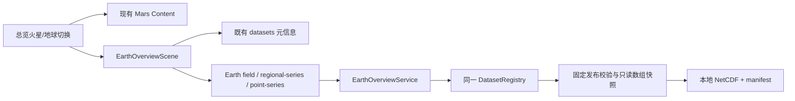

# 二维地球数据总览 Implementation Plan

> **For agentic workers:** 使用 `executing-plans` 技能逐项执行本方案，按复选框记录完成状态。本方案交给另一个对话实施；本次只交付计划。默认顺序实施，不创建额外对话或自动提交。用户已有指令优先于技能中的流程建议。

**Goal:** 在现有数据总览中切换到地球，按真实日期查看 MERRA-2 五个变量的二维区域场，逐日播放，并查看点位时间序列和覆盖区域的加权平均变化。

**Architecture:** 在第一步数据集注册表上增加同一发布版本的只读数据快照及三类总览 API。前端保留 Mars 总览组件，在同一路由条件挂载 Earth 场景；共用主题、色带和图表库，Earth 使用独立的日期、坐标和单位逻辑。

**Tech Stack:** FastAPI、Pydantic v2、NumPy/xarray/netCDF4；React 19、现有 Plotly、SVG、现有色带工具；pytest、Node 内置测试及真实浏览器验收。不新增在线地图 SDK、数据库表或前端状态库。

---

## 1. 范围、前置依赖和工作区规则

项目为 `D:\_Aresvision\Aresvision`。所有源码路径均相对该目录；后端简称路径以 `AresVision_backend/backend/` 为前缀。此文档属于项目功能设计，保存到未被 Git 忽略的 `docs/plans/`。

执行前阅读父目录 `AGENTS.md`，以及 [README](../../README.md) 的“快速接手”“模块与代码入口”“关键业务链路”“当前功能边界”“README 维护约定”。禁止批量删除或递归清理文件，不通过其他脚本语言绕过该约定。

第一步依赖：[数据集注册与训练任务身份方案](2026-09-23-dataset-registry-and-task-identity.md)；已实现契约入口：[数据集注册表](../dataset-registry.md)；数据协议：[Earth 小包](../earth-compact-dataset.md)。

### 本阶段必须完成

- 总览入口的“火星 / 地球”切换；默认仍为火星。
- 地球数据集元信息、可用状态、日期和变量选择。
- 全球经纬度底图上的区域热力图；未覆盖区域明确显示无数据。
- 日期选择、前一天/后一天、从首日重播、逐日播放/暂停。
- 臭氧、2 米温度、10 米东向风、10 米北向风、地表入射短波辐射五个变量。
- 点击有效网格查看当前值和完整逐日点位时间序列。
- 完整覆盖区域的逐日纬度余弦加权均值。
- 原始单位、网格分辨率、日期范围、抽样限制和数据来源说明。
- 请求过期保护、错误/缺数据状态、中英文、深浅主题、响应式布局、回归与浏览器验收。

### 本阶段保持的功能边界

Earth 训练和预测仍关闭；不制作三维地球，不新增风场粒子或派生风速，不接其他地球数据。不实现自选多边形区域、重网格、平滑/插值、臭氧单位换算、导出、PFI、季节诊断和 Earth Copilot。这里的“区域平均”固定指小包全部覆盖区域；不能称为全球平均。

页面直接展示物理量，TO3 为 DU、T2M 为 K、U10M/V10M 为 m s-1、SWGDN 为 W m-2。全局设置中的火星臭氧/温度单位不作用于 Earth；地球界面只显示本场景实际使用的单位说明，不增加弹窗审批。

## 2. 编制时核实的现状

2026-09-23 编制本方案时，第一步源码已经存在于当前工作树，尚有大量未提交修改。执行前重新核实，不凭方案声称第一步所有测试已通过；也不要覆盖其他对话的修改。

本次实际运行了 `DatasetRegistry(EARTH_MERRA2_DIR).get_dataset('earth_merra2_daily_v1')`：

```json
{
  "availability": "available",
  "availability_reason": null,
  "dataset_fingerprint": "74ce14752cb83932b29b458d9c19a61804861c270e6fec33f55316778ad64d31",
  "time": {
    "kind": "date", "calendar": "proleptic_gregorian",
    "start": "2020-01-01", "end": "2021-12-31", "count": 731,
    "step": 1, "step_unit": "day"
  },
  "capabilities": {
    "metadata": true, "training": false, "web_overview": false, "trained_prediction": false
  }
}
```

本次没有执行第一步完整回归，也没有运行地球 UI；下列内容仍为实施计划。

| 入口 | 已核实事实及影响 |
| --- | --- |
| `services/dataset_registry.py` | 有 `DatasetRegistry`、固定发布 SHA、锁、描述符缓存；Earth 文件变动会触发重新验证。外部代码不能直接访问其私有目录/expected SHA |
| `services/earth_dataset_metadata.py` | 校验发布指纹和 NetCDF 后生成元数据，再关闭已加载 dataset；可扩展以产出同一轮校验的数据快照 |
| `services/earth_dataset.py` | `load_earth_dataset()` 会加载小包并验证五个通道，禁止缺失值；原始五场数组约 22.2 MB |
| `routers/datasets.py`、`schemas/datasets.py` | 两个目录接口已存在；描述符含完整经纬度数组，API 不返回服务器路径 |
| `main.py` | 已装配 `app.state.dataset_registry`，新 service 复用同一实例 |
| `tests/conftest.py` | `earth_release` 构造 731 天、31×49 临时小包，当前场在空间上是常数；需要额外有空间变化的 fixture 才能发现经纬颠倒/均值错误 |
| `frontend/src/pages/DataOverviewPage.jsx` | 文件内有 `DataOverviewPageContent` 和默认 export；Mars 请求、播放和三维渲染均在 content 中，多项现有结构测试引用这个文件 |
| `DataOverviewContext.jsx` | 主要是 Mars 状态与纯计算；可以保留 provider 挂载来保留 Mars 用户选择，但 Earth 不读写其中的 MY/Ls |
| `DataOverviewPage/SidebarMenu.jsx` | Mars 左栏位于导航栏下方（top=70px），可在顶部放通用 planet switch，不挤入固定顶部状态条 |
| `DataOverviewPage/fieldGrid.js` | 默认 36×72、北到南纬度和全球经度，禁止用来处理 Earth 31×49 区域网格 |
| `PointProbeModal.jsx`、`TimelineController.jsx` | 直接绑定 Mars context 和单位/Ls；复用交互模式及通用组件，不能原样挂载在 Earth |
| `utils/colormaps.js` | 可复用 `getRgbStr()`、`makeGradient()`；不必创建第二套色表 |
| `react-plotly.js` | 已作为依赖用于曲线；Earth 曲线用真实日期，不走 Mars 的 research suite 请求 |
| `frontend/public/` | 未发现地球底图，只有 Mars 纹理等资源；本阶段增加本地海岸线 |

### 开工命令与依赖核查

项目根目录：

```powershell
git status --short --branch
git log -5 --oneline
git diff --stat
rg --files -g AGENTS.md -g '!node_modules' -g '!.venv' .
```

必须已有 `dataset_registry.py`、`earth_dataset_metadata.py`、目录路由/schema 和 `earth_release` fixture。若换 worktree，要带上当前未提交第一步依赖及运行数据配置，不能只检出 HEAD。缺少依赖时先定位第一步实际工作树或未合入补丁；不要复制一个不兼容注册表。无法获得时明确报告第一步依赖缺失，并完成不依赖它的地图纯函数、文档和 UI 布局工作。

## 3. 架构和文件边界



### 文件清单

| 动作 | 路径 | 职责 |
| --- | --- | --- |
| 修改 | `AresVision_backend/backend/services/earth_dataset_metadata.py` | 产出已验证 release snapshot，原 metadata 函数保持兼容 |
| 修改 | `AresVision_backend/backend/services/dataset_registry.py` | 唯一发布校验/快照缓存入口，新增受控 snapshot 方法 |
| 新增 | `AresVision_backend/backend/services/earth_overview_service.py` | 日期/变量/点位校验，场、点序列、区域加权均值 |
| 新增 | `AresVision_backend/backend/schemas/earth_overview.py` | 三种响应，有限浮点及日期/坐标契约 |
| 新增 | `AresVision_backend/backend/routers/earth_overview.py` | 三个 GET 接口和稳定错误映射 |
| 修改 | `AresVision_backend/backend/main.py` | 装配 service、挂载路由 |
| 扩展 | `AresVision_backend/backend/tests/conftest.py` | 独立 `earth_spatial_release` fixture，保留旧 fixture 值不变 |
| 新增 | `AresVision_backend/backend/tests/test_earth_overview_service.py` | 数值、日期、坐标、缓存变化行为 |
| 新增 | `AresVision_backend/backend/tests/test_earth_overview_routes.py` | API 形状、错误、身份和拒绝场景 |
| 修改 | `AresVision_backend/backend/tests/test_dataset_registry.py`、`test_dataset_routes.py` | 新 snapshot 生命周期、capability 更新 |
| 新增 | `frontend/src/services/datasets.js`、`datasets.test.js` | 公开元信息/地球总览 API 封装、结构化错误、AbortSignal |
| 修改 | `frontend/src/pages/DataOverviewPage.jsx` | planet 分支、状态持有、Mars 卸载请求清理；保留现有 Mars 实现所在文件 |
| 修改 | `frontend/src/pages/DataOverviewPage/SidebarMenu.jsx` | 顶部插槽容纳 planet switch |
| 新增 | `frontend/src/pages/DataOverviewPage/PlanetSceneSwitch.jsx` | 两个原生可访问按钮 |
| 新增 | `frontend/src/pages/DataOverviewPage/EarthOverview/EarthOverviewScene.jsx` | 页面组装、状态与元信息/场请求 |
| 新增 | `frontend/src/pages/DataOverviewPage/EarthOverview/useEarthOverview.js` | 请求、AbortController、当前身份/过期响应校验 |
| 新增 | `frontend/src/pages/DataOverviewPage/EarthOverview/earthOverviewModel.js`、`.test.js` | 日期、请求身份、payload 验证、下一播放步纯函数 |
| 新增 | `frontend/src/pages/DataOverviewPage/EarthOverview/earthRequestCoordinator.js`、`.test.js` | 每通道取消与最新请求 token，不写预测缓存 |
| 新增 | `frontend/src/pages/DataOverviewPage/EarthOverview/EarthMap2D.jsx` | SVG 底图/数据格/点选/色带 |
| 新增 | `frontend/src/pages/DataOverviewPage/EarthOverview/earthMapGeometry.js`、`.test.js` | 网格边界、投影、点击逆变换、海岸线拆分 |
| 新增 | `frontend/src/pages/DataOverviewPage/EarthOverview/EarthTimeline.jsx` | 受控日期与索引播放控件 |
| 新增 | `frontend/src/pages/DataOverviewPage/EarthOverview/EarthSeriesPanel.jsx` | 独立点/区域曲线、当前日期标记、状态 |
| 新增 | `frontend/src/pages/DataOverviewPage/EarthOverview/earthSeriesModel.js`、`.test.js` | 曲线日期/单位/采样语义，Plotly traces/layout 数据 |
| 新增 | `frontend/src/pages/DataOverviewPage/EarthOverview/earthOverview.css` | Earth 局部响应式布局，无全局 body 样式 |
| 新增 | `frontend/public/earth/ne_110m_coastline.geojson`、`README.md` | 本地公开海岸线与来源/许可/SHA |
| 修改 | `frontend/src/i18n/zh.js`、`en.js` | `earthOverview.*` 和 `overviewPlanet.*` 文案 |
| 新增 | `docs/earth-overview.md` | 已实现接口、UI、空间/时间/单位约定及实际验收 |
| 修改 | `README.md`、`docs/earth-compact-dataset.md`、`docs/dataset-registry.md` | 第二阶段完成状态与下一阶段边界 |

纯函数测试必须调用生产实际使用函数；不增加只检查文件中是否出现某字符串的 Earth 行为测试。现有 Mars 结构测试仍需回归。

## 4. 数据服务和 API 固定契约

### 4.1 只读发布快照与缓存

新增内部数据结构 `VerifiedEarthRelease`，在 `earth_dataset_metadata.py` 定义，字段为 `metadata: dict`、`signature: tuple`、`dates: np.ndarray`、`latitude: np.ndarray`、`longitude: np.ndarray`、`fields: Mapping[str, np.ndarray]`。五个 field 均为 `[T,H,W]` float32，日期为 `datetime64[D]`，坐标保持原始顺序。数组设为不可写，mapping 用只读包装；不通过 HTTP 直接返回该对象。

新增 `read_earth_release()`，与现有 `read_earth_metadata()` 使用相同参数。它沿用现有发布 SHA、文件语义检查和前后文件签名检查，在同一 `with ds:` 中复制需要的数组并关句柄。`read_earth_metadata()` 保留签名，通过调用 `read_earth_release(...).metadata` 返回独立副本；已有 standalone 调用不变。

注册表新增：

```text
get_earth_overview_snapshot(dataset_id, expected_fingerprint) -> VerifiedEarthRelease
```

由 registry 负责路径、release SHA、锁与校验；EarthOverviewService 不访问 `_earth_package_dir` 等私有字段。描述符查询与 snapshot 共享同一个验证结果和锁：

1. 获取 registry 锁后计算当前包签名，锁内判断缓存是否仍匹配。
2. 缓存失效时先清除旧描述符和旧数组，执行一次 release 读取与校验。
3. 缓存标签必须是**该次校验确认的 signature**；不能在校验返回后把任意较新的 `stat()` 结果贴到旧数组上。
4. 文件缺失、校验失败或加载中变化时，旧 snapshot 不再可用；目录仍按第一步协议返回状态。
5. 调用方 expected fingerprint 不同于当前已验证指纹，返回 409；不能返回新数据配旧元信息。
6. 同一进程最多缓存一份本小包的五场数组，不创建每日期/变量全量副本，不引入 Redis/SQLite 总览缓存。

用 registry 的锁串行这两个入口的 NetCDF 读取；同一进程内新代码不另开不受锁控制的读取器。字段响应转 JSON 时只复制一日，序列只返回 731 个标量。快照对象保存内存数组，关闭文件后仍可读。

每个 API 请求都先让 registry 检查包签名，再使用当前 snapshot；即使区域序列缓存命中，也不能绕过文件是否已变化的检查。服务的派生序列缓存按 fingerprint+variable 建键，发布变化时清空。

### 4.2 新 GET 接口

URL 前缀统一为 `/api/datasets/{dataset_id}/overview`，初版只支持 `earth_merra2_daily_v1`。公开只读，与第一步目录权限一致，不使用 Mars 上传来源参数。

所有请求必须传 `expected_fingerprint=<64位小写SHA>`，值来自当前元数据，不允许客户端传磁盘路径。这样一次页面会话不会把不同版本拼接展示。

| 接口 | 必传参数 | 可选参数 |
| --- | --- | --- |
| `/field` | `date=YYYY-MM-DD`, `variable`, `expected_fingerprint` | 无 |
| `/regional-series` | `variable`, `expected_fingerprint` | `start`, `end`（日期，缺省为完整覆盖期） |
| `/point-series` | `lat`, `lon`, `variable`, `expected_fingerprint` | `start`, `end` |

变量严格匹配 `TO3/U10M/V10M/T2M/SWGDN`。初版不接受 `wind`、`O3`、`temperature` 等别名，以免混用 Mars 字段。日期只接受完整 ISO date；不把时间戳、火星年、Ls 或整数样本下标解释为日期。

公共响应字段：

```text
dataset_id: string
dataset_version: string
dataset_fingerprint: string
planet: "earth"
variable: one of the five variable ids
units: original variable units
```

`/field` 增加：

```text
date: ISO date
calendar: Gregorian calendar from metadata
lat: H finite floats, ascending
lon: W finite floats, ascending
dimension_order: ["lat", "lon"]
field: H rows × W columns, finite physical values (never normalized)
coverage: {latitude_range:[south,north], longitude_range:[west,east], wrap_longitude:false}
color_range: {min:float, max:float, scope:"dataset", centered_on_zero:bool}
statistics: {min:float, max:float, regional_mean:float, valid_count:int}
```

`field[0][0]` 对应最南、最西点；不是图像左上角北纬。前端通过真实坐标绘图，不翻转后又重复翻转。

`/regional-series` 增加：

```text
start: ISO date
end: ISO date
dates: ascending consecutive ISO dates, inclusive endpoints
values: one finite mean per date
aggregation: "cos_lat_sample_mean"
coverage: same coverage object as field
```

`/point-series` 增加：

```text
start: ISO date
end: ISO date
requested: {lat:float, lon:float}
grid_point: {lat:float, lon:float, lat_index:int, lon_index:int}
selection: "nearest_grid_point"
dates: ascending consecutive ISO dates
values: original grid point values for each date
```

不为曲线接口增加当前 date 参数；当前值从 `dates` 对齐当前已显示场日期获取。这样播放只请求下一天场，不重复取点/区域全序列。

### 4.3 错误协议

统一响应 `{"detail":{"code":"...","message":"..."}}`，只有缺/坏包时增加安全的 `availability_reason`。前端按 code 翻译；不把服务器路径或 traceback 直接显示。

| 场景 | HTTP / code |
| --- | --- |
| 未注册 ID | 404 `unknown_dataset` |
| 已注册 Mars ID 请求新总览接口 | 409 `dataset_overview_not_supported` |
| expected fingerprint 与当前发布不一致 | 409 `dataset_version_changed` |
| 已注册 Earth 缺包/坏包/不可读 | 503 `dataset_unavailable` |
| 验证过程中包变化 | 503 `dataset_unavailable`，reason 为已有 package_changed 错误码 |
| 无效日期/日期不存在/日期越界 | 422 `invalid_date` / `date_out_of_range` |
| start > end | 422 `invalid_date_range` |
| 未支持 variable | 422 `unsupported_variable` |
| 经纬度超覆盖区（即使仍在全球范围内） | 422 `point_outside_coverage` |
| 缺必需参数、格式错误 SHA、NaN/Inf 坐标 | Pydantic 422，前端以 `invalid_request` 显示 |

严格禁止把越界点 clamp 到边缘或把 240° 经度 wrap 为 -120°。同距离最近邻取数组较小下标，前端/后端一致。

路由使用同步 handler，让 FastAPI 在线程池运行读取与 NumPy 计算；不在 `async def` 事件循环中直接做全文件加载。`main.py` 在 registry 装配后创建 `EarthOverviewService(app.state.dataset_registry)`，新路由只通过 app.state 获取。

### 4.4 区域均值和色带

区域均值定义为当前覆盖网格的纬度余弦加权**抽样点均值**：

```python
weights = np.cos(np.deg2rad(latitude)).astype(np.float64)
means = np.einsum("thw,h->t", field.astype(np.float64), weights) / (
    len(longitude) * weights.sum()
)
```

此式与现有独立预览脚本的语义一致；不是保守网格面积积分或全球总量。`field.statistics.regional_mean` 必须与同一天 `/regional-series` 完全一致（浮点容差内）。对全部有限值求值；遇到异常 NaN 不填零或静默改分母，失效为 invalid dataset。

色带在同一变量整个数据期固定，播放不能每帧自动重算范围：

- TO3、T2M、SWGDN：全数据 min/max，复用用户选定的现有 colormap。
- U10M、V10M：`[-max(abs(min),abs(max)), +max(abs(min),abs(max))]`，`centered_on_zero=true`，使用现有 `rdbu`，低值蓝/高值红，并标示东西/南北正负方向。
- 常数场：color min/max 可相等；前端统一使用色带中点，不除以零，不伪造实际统计 min/max。
- 色带 legend 和格子共用同一转换函数与范围；渲染颜色不改变数值。

## 5. 二维地图、时间和页面行为

### 5.1 地图坐标和无数据

首版用 SVG 等经纬度世界地图，`viewBox="0 0 360 180"`，坐标转换固定：

```javascript
export function project(lon, lat) {
  return { x: lon + 180, y: 90 - lat };
}
export function unproject(x, y) {
  return { lon: x - 180, lat: 90 - y };
}
```

保持 2:1 宽高比；禁止把区域数组当作全球纹理缩放。全部格子只覆盖 lon [-120,120]、lat [-60,60]；剩余地区保留底图、低对比斜线纹理和“无数据”图例。无数据不等于数值零，不进入颜色归一化或均值计算。

网格坐标是采样点中心，显示矩形边界取相邻中心中点，最外侧边界**裁至声明覆盖端点**：

```javascript
export function clippedCellEdges(values) {
  if (values.length < 2 || values.some((v, i) => !Number.isFinite(v) || (i > 0 && v <= values[i - 1]))) {
    throw new Error('Invalid ascending coordinate axis');
  }
  return [values[0], ...values.slice(1).map((v, i) => (values[i] + v) / 2), values.at(-1)];
}
export function gridCellRect(latEdges, lonEdges, row, col) {
  const south = latEdges[row], north = latEdges[row + 1];
  const west = lonEdges[col], east = lonEdges[col + 1];
  return { x: west + 180, y: 90 - north, width: east - west, height: north - south };
}
```

边缘半格是显示策略，不表示原数据经过面积平均。整个数据层再加 coverage clipPath 作为保障。不能额外补首尾重复列，不能经度环绕插值。

绘制顺序：地图底色/无数据纹理 → 1519 个有效数据格 → 真实海岸线和经纬网 → 区域边界和选中点 → hover 标记。海岸线不遮挡点击，设 `pointer-events:none`。格子 `shape-rendering:crispEdges` 减少细缝，SVG 当前帧通过 props 更新而不创建无限 DOM。

点击 SVG 时使用 `getScreenCTM().inverse()` 和 `DOMPoint` 换回 viewBox 坐标，不能按包含 letterbox 的整个 DOM bounding box 线性映射。区域外点击仅显示“此处无数据”，不发点位 API、不移动上一个有效点。覆盖边界上的点允许选择。

点位选择先前端快速显示最近采样点，再以 API 返回的 `grid_point` 为最终位置；选中的请求坐标和实际网格坐标均可查看。禁止插值点值。补充经纬度数值输入和“查看点位”按钮，供键盘用户使用，不为 1519 个格子创建 1519 个 tab stop。

### 5.2 本地海岸线资源

使用 Natural Earth 1:110m coastline，公开数据；开发时下载入仓库，浏览器运行时不依赖在线瓦片或外部 CDN。本次已验证以下 URL 返回 134 个 LineString 要素：

```text
URL: https://raw.githubusercontent.com/nvkelso/natural-earth-vector/master/geojson/ne_110m_coastline.geojson
文件字节数: 139907
SHA-256: 851f581ff5ffb844deed8ae1a9ce22e3c4bb3d74fa342cadb5d8e39b41ae7c3c
上游许可入口: https://www.naturalearthdata.com/about/terms-of-use/
本地位置: frontend/public/earth/ne_110m_coastline.geojson
```

使用 URL+内容 SHA 固定资源，不假装 mutable master 是固定 commit。下载值不匹配时检查上游变化并记录新的真实来源，不能忽略校验。`frontend/public/earth/README.md` 写明来源、抓取日期、公共领域说明、SHA 和“低分辨率轮廓仅作地理定位”。不在图中增加未经数据支持的政治边界。

每个 LineString 独立输出 SVG path；相邻经度差大于 180° 时断开为新的子路径，不能出现横跨全世界的海岸线。末点不自动 `Z` 闭合。测试包括跨 ±180° 的人工折线。

海岸线请求失败时保留经纬网和有效数据，并显示可重试的底图提示；不得阻止日期/数据查询。但正式交付必须包含本地资源并通过无外网请求的地图检查。

### 5.3 场景切换和布局

路由仍为 `#/overview`。本阶段不新增 React Router、不扩展预测页工作流、不把 planet 参数推入全局 Settings。

- `DataOverviewProvider` 保持在 `DataOverviewPage` 外层，其下 `OverviewSceneContent` 持有 `planet` 与 Earth 的 `date/variable/selectedPoint` 基本选择。
- `planet=mars` 时挂载现有 `DataOverviewPageContent`，`planet=earth` 时只挂载 `EarthOverviewScene`。Earth 不挂载 Mars3DBackground、摄像头、Mars 查询组件或 Copilot。
- 通用 `PlanetSceneSwitch` 放进 Mars 左栏顶部插槽；Earth 在主标题旁放同一组件。按钮使用 `type=button`、`aria-pressed`、可见焦点。
- 切换前暂停 Mars 播放；Mars content 卸载时 abort 场/点位请求、取消 timer，旧回包不能更新持久的 Mars provider。原 ozone overlay API 已使用 abort 状态判断但可能未传 signal；至少确保卸载 token 被取消，防止写状态。
- Earth 离开时暂停、清理所有请求和 timer；回到 Earth 保留基本选择，数据按当前 descriptor fingerprint 重新验证加载，不沿用未经验证的旧场。
- Earth 返回 Mars 时保留原 MY/Ls、变量和源选择，保持暂停。离开整个总览路由后按原有页面生命周期重置即可，不额外持久化 localStorage。

Earth 桌面布局：70px 全局导航栏下方增加正常文档流内容，左/上部控件与元信息，中部地图和色带，下方点位/区域曲线。地图不使用 Mars 固定双侧 HUD。推荐最大内容宽 1440px；<=900px 切单列，390px 屏宽不得横向溢出。地图可保持 2:1 概览并用数值坐标输入补充小屏精确点选，不在首版扩展平移缩放系统。

默认日期取元数据 `time.start`，默认变量 TO3；不得写死 731 或起始日期来代替 descriptor。Earth 缺包时仍可进入场景看到说明与重试，不自动切回 Mars 掩盖错误。

### 5.4 日期和逐日播放

所有状态使用 ISO 日期或元数据派生的日序号。JavaScript 用 UTC 毫秒/纯日期运算，禁止 `new Date(...).toLocaleDateString()` 引入前一天偏移。支持 2020-02-29。

- 日期输入 `min/max` 来自元数据；手动非法/越界值显示错误，不静默 clamp。
- 时间滑块以 0..count-1 为索引，label 始终显示实际日期；不是 Ls 0..360。
- 前/后一天和日期选择会暂停播放；到首尾时对应按钮禁用。
- 默认每个成功展示帧停留 600ms，再请求下一天。使用可清理的单次 `setTimeout`，不使用固定 interval 堆积未完成请求。
- 场尚在加载时不前进；失败立即暂停并显示重试。
- 最后一天展示后停止，停留末日；“从首日重播”显式回到首日再开始，不能循环悄悄换年。
- 切换 variable、点位手动选择、离开页面、标签页隐藏时暂停。暂停不取消正在加载的用户所选日期，但不得继续安排下一帧。

### 5.5 异步一致性与显示状态

请求分三个通道：`field`、`regional-series`、`point-series`，加独立元信息请求。每通道最多一个 active controller；新请求取消旧请求，并用 token+context 双重检查，即使模拟 fetch 不尊重 abort 也不会写旧结果。

```text
field identity = [dataset_id, fingerprint, variable, requested_date]
regional identity = [dataset_id, fingerprint, variable, start, end]
point identity = [dataset_id, fingerprint, variable, requested_lat, requested_lon, start, end]
```

成功还必须验证 payload 对应字段与请求一致、维度/坐标正确、日期数组长度等于 values 长度；不能只看 HTTP 200。客户端字段名、状态值和 request identity 统一使用这些定义。

区分 `requestedDate` 和 `field.date`：加载新日期时可以保留旧场，但标题和标记仍显示旧 `field.date`，另显示“正在加载 requestedDate”；不允许把旧值标成新日期。切换变量时清空旧场/旧曲线，不让温度数值配 DU。版本变化/不可用时清空场、图例、曲线、point 当前值并暂停，只保留可重试错误状态。

409 version_changed：清空本场景缓存，重新请求 descriptor 一次，更新选择范围并等待用户继续；不能无限自动重试。503 unavailable：保留错误提示和手动刷新；不显示旧数据作为当前成功结果。AbortError 不弹错误。

只允许有界内存缓存：区域序列每 fingerprint 每变量最多一份；点序列最多一个当前点；场只保留当前成功帧。不把响应写入现有 `predictCache`、认证会话或 SQLite。

## 6. 实施任务

### 任务 1：增加验证快照，保持第一步协议

**文件：**metadata、registry、现有 registry 测试。

- [ ] 先写快照正确性测试：公开 descriptor 与内部 snapshot 相同 fingerprint，数组 shape/日期/单位对应；数组不可修改；重复查询只验证一次。
- [ ] 增加 `VerifiedEarthRelease` 并提取已有验证流程，避免复制第二套 manifest 检查。

```python
from dataclasses import dataclass
from types import MappingProxyType
from typing import Mapping
import numpy as np

@dataclass(frozen=True)
class VerifiedEarthRelease:
    metadata: dict
    signature: tuple
    dates: np.ndarray
    latitude: np.ndarray
    longitude: np.ndarray
    fields: Mapping[str, np.ndarray]

def readonly_array(values, dtype=None):
    result = np.array(values, dtype=dtype, copy=True)
    result.setflags(write=False)
    return result
```

在现有 `read_earth_metadata()` 的 `with ds:` 内已有 `_extract_metadata()` 返回值基础上，创建以下内容；移入 `read_earth_release()`，结束后保留现有签名变化检查：

```python
release = VerifiedEarthRelease(
    metadata=metadata,
    signature=signature_before,
    dates=readonly_array(ds.time.values, "datetime64[D]"),
    latitude=readonly_array(ds.lat.values),
    longitude=readonly_array(ds.lon.values),
    fields=MappingProxyType({name: readonly_array(ds[name].values, "float32") for name in CHANNELS}),
)
```

- [ ] registry 私有统一加载函数同时缓存 release 和 descriptor，返回 descriptor 深拷贝。snapshot 方法先用已有 ID 校验区分 404/409，再验证 availability/fingerprint，返回不可写数组；metadata 也给调用者副本，避免篡改缓存。
- [ ] 加入“成功后文件被替换/消失/验证中变化”的测试，证明旧 snapshot 和派生缓存不再被使用；锁内检查签名并用实际校验 signature 标记缓存。
- [ ] 运行现有 `test_dataset_registry.py`、`test_dataset_routes.py`、`test_earth_dataset.py`。本任务暂不切换 `web_overview=true`，完整入口联调后统一开启。

### 任务 2：Earth 数值服务与可发现坐标错误的 fixture

**文件：**新增 service 和服务测试，扩展 opt-in fixtures。

- [ ] 新 fixture 复用现有构建工具，但场值设计为 `1000*t + 10*row + col`（每变量可加固定 offset），使翻转/转置可见；保持 731 天、31×49、五通道和真实日期。不要更改现有 `earth_release` 的数据，否则可能破坏第一步断言。
- [ ] service 构造只接收 registry，暴露三个方法，与 API 参数同名：

```text
get_field(dataset_id, expected_fingerprint, date, variable) -> dict
get_regional_series(dataset_id, expected_fingerprint, variable, start=None, end=None) -> dict
get_point_series(dataset_id, expected_fingerprint, variable, lat, lon, start=None, end=None) -> dict
```

- [ ] 实现以下独立校验函数；不要调用 Mars 单位服务或 `EarthOzoneWindows`（后者会归一化）。

```python
import datetime as dt
import re
import numpy as np

class EarthOverviewError(ValueError):
    def __init__(self, code, message, status_code=422):
        super().__init__(message)
        self.code, self.status_code = code, status_code

def require_date_index(value, dates):
    if not isinstance(value, str) or re.fullmatch(r"\d{4}-\d{2}-\d{2}", value) is None:
        raise EarthOverviewError("invalid_date", "Use YYYY-MM-DD")
    try:
        target = np.datetime64(dt.date.fromisoformat(value), "D")
    except ValueError as exc:
        raise EarthOverviewError("invalid_date", "Invalid calendar date") from exc
    index = int(np.searchsorted(dates, target))
    if index == len(dates) or dates[index] != target:
        raise EarthOverviewError("date_out_of_range", "Date is outside the available range")
    return index

def nearest_grid_index(axis, value):
    if not np.isfinite(value) or value < axis[0] or value > axis[-1]:
        raise EarthOverviewError("point_outside_coverage", "Point is outside the data coverage")
    return int(np.argmin(np.abs(axis.astype(np.float64) - value)))
```

- [ ] 同一变量派生均值和色带范围按发布身份缓存；变量声明从 descriptor 和 snapshot 对应，单位从已验证 metadata 读取。日期裁切含端点；start/end 任一超界都拒绝，不 clamp。
- [ ] 加入独立手算权重测试（不能只调用同一生产函数计算 expected）：

```python
import numpy as np
import pytest

def test_cosine_weighting_is_not_an_unweighted_global_average():
    from services.earth_overview_service import regional_sample_mean
    field = np.array([[[20, 20], [0, 0], [20, 20]]], dtype=np.float32)
    actual = regional_sample_mean(field, np.array([-60, 0, 60]))
    assert actual[0] == pytest.approx(10.0)
    assert actual[0] != pytest.approx(float(field.mean()))
```

`regional_sample_mean(field, latitude)` 作为服务实际使用函数，按 4.4 的公式实现，检查 shape/有限值。

- [ ] 测试 `2020-02-28/29/03-01` 对应连续下标、`2021-02-29` 拒绝；首尾日；小数经纬最近邻 tie；±120°边界允许；±120.001°/±60.001°拒绝；不得 wrap 240°。
- [ ] field 点值与 point-series 同日期值相同；field region mean 与 regional-series 相同；五变量单位原样返回；U/V 色带固定对称；逐日期不改变范围；常数场不产生 NaN。
- [ ] 未知/Mars ID、缺/坏包、旧 fingerprint 均明确失败。测试缓存命中之后文件损坏，也必须失败，不返回旧 200。
- [ ] 运行 `python -m pytest tests/test_earth_overview_service.py -q`，临时目录要求见任务 9。

### 任务 3：响应 Schema、路由和 HTTP 集成测试

**文件：**新增 schemas/router/route tests，修改 main。

- [ ] 按 4.2 定义 `EarthFieldResponse`、`EarthRegionalSeriesResponse`、`EarthPointSeriesResponse`，共用 `EarthResponseIdentity`、`EarthCoverage`。使用 `ConfigDict(allow_inf_nan=False)`；响应有限值验证、矩阵形状与坐标长度对齐由服务和测试共同保障。
- [ ] Query 中 SHA 用 `pattern=r'^[0-9a-f]{64}$'`；lat/lon 使用 `FiniteFloat`；variable/date 不设会悄悄默认值的 fallback。unknown variable 走服务固定错误码。
- [ ] new router 的路径形式：

```python
router = APIRouter(prefix="/datasets/{dataset_id}/overview", tags=["Earth Overview"])

@router.get("/field", response_model=EarthFieldResponse)
def get_field(
    request: Request, dataset_id: str,
    date: str = Query(...), variable: str = Query(...),
    expected_fingerprint: str = Query(..., pattern=r"^[0-9a-f]{64}$"),
):
    try:
        return request.app.state.earth_overview_service.get_field(
            dataset_id=dataset_id, expected_fingerprint=expected_fingerprint,
            date=date, variable=variable,
        )
    except (DatasetRequestError, EarthOverviewError) as exc:
        raise HTTPException(status_code=exc.status_code, detail={
            "code": exc.code, "message": str(exc),
        }) from exc
```

服务/registry 的 `dataset_unavailable` 异常额外携带安全 `availability_reason`；统一 helper 在三条 route 映射，保持代码/状态一致。需要定义 helper 及两个另外的完整 handler，不能只挂一条演示接口。
- [ ] `main.py` 在 registry 之后装配 service，使用 `API_PREFIX` 挂载 router。不实例化第二个 registry，不新增 DB migration。
- [ ] TestClient 用隔离 FastAPI + fixture registry + service 挂载三接口；不为了数据接口测试启动完整应用的训练、邮件、用户数据库。
- [ ] 以下断言作为 HTTP 成功基础，再覆盖 4.3 全部错误路径：

```python
def test_field_and_series_agree(earth_client):
    client, fingerprint = earth_client
    params = {"variable": "TO3", "expected_fingerprint": fingerprint}
    prefix = "/api/datasets/earth_merra2_daily_v1/overview"
    field = client.get(prefix + "/field", params={**params, "date": "2020-02-29"})
    point = client.get(prefix + "/point-series", params={**params, "lat": 0, "lon": 0})
    region = client.get(prefix + "/regional-series", params=params)
    assert field.status_code == point.status_code == region.status_code == 200
    f, p, r = field.json(), point.json(), region.json()
    index = p["dates"].index(f["date"])
    row, col = p["grid_point"]["lat_index"], p["grid_point"]["lon_index"]
    assert f["field"][row][col] == p["values"][index]
    assert f["statistics"]["regional_mean"] == pytest.approx(r["values"][index])
    assert f["units"] == p["units"] == r["units"] == "DU"
```

在 `test_earth_overview_routes.py` 定义 `earth_client` fixture：用 `earth_spatial_release` 构造 registry，查询 fingerprint，挂载 service/router，`with TestClient(app) as client: yield client, fingerprint`。
- [ ] 运行服务/API 和第一步目录回归，保留 Earth 训练拒绝测试。

### 任务 4：前端 API、日期和请求身份纯逻辑

**文件：**datasets API 模块、model/coordinator 及 Node 测试。

- [ ] 新 API 模块暴露 `fetchDatasets({signal})`、`fetchDataset(id,{signal})`、`fetchEarthField(id,params,{signal})`、`fetchEarthRegionalSeries(...)`、`fetchEarthPointSeries(...)`。公共读取用 fetch，不修改现有 `api.js` 的全局错误/认证语义。
- [ ] `URLSearchParams` 构造参数，`encodeURIComponent(id)` 构造路径；取消信号传给 fetch。错误类保存 `code/status/availabilityReason`；string detail/422 validation array/网络错误都有可读兜底，AbortError 原样传播。
- [ ] 编写 fetch mock 测试请求 URL、date、lat/lon 和 fingerprint 原样传递，不包含 `my/ls/data_source/upload_id`，验证 signal 与 structured 409/503。
- [ ] 日期纯函数实现 strict ISO 校验和 UTC 步进，跨闰日不受操作系统时区影响：

```javascript
const DAY_MS = 86_400_000;
export function isoDayNumber(value) {
  if (!/^\d{4}-\d{2}-\d{2}$/.test(value)) throw new Error('Invalid ISO date');
  const timestamp = Date.parse(`${value}T00:00:00Z`);
  if (!Number.isFinite(timestamp) || new Date(timestamp).toISOString().slice(0, 10) !== value) {
    throw new Error('Invalid ISO date');
  }
  return timestamp / DAY_MS;
}
export function dateAtIndex(start, index) {
  if (!Number.isInteger(index)) throw new Error('Invalid day index');
  return new Date((isoDayNumber(start) + index) * DAY_MS).toISOString().slice(0, 10);
}
export function nextPlaybackDate({ start, end, displayedDate, requestedDate, ready, playing }) {
  if (!playing || !ready || displayedDate !== requestedDate || displayedDate >= end) return null;
  return dateAtIndex(start, isoDayNumber(displayedDate) - isoDayNumber(start) + 1);
}
```

- [ ] coordinator 是 Earth 独立、小型通用实现，不导入 `predictCache`；每通道 abort + token 检查：

```javascript
export function createEarthRequestCoordinator() {
  const active = new Map();
  return {
    start(channel, contextKey) {
      active.get(channel)?.controller.abort();
      const controller = new AbortController();
      const token = { channel, contextKey, controller, signal: controller.signal };
      active.set(channel, token);
      return token;
    },
    isCurrent(token, contextKey = token.contextKey) {
      return active.get(token.channel) === token && !token.signal.aborted && token.contextKey === contextKey;
    },
    invalidateAll() {
      for (const token of active.values()) token.controller.abort();
      active.clear();
    },
  };
}
```

- [ ] Node 测试模拟 A 请求比 B 晚返回且不尊重 abort，保证只能接受 B；取消场请求不取消点序列通道；invalidate 后所有 token 无效。
- [ ] payload 校验函数在真实 hook 中使用：核对公共身份、field date/units、H/W/ascending coords、finite values、coverage、序列日期唯一递增和 lengths。descriptor 缺动态字段时不发 field 请求。
- [ ] 使用 `node --test` 运行新纯函数/API 测试，先失败再实现。

### 任务 5：本地底图和二维地图组件

**文件：**本地海岸线、geometry、EarthMap2D、Node 测试。

- [ ] 下载并核验 5.2 指定文件，保存 asset README。脚本应先验证 bytes/hash 再写目标，已存在且不同内容时停止替换；不删除原文件。下载依赖故障先完成可独立执行的地图逻辑，再明确报告资源未齐。
- [ ] geometry 实现 5.1 函数、最近邻与 `splitCoastline()`：超过 180°经度跳变断开，不闭合、不重复首尾列。
- [ ] 加入覆盖边缘几何测试，防止热力图自动长到 62°纬度或122.5°经度：

```javascript
import test from 'node:test';
import assert from 'node:assert/strict';
import { clippedCellEdges, gridCellRect, project, unproject } from './earthMapGeometry.js';

test('edge cells end exactly at regional limits', () => {
  const lat = Array.from({ length: 31 }, (_, i) => -60 + i * 4);
  const lon = Array.from({ length: 49 }, (_, i) => -120 + i * 5);
  const a = clippedCellEdges(lat), b = clippedCellEdges(lon);
  const southwest = gridCellRect(a, b, 0, 0);
  const northeast = gridCellRect(a, b, 30, 48);
  assert.deepEqual(southwest, { x: 60, y: 148, width: 2.5, height: 2 });
  assert.deepEqual(northeast, { x: 297.5, y: 30, width: 2.5, height: 2 });
  assert.deepEqual(unproject(...Object.values(project(0, 0))), { lon: 0, lat: 0 });
});
```

- [ ] EarthMap2D 仅接收受校验 field/descriptor、selectedPoint、colormap、onPointSelect；不自行 fetch 数据、不访问 Mars context。
- [ ] 用真实 lat/lon loops 创建 SVG 矩形，fill 复用 `getRgbStr`。无数据底层为斜纹；coverage clip 裁剪图层；图例包含 min/max/单位和“区域外无数据”。SVG id 使用 React `useId()`，避免 clipPath 在多实例间冲突。
- [ ] 添加 hover 提示和 click inverse transform；使用 `getScreenCTM()` 消除缩放/页面偏移问题，边界检查后发请求。
- [ ] 地图 geojson 仅从 `/earth/ne_110m_coastline.geojson` 加载一次，支持本地失败重试；不能浏览器回退请求 GitHub/CDN。
- [ ] 配合独立小数据 fixture 进行实际浏览器检查：南西样本和东北样本的值、方向正确；边界外透明/斜纹；世界海岸线无跨图长线。截图不能代替数值断言。

### 任务 6：场景切换、页面状态、日期播放

**文件：**DataOverviewPage、SidebarMenu、新 switch/scene/hook/timeline/CSS。

- [ ] `SidebarMenu({sceneSwitch=null})` 在第一个业务控件前渲染插槽；保持其他 props/context 和固定 sidebar 布局。Mars content 接收 `sceneSwitch`，传入 SidebarMenu。
- [ ] `DataOverviewPage` 继续包现有 provider，在其内新建 `OverviewSceneContent` 持有场景选择，下面是组装形状（实际 import 和回调在对应文件完整实现）：

```jsx
function OverviewSceneContent() {
  const [planet, setPlanet] = useState('mars');
  const [earthSelection, setEarthSelection] = useState({ date: null, variable: 'TO3', point: null });
  const { setIsPlayingTimeline } = useDataOverview();
  const switchPlanet = (next) => {
    setIsPlayingTimeline(false);
    setPlanet(next);
  };
  const sceneSwitch = <PlanetSceneSwitch value={planet} onChange={switchPlanet} />;
  return planet === 'earth'
    ? <EarthOverviewScene selection={earthSelection} onSelectionChange={setEarthSelection} sceneSwitch={sceneSwitch} />
    : <DataOverviewPageContent sceneSwitch={sceneSwitch} />;
}
```

保持 `DataOverviewPageContent` 在原文件，避免无关搬迁导致 Mars 结构测试大面积失效。进入 Earth 的分支不得同时 hidden 挂载 MarsContent。
- [ ] 加强 Mars content 的卸载清理：abort `mainAbortRef`、`overlayAbortRef`、`pointProbeAbortRef`，取消 timer；使用每个请求的 active/token guard。不要改原 Mars 600ms interval 的业务行为。
- [ ] Earth hook 用 descriptor 请求初始化选择；`selection.date=null` 取 time.start，否则验证仍在范围。默认变量 TO3，原 selected point 合法才保留。字段失败不得被 catch 后替换成全零 field。
- [ ] field/regional/point 请求按 5.5 独立 effects/coordinator；每 effect 返回 abort cleanup，卸载 `invalidateAll()`；失败更新对应状态，过期请求连 error/loading 也不能覆盖。
- [ ] `EarthTimeline` 受控 props 包括 start/end/requestedDate/displayedDate/playing/loading/error/onDateChange/onPlayChange/onRestart。上一天/下一天/date input/range 触发同一选择函数，校验及暂停逻辑不分叉。
- [ ] 播放 effect 只在 `nextPlaybackDate()` 返回非空时 setTimeout 600ms，回调更新 requested date 后进入 loading；cleanup 清 timer。在末日把 playing=false，不回到首日。document visibility hidden 时暂停，组件卸载移除事件。
- [ ] Earth CSS 使用 `padding-top: 86px` 留出既有导航；布局正常滚动，采用主题 CSS 变量。图例、标题、日期控件不与全局 nav/SettingsFab 重叠。390/900/1440px 实际检查。
- [ ] 请求延迟浏览器验收：连续切三天/两变量/两个点，最后画面都对应最后选择；Earth→Mars→Earth 没有旧响应写入或重开摄像头；播放取消正确。

### 任务 7：点位与区域曲线、元信息和文案

**文件：**EarthSeriesPanel、series model/tests、i18n、Scene。

- [ ] 使用两个独立 Plotly 面板，x=ISO date、y=物理值；区域曲线全年显示，点位未选时显示“在地图点选或输入经纬度”。曲线不做 Z-score、平滑或插值，`connectgaps=false`。
- [ ] 同一变量的点序列可叠加一条区域均值作对照，但 legend 必须区分；所有线共用同一物理单位。默认建议两张图避免把“点”和“区域”误读为同一数据。
- [ ] 竖线/marker 跟随**已展示 field.date**；加载新场时不得把 marker 先移到尚未展示的日期。鼠标点曲线的日期可调用统一日期选择入口并暂停播放。
- [ ] 点位标题显示实际 grid_point 经纬，tooltip 可显示 requested 坐标；当前数值按 field.date 在序列查找，找不到时显示无数据，不能用邻近日期偷偷替代。
- [ ] Series model 测试使用跨闰日序列和空间非均匀 fixture，验证 trace x/y/units、marker 日期、选点无数据和 stale identity 不被显示。
- [ ] 增加中英文文案至少包含以下语义，所有交互按钮和错误状态也须有翻译：

| 中文 | 英文 |
| --- | --- |
| 火星 / 地球 | Mars / Earth |
| 地球日数据总览 | Earth daily data overview |
| 臭氧柱浓度 / 东向风 / 北向风 / 2 米温度 / 地表短波辐射 | Total column ozone / Eastward wind / Northward wind / 2 m temperature / Surface shortwave radiation |
| 数据日期 / 前一天 / 后一天 / 从首日重播 | Data date / Previous day / Next day / Replay from first day |
| 正在加载所选日期 | Loading selected date |
| 区域外无数据 | No data outside coverage |
| 所选网格点 / 请求位置 | Selected grid point / Requested location |
| 覆盖区域平均（纬度余弦加权） | Coverage mean (cosine latitude weighted) |
| 原始单位 / 日平均 / 点抽样网格 | Original units / Daily mean / Point-subsampled grid |
| 数据包不可用 / 版本已变化，请刷新 | Dataset unavailable / Dataset version changed; refresh |
| 此底图仅用于地理定位 | Basemap for geographic reference only |

- [ ] 数据说明卡显示来源 MERRA-2、日期范围、31×49 和4°×5°（均来自 descriptor）、范围 ±60°/±120°、单位；说明两年日均/空间点抽样/非全球。ID/version 可在详情折叠区展示，SHA 和内部 schema 不占主操作流。
- [ ] 风控件是 U10M/V10M 两个明确选项；不能用其中一个表示风速。辐射 label 明确 SWGDN 入射地表短波，不用 Mars 的太阳相位解释。

### 任务 8：能力开关和文档同步

**文件：**registry capability、相关测试、三篇现有文档及新专题。

- [ ] API 和前端完成且验证后，将 Earth `web_overview` 改为 true；`metadata=true`、`training=false`、`trained_prediction=false` 保持语义。capability 表示入口适配，所以缺包 Earth 也可声明 `web_overview=true`，前端同时要求 `availability=available` 才请求数据。
- [ ] 更新第一步测试中对应 capability 断言，保留训练拒绝、版本 SHA 等断言。不要把两个 Mars 训练 ID 的 web_overview 自动改为 true，现有 Mars 总览仍通过原源选择协议运行。
- [ ] 原 manifest 固定发布内容不改写，生产 SHA 不变。registry 返回的 limitations 目前包含历史“读取器尚未接注册表”等说明；保留物理数据限制，当前应用能力说明由 registry 生成，不能将旧 manifest capability 文案直接照搬到 UI。添加测试确保 API 不再宣称 Earth 总览未接入。
- [ ] 新 `docs/earth-overview.md` 写明三个接口、参数/错误、日期和点选语义、区域均值公式、渲染边界、底图来源、可用与未开放功能。
- [ ] README 同步主要功能、模块入口、业务链路和当前边界；Earth 小包文档和注册表文档更新第二阶段完成状态。原第一阶段验证记录作为历史保留，新增本次实际验证范围，不改写过去测试结果。
- [ ] 不新增配置或依赖时明确沿用 `ARESVISION_EARTH_MERRA2_DIR`；新增运行命令必须写执行目录。不要在 README 写本机绝对数据路径或暂态分支。

### 任务 9：回归、真实值比对和浏览器验收

- [ ] 执行第 7 节矩阵，记录实际结果与没执行的原因。
- [ ] 独立读取真实 NetCDF，对三日期×五变量×三个坐标比对45个点值，另比对15个区域均值；不使用 service 自身函数生成 expected。
- [ ] 使用真实浏览器验证完整交互；通过已有浏览器工具执行时按该工具/技能要求操作。纯 Node 单元测试和截图不能替代交互验收。
- [ ] 检查 Git diff 与文档链接；没有新数据库、权重、训练任务、运行数据或意外依赖锁文件变更。保留第一步及其他既有未提交修改。
- [ ] 交付改变的用户行为、API、真实执行的测试、截图/验证记录和仍未开放的训练/预测/三维；不自动提交、推送或创建 PR。

## 7. 验收矩阵与命令

### 自动化与人工必测

| 编号 | 场景 | 预期 |
| --- | --- | --- |
| B1 | field 首/尾日、闰日、五变量 | shape/数值/日期/单位正确，无归一化 |
| B2 | 点系列与场交叉比对 | 同一日、网格点数值一致，坐标索引无转置 |
| B3 | 区域加权均值 | 手算用例通过，field 与序列同日一致 |
| B4 | 越界日期、范围、坐标、未知变量/ID | 明确4xx，不 clamp/wrap/fallback |
| B5 | 缺包、坏包、替换包、请求旧 fingerprint | 503/409，旧缓存不可继续作为成功结果 |
| B6 | 多次并发读取 | 单快照、句柄关闭、数组不可写、缓存不串 |
| F1 | 地图四角和赤道测试 | row0 在南、lon0 在西，无镜像/转置 |
| F2 | 全世界视图 | 有色面积恰在区域内；全球其余位置标无数据 |
| F3 | map点选+键盘经纬度输入 | 最近点一致，边界外无请求；同距取较小下标 |
| F4 | 日期控制与播放 | 连续逐日、含闰日、慢网无跳帧、末日停止 |
| F5 | 日期/变量/点位快速切换 | 只有最新请求被应用，错误/加载状态也不被旧请求覆盖 |
| F6 | 跨planet切换 | 停止播放与请求、Mars选择保留、Earth无摄像头/Mars查询 |
| F7 | 曲线 | 全731日、原单位、当前展示日标记，不以全球均值命名 |
| F8 | 色带设置 | 数值不变、同变量日期间范围固定、风场零点居中 |
| F9 | 中英文、深浅主题、390/900/1440px | 可读、可操作，无页面横向溢出或遮挡 |
| F10 | 离线底图 | 无外部瓦片/CDN请求，本地海岸线正确，无横跨地图错误连线 |
| C1 | 原Mars总览/上传图层/点探查/播放 | 对应回归和人工抽查保持 |
| C2 | 第一阶段身份与训练限制 | 目录一致，Earth训练仍409，数据库/权重无新变更 |

### 后端验证

从 `AresVision_backend/backend/` 执行，使用现有项目 Python。先验证依赖，不无理由安装或切换全局环境。每次使用新的 ASCII 临时目录，不清理已有目录。

```powershell
$earthOverviewTemp = Join-Path ([IO.Path]::GetTempPath()) ('earth-overview-' + [guid]::NewGuid().ToString('N'))
python -m pytest tests/test_earth_overview_service.py tests/test_earth_overview_routes.py -q --basetemp "$earthOverviewTemp"
```

第一步与 Mars 回归建议分独立进程，避免仓库已有测试对模块 mock 的污染；每次生成新的 basetemp：

```powershell
$earthRegressionFiles = @(
  'tests/test_dataset_registry.py',
  'tests/test_dataset_routes.py',
  'tests/test_earth_dataset.py',
  'tests/test_training_dataset_identity.py',
  'tests/test_analysis_overview_uploaded_sources.py',
  'tests/test_mcd_overview_service.py'
)
foreach ($earthTestFile in $earthRegressionFiles) {
  $earthRunTemp = Join-Path ([IO.Path]::GetTempPath()) ('earth-regression-' + [guid]::NewGuid().ToString('N'))
  python -m pytest $earthTestFile -q --basetemp "$earthRunTemp"
  if ($LASTEXITCODE -ne 0) { throw "Test failed: $earthTestFile" }
}
```

如果系统 Temp 路径含非 ASCII 字符，将临时根目录设为父工作区下新的英文目录，以免 Windows NetCDF 路径问题。不要复用/删除旧临时目录。

### 前端验证

从 `frontend/` 执行：

```powershell
node --test src/services/datasets.test.js src/pages/DataOverviewPage/EarthOverview/earthOverviewModel.test.js src/pages/DataOverviewPage/EarthOverview/earthRequestCoordinator.test.js src/pages/DataOverviewPage/EarthOverview/earthMapGeometry.test.js src/pages/DataOverviewPage/EarthOverview/earthSeriesModel.test.js
node --test
npm run build
```

预期新测试和相关既有测试全部通过、build 成功。已有失败要核对改动前基线后如实记录，不能删除旧断言或把失败说成通过；需要改结构测试时保留它检查的原交互语义。

### 真实数据只读数值核对

实现后从后端运行如下脚本。只使用 registry/service 和原始读取器，不启动数据库/训练子进程：

```powershell
@'
import numpy as np
from config import EARTH_MERRA2_DIR
from services.dataset_registry import DatasetRegistry
from services.earth_dataset import CHANNELS, load_earth_dataset
from services.earth_overview_service import EarthOverviewService

registry = DatasetRegistry(EARTH_MERRA2_DIR)
descriptor = registry.get_dataset("earth_merra2_daily_v1")
assert descriptor["availability"] == "available", descriptor["availability_reason"]
service = EarthOverviewService(registry)
common = {"dataset_id": descriptor["dataset_id"], "expected_fingerprint": descriptor["dataset_fingerprint"]}
with load_earth_dataset(EARTH_MERRA2_DIR / "earth_merra2_daily.nc") as ds:
    for date in ("2020-01-01", "2020-02-29", "2021-12-31"):
        for variable in CHANNELS:
            f = service.get_field(**common, date=date, variable=variable)
            raw = ds[variable].sel(time=date).values
            np.testing.assert_array_equal(np.asarray(f["field"], dtype="float32"), raw)
            for lat, lon in ((-60, -120), (0, 0), (60, 120)):
                p = service.get_point_series(**common, variable=variable, lat=lat, lon=lon)
                value = p["values"][p["dates"].index(date)]
                assert value == float(ds[variable].sel(time=date, lat=lat, lon=lon))
            w = np.cos(np.deg2rad(ds.lat.values.astype("float64")))
            expected = sum(float(raw[row].mean(dtype="float64")) * w[row] for row in range(len(w))) / sum(w)
            np.testing.assert_allclose(f["statistics"]["regional_mean"], expected, rtol=1e-10, atol=1e-8)
print("Verified 45 point values and 15 regional means against local NetCDF")
'@ | python -B -
```

### 网页完整路径

使用工作区现有启动方式，先确认是否已有服务，避免随意重启其他任务的进程。浏览器加载开发服务或明确已构建版本；生产 dist 不会因源码改动自动刷新。

1. 打开 `#/overview`，确认默认 Mars。
2. 切 Earth，初始日期与 TO3/DU 正确，地图只在区域内着色。
3. 选 `2020-02-29`，依次切五变量，检查单位与实际场值；全局 Mars 单位设定不改变 Earth 数值。
4. 点击赤道0°经度，检查 snapped 坐标、当前值、731日点曲线；点覆盖区外，无数据提示且无点API请求。
5. 播放从2月28日跨闰日；模拟慢网、快速改日期与变量；暂停/末日停止正确。
6. Earth→Mars，确认停止 Earth 请求且 Mars 原选择保留；再回 Earth 正确重读身份。
7. 查看区域曲线、数据说明；主题和语言切换；390px 屏宽可操作。
8. 网络面板确认底图只来自本地资源；console 无本次新增错误。
9. 使用隔离测试 fixture 模拟缺包/旧 fingerprint/接口故障，确认清场与重试，不能破坏真实数据文件来制造故障。

将桌面地图、手机布局、点位/区域曲线至少三张验收截图保存到工作区明确的输出目录，在交付中提供路径；运行截图不必提交 Git。记录真实检查结果，不照抄此列表当成已执行。

## 8. 完成定义

- [ ] 第一阶段元数据和发布身份仍可靠，Earth web_overview=true 仅在本阶段完成后声明。
- [ ] 网页可以切 Earth、选日期与变量、正确渲染局部地图。
- [ ] 域外无数据、无全球拉伸/首尾连接/填零，无经纬度转置。
- [ ] 点曲线和区域均值可用，物理单位、实际日期、抽样含义准确。
- [ ] 播放、跨场景、迟到响应和缺包错误有实际验证。
- [ ] Mars 功能与第一步任务身份兼容回归完成。
- [ ] README、注册表、Earth小包和新总览文档同步，测试与截图可追溯。
- [ ] Earth训练、预测、三维仍未开放；下一步才进入 DLinear 7天输入/3天输出训练接入。

## 9. 可复制到执行对话的指令

```text
请实施 D:\_Aresvision\Aresvision\docs\plans\2026-09-23-earth-overview-2d.md。

先阅读 AGENTS.md、README 接手章节和第一步已实现的数据集注册协议，核对 Git 状态；保留当前未提交的第一步修改与 Earth 小包代码。按方案完成第二步“二维地球数据总览”：同一发布身份的只读数据快照、日期场/点序列/区域均值API、火星/地球切换、局部覆盖二维地图、真实日期逐日播放和五变量原始单位展示。

重点验证未覆盖区域为无数据、经纬度不翻转或首尾连线、闰日正确、区域均值为纬度余弦加权、迟到请求不覆盖新选择。复用现有主题、色带和 Plotly，底图使用本地资源。Earth 训练、预测和三维不在本阶段开放。

完成后同步 README 与专题文档，运行相关 pytest、Node测试、前端构建、真实数据只读比对和浏览器验收，报告实际结果。不要批量删除文件、修改真实数据以制造错误、创建训练任务、自动提交或推送。
```
