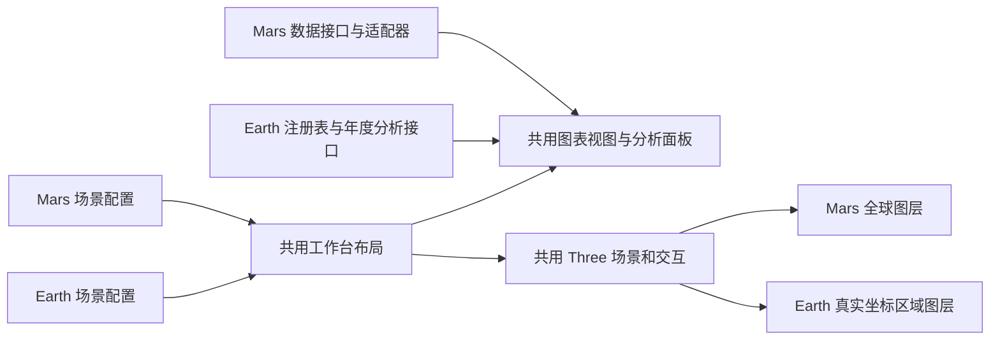

# 火星 / 地球共用分析工作台 Implementation Plan

> **2026-09-24 实施状态（优先于下文历史假设）**：本方案首期范围**已实现**，实现说明与协议见 [共用分析工作台](../earth-analysis-workbench.md)。
>
> **2026-09-25 布局已被替代：** 本文中“三栏布局 / 左右固定面板 / ≤1120px 顺序布局 / 拖拽改宽”的描述由 [行星观测台改版计划书](2026-09-25-planetary-observatory-redesign.md)（已实施）取代。本方案的**数据、单位、能力、请求隔离与年度分析契约仍然有效**，改动只在承载布局与控件位置上；阅读布局与控件位置时以[共用分析工作台](../earth-analysis-workbench.md)为准。
>
> 已完成：共用工作台壳层与控制器（`OverviewShell` / `useOverviewController` / `OverviewAdapter` / `OverviewCard` / `OverviewScene`）、`marsOverviewAdapter` 与 `earthOverviewAdapter`、统一卡片状态（`idle/loading/ready/unsupported/error`）、`SphericalFieldCanvas` 的显式 `planet/field/geometry/selection/lighting` 接口与 Earth 全球单元图层、Earth 三维工作台（日期播放、五变量原始单位、经纬度点选、点位曲线、覆盖均值）、三种分析模式、Earth 年度分析接口 `/api/analysis/earth/overview/*`、极区统计（`|latitude| >= 60°`）、昼夜能力说明与图表 AI 解读。
>
> 与下文的差异（以实际实现为准）：
> - **极区已开放**：v2 覆盖全球 ±90°，极区统计使用日平均数据并返回实际采样纬度；下文“极区不可用”的假设来自 v1 的 ±60° 覆盖，已失效。
> - **昼夜仍不可用**：日平均数据没有日内采样，卡片固定显示原因码 `daily_data_has_no_diurnal_samples`，不请求 Mars 昼夜接口。
> - **接口路径**：Earth 分析接口位于 `/api/analysis/earth/overview/*`（`context`、`research-suite`、`spatial-diagnostics`、`polar-dynamics`、`insight`），不是 `/api/datasets/{id}/overview/*` 的扩展；`/overview/*` 的三个二维接口保持原样。
> - **年度与日期联动**：年度分析年份跟随当前日期所在年份，切换年份把日期平移到目标年同月同日；播放范围是完整发布区间（2020-01-01 ~ 2021-12-31），不是单年。
> - **手势仍在第二阶段**：控制器已导出 `gestureActions`（旋转/缩放/播放/步进/选点/清除/模式/重置视角），未接入摄像头识别。
> - 下文按 v1 网格写出的 31×49、1519 个单元、±60°/±120°、8/15/8 纬带行数等数值全部失效；实际为 36×72、2592 个单元、±90°/±180°、6/6/12/6/6 行。

> **For agentic workers:** 使用 `executing-plans` 逐项实施。本方案根据用户确认的“整个工作台，包括三维地球和右侧分析图表”编制，交给另一对话执行。默认顺序实施，保留已有修改；不自动提交、推送、创建额外对话或批量删除文件。

**Goal:** 在现有数据总览切换到地球后，使用与火星共用的三栏分析工作台、三维球体交互、日期播放、点选和三类分析图表；所有数值、坐标、时间与能力限制严格来自 MERRA-2 小包。

**Architecture:** 将现有 Mars 页面中的布局、图表呈现和三维场景提取为共用组件，Mars 与 Earth 各自保留数据适配器。Earth 沿用第二步的 registry、只读快照和五场原始数据，增加年度分析接口和区域球面图层；能力决定可用卡片，数据身份与真实日期决定请求和缓存隔离。

**Tech Stack:** 现有 React 19、Three.js/TrackballControls、Plotly、FastAPI/Pydantic、NumPy、xarray/netCDF4；pytest、Node 内置测试、Vite、真实浏览器验收。不引入地图 SDK、在线瓦片或新的图表框架。

---

## 1. 任务定位与当前状态

这是第二步二维地球总览的扩展，称为“共用分析工作台”。用户已确认范围包含三维地球和全部三类分析模式，不能仅交付右侧一张季节热力图或另一个独立简版 Earth 页面。

本工作区为 `D:\_Aresvision`，项目为 `D:\_Aresvision\Aresvision`。下文源码路径相对项目根目录，后端简称以 `AresVision_backend/backend/` 开头。执行前读父目录 AGENTS.md、[README](../../README.md) 的接手章节、[地球总览已实现协议](../earth-overview.md)、[数据集注册协议](../dataset-registry.md)和[数据小包](../earth-compact-dataset.md)。

第二步已交付二维地图、日期/变量选择、逐日播放、点位序列、覆盖区域均值、UTC 日期与过期请求保护。当前工作树仍有前两步未提交源码；不得从不含这些文件的 HEAD 新建 worktree 后误判它们不存在，也不得覆盖为初始版本。

本方案与 [DLinear 地球训练方案](2026-09-23-earth-dlinear-training.md) 是不同交付项。可以先完成工作台，再接训练；如训练已在其他对话开展，数据/模型独立模块可继续，但 registry、schema、README 等共享文件需协调。工作台不新增训练任务或预测缓存，训练方案也不能删除本方案已接入的 Earth 功能。

当前核实入口：

| 文件 | 当前行为与复用要求 |
| --- | --- |
| `frontend/src/pages/DataOverviewPage.jsx` | Mars/Earth 互斥挂载，页面层保存 Earth 日期/变量/点位；继续保持 |
| `DataOverviewPage/SidebarMenu.jsx` | 内嵌 Mars 数据源、MY、Ls 与模型；提取共用模式/显示控件，数据选择仍按场景 |
| `DataOverviewPage/DetailPanel.jsx` | 统一卡片、折叠、拖拽宽度，但直接读取 Mars context 并创建 Mars 请求组件；分离面板与数据容器 |
| `DataOverviewPage/overviewChartLayout.js` | 三个模式 `temporal/drivers/dynamics` 及卡片目录可复用；描述和可用卡片须由场景定义 |
| `OverviewCharts/*.jsx` | 多数同时做请求、单位转换、图表和 AI 快照，不能直接给 marsYear 传地球年份 |
| `OverviewCharts/ResearchDataClient.js` | 缓存键为 Mars year 和上传来源；Earth 不进入这个缓存 |
| `components/SphericalFieldCanvas.jsx` | 可复用 Three 场景、控制、标签和点击；底图、太阳光、粒子分布有 Mars 约定 |
| `components/sphericalFieldParticles.js` | 按矩阵大小推断全球纬经，并 modulo 连接首尾；禁止用该旧 grid 分支渲染 Earth |
| `DataOverviewPage/fieldGrid.js` | 默认 36×72、纬度北到南，不能转换 Earth 区域网格 |
| `EarthOverview/earthMapGeometry.js` | 已有裁到覆盖边界的 cell edges、最近邻、同距选较小下标；球面和二维共用这些定义 |
| `frontend/src/services/datasets.js` | 已有结构化错误、AbortSignal、三个 Earth 接口；在此增量扩展 |
| `services/earth_overview_service.py` | 通过 `get_earth_overview_snapshot()` 取得已验证原始数组；Earth 分析也走同一入口 |
| `services/analysis_service.py` | 既有算法依赖 Mars 数据适配、Ls、全球纬带；可参考公式，不能伪造 Mars 输入来复用服务 |

## 2. 必须实现的用户流程

1. 在现有 `#/overview` 左侧切换“地球”，保持三栏工作台：左侧场景与分析控件，中央三维地球与日期条，右侧分析卡片。
2. 选择 2020 或 2021、某个日期和变量；中央球体、图例、点位读数与对应日期标记一致。
3. 使用“基础总览”查看日期×纬度热力图、覆盖区域年内变化、纬带极值、环境因子；不支持的昼夜/极区卡片显示具体原因。
4. 使用“影响关系”查看 SWGDN–TO3、五变量相关性和 T2M–TO3 关系，支持覆盖区域与有效纬带。
5. 使用“高级空间诊断”查看选定年的区域空间距平、纬带 RMS 和峰谷跨度。
6. 三维旋转、缩放、点选、经纬网、底图、场显隐、色带和播放正常；可以切回二维核对同日同点数值，保持选择。
7. Earth→Mars→Earth 保留各自日期/变量/点位/模式/展开卡片；切换时暂停播放、取消旧请求，不能把另一星球结果闪回当前画面。
8. 共用当前图表解读入口和可选手势交互。Earth 的解读上下文含日期、DU、区域覆盖，不带 Mars 的 MY/Ls、沙尘事件自动提示。

桌面复用截图的三栏结构与卡片样式。窄屏改为可展开的控件区、主视图、图表区，不能固定叠加 280px+540px 面板挤掉球体。浏览器不支持 WebGL 时自动显示二维地图并说明切换原因。

用户确认的新范围替代前一阶段“Earth 暂不做三维和季节诊断”的计划限制。数据本身的限制继续有效：不能从日平均推导昼夜循环，不能把仅到 ±60° 的数据称为极区观测，也不能把两年数据称为多年气候态。

## 3. 逐项功能映射

| 现有卡片/功能 | Earth 对应实现 | 共用与适配要求 |
| --- | --- | --- |
| 分析工作台、三模式 | 保留 temporal / drivers / dynamics | 共用模式选择、布局、卡片折叠、宽度调整；文字按场景 |
| 火星年 MY | 年份 2020 / 2021 + ISO 日期 | 年份来自 metadata，选定年显示实际 365/366 天；不用 MY 标签 |
| 三维火星 | 三维地球，局部数据覆盖 | 共用场景/controls/拾取基础，使用真实 lat/lon 和区域图层 |
| 季节变化 | 年内日期×纬度变化 | 纬度行上对已覆盖经度求均值，标明“覆盖经度内平均”，横轴真实日期 |
| 年内全球变化 | 覆盖区域年内变化 | 五变量区域加权均值，原始值分轴小图与 Z-score 对照；不叫全球 |
| 季节极值 | 纬带年内极值 | 三个有覆盖的纬带；峰日、谷日、原始值和峰谷差；不套五个全球纬带 |
| 环境因子 | 风 U/V、T2M、SWGDN 与 TO3 的纬带关系 | 复用热力图/序列/摘要，删除沙尘字段；本次不强加派生风速 |
| 昼夜变化 | 不可用卡片 | 明示“当前数据为日平均，缺少小时或地方时采样”，不请求 Mars diurnal |
| 极区动力 | 不可用卡片 | 明示“覆盖仅到南北纬 60°，不足以分析极区”，不能以 60° 一行冒充极冠 |
| 太阳辐射–O3 | 地表入射短波辐射 SWGDN–TO3 | 散点、日期着色、回归/相关；不是 UV 或臭氧光化学生产效率 |
| 变量相关性 | 五个变量的日区域均值 Pearson r | 5×5 矩阵，样本数/无效原因；不混时间与空间样本 |
| 温度–O3 耦合 | T2M–TO3 同期变化与滞后相关 | 横轴日期，滞后按天；关联不表示因果 |
| 波动结构与诊断 | 覆盖区域的年平均空间距平、RMS、峰谷跨度 | 不称全球纬向驻波、波数谱或地形因果；不周期拼接 |
| 点位聚焦 | 当日值、年度点位曲线、当前区域分布 | 点位曲线复用已实现 point-series；统计区分“点位”和“整个覆盖区” |
| 图例、设置 | DU/K/m s-1/W m-2，已有色带 | 地球使用原始单位；Mars 单位设置不能改变 Earth 数值 |
| AI 图表解读 | 共用交互，Earth 快照适配 | 仅主动点击调用；数据未就绪不发送旧快照；不可用卡片只解释限制 |
| 手势 | 共用已有 rotate/zoom/pick/play 动作 | 默认关闭，用户开启后才申请摄像头；不把 Earth 日期转成 Ls |

不显示个人 MCD、NOMAD/OpenMARS 图层比较或 Mars 臭氧差分开关为 Earth 可用功能。Earth 左栏展示实际 dataset 名称/版本、区域范围与可用状态。

## 4. 统一展示契约与组件边界

采用“共用视图 + 场景适配器”，不建立第二套几乎相同的 Earth 工作台 JSX。无需一次性重写全部 Mars 服务与接口。



### 4.1 场景状态

Earth 保存独立选择：`datasetId`、`fingerprint`、`year`、`date`、`variable`、`point`、`mode`、`expandedCard`、`viewMode`（3d/2d）、`bandId`、显示控件和 camera pose。Earth 默认 viewMode=3d，默认日期来自 metadata.start，初始年份与日期一致；没有数据时显示可解释状态。

切年规则：保留月日，目标年没有该日期时取该月最后一天，例如 2020-02-29 → 2021-02-28；年份变化清除旧分析 payload，先暂停播放，等新年场确认后显示。日期选择限定当前年，播放至该年末停止；提供显式“下一年”，不在后台自动切年。原二维组件的跨全包日导航能力可留作工具函数，新工作台按当前年传入首尾界限。

已选点位可以随年份保持，因为 grid 相同；release/fingerprint 或 grid 改变时重新验证覆盖和索引。模式/折叠等展示状态不是 dataset identity，也不进入训练超参数。

共用视图接收显式 props，禁止内部自行访问 `useDataOverview()`、Mars API、Earth API 或 `settings.units.ozone` 做数值转换。Mars 包装组件在外层保持旧逻辑，Earth 适配器提供原始物理量。

### 4.2 图表视图模型

共用类型用 JSDoc 定义于 `OverviewCharts/views/overviewViewModel.js`，由纯 validator 检查边界：

- identity：`planet`、`datasetId`、`fingerprint`、`periodKey`，Mars 没有发布指纹时允许 null，沿用来源键。
- temporal axis：`kind="date"|"mars_ls"`、`values`、`label`，日期值为 ISO 字符串；不能为了共用图表把 Earth 字段命名为 ls。
- heatmap：`x/y/z` 及两轴标签、`units`、`range`；`z.length===y.length`、每行长度等于 x.length。
- series：`id/label/units/x/y`，全部坐标含义明确；相关系数等无量纲结果不借用 DU。
- state：`loading|ready|unavailable|error` 和结构化 reason；暂无值使用 null，不转 0。

共用视图至少提取：`TemporalHeatmapView.jsx`、`MultiSeriesView.jsx`、`ExtremesView.jsx`、`RelationshipView.jsx`、`CorrelationView.jsx`、`SpatialDiagnosticsView.jsx`、`DistributionView.jsx`。Mars 现有容器改为调用这些 view，Earth 容器也调用同一份 view；只共用 Plotly 依赖或 CSS 不算完成复用。

`AnalysisCardPanel.jsx` 共用折叠、懒挂载、宽度与模式头；不可用卡片也能展开说明，但不挂载数据请求。`AnalysisModePicker.jsx` 共用左侧三个模式。Mars `DetailPanel.jsx`、`SidebarMenu.jsx` 可保留文件名与 export，作为兼容包装层。

## 5. 地球年度分析的科学定义

所有年度分析固定选择一个公历年，2020 是 366 天，2021 是 365 天。保留 2 月 29 日，不折成 360 点，不按索引冒充月份；显示“年内变化”，不从两年样本推断长期趋势或气候态。

设变量 `F[t,i,j]`，纬度 `phi[i]`，经度范围 -120…120；所有原始值已由 registry 验证有限。计算使用 float64，只读原数组。

### 5.1 时间序列与纬带

覆盖经度内均值 `Z[t,i]=mean_j F[t,i,j]`，季节图响应为 `z[i][t]=Z[t,i]`。这是区域经度平均，不能叫完整纬圈平均。

区域均值沿用第二步 `cos_lat_sample_mean`，保持与现有 regional-series 同日同值：

```python
import numpy as np

def covered_mean(field, latitude):
    weights = np.cos(np.deg2rad(np.asarray(latitude, dtype=np.float64)))
    values = np.asarray(field, dtype=np.float64)
    return np.einsum("tij,i->t", values, weights) / (values.shape[2] * weights.sum())
```

三个互不重叠纬带：`south_mid=[-60,-30)`、`tropics=[-30,30)`、`north_mid=[30,60]`。所有 31 行恰好归属一次；当前网格对应 8/15/8 行。每带按上述余弦权重在带内归一化，记录真实采样纬度和点数，不能把标签阈值当作实际存在的网格点。

极值根据每个变量的年度纬带日均曲线计算，输出 max/min/date/peak_to_peak，多个相同极值取最早日期。温度峰谷差单位 K，风保留正负值，禁止对 U/V 求绝对值后当成原变量。

Z-score 仅为图表展示的年度曲线标准化，`ddof=0`；原值始终可在 tooltip 获取。常量序列显示 0 并附 `constant_series` 提示；这份统计不得复用为训练归一化，训练仍只用训练日期拟合。

默认原始曲线，不默认平滑。用户启用“21 天移动平均”时显示原曲线与趋势曲线，中心窗口仅使用同年可用样本，端点注明截短窗口；相关性与极值仍从原始序列计算。

### 5.2 相关、散点与滞后

以五变量**同一天覆盖区域/同一纬带均值**组成成对序列，计算 Pearson r，不 flatten 成混合时空相关。不做显著性、p 值或因果声称。

- n<3 或任一序列方差为零：r=null，分别记录 `insufficient_samples` 或 `constant_series`。
- 矩阵对称；常量变量对角线同样 null，不伪造 r=1。
- 散点 x=SWGDN 或 T2M，y=TO3；颜色用日期，tooltip 含 ISO 日期和各自单位，最多 366 点无需随机抽样。
- 简单最小二乘仅在 x 有方差且 n≥3 时返回 slope/intercept，单位为 DU/(W m-2) 或 DU/K；无效时回归字段 null。
- 滞后范围固定 -30…30 天，`r(k)=corr(driver(t), TO3(t+k))`；正 k 明确表示驱动序列领先臭氧 k 天。禁止环绕、跨年或未来补点，每个 lag 保存实际 n。
- UI 不把最大 |r| 对应 lag 自动描述为物理响应时间；共同季节性和时间自相关限制写在图注。

### 5.3 区域空间距平

先求年度时间均值 `M[i,j]=mean_t F[t,i,j]`，再去掉同纬度覆盖经度均值：`A[i,j]=M[i,j]-mean_j M[i,j]`。标题为“年平均场相对于同纬度覆盖经度均值的距平”。不是多年气候距平，也不是全球行星波。

每带 RMS 使用 cos(phi) 加权的 `sqrt(sum(w*A²)/sum(w))`，分母包含经度点数；峰谷跨度为带内 A 的 max-min。保留每个指标的原始单位与权重定义。距平色带以 0 对称，取该响应 max(abs(A))；完全为零时用色带中点。

空间图维度为 `[lat,lon]`，地图/热力图轴使用真实坐标，不排序后遗失对应值，不闭合 -120 与 120。RMS 不等于时间不稳定性，不从年平均图推导事件频率。

### 5.4 当前场分布与点位

复用当日 field 计算覆盖区直方图与分位数，网格样本等权，明确是“网格点频数”。区域加权均值单独标注，不能把等权直方图的平均数混写为 cos-lat 区域平均。

点位面板显示 requested 坐标、实际采样坐标、当日值及选定年曲线。年度图表默认继续分析覆盖区域；点位选中只切“点位聚焦”卡片，不悄悄将所有区域统计改成该点。返回区域分析恢复原模式和展开卡片。

## 6. Earth API 与请求隔离

保留三个已实现接口原样新增两个接口，不修改 Mars `/analysis/overview/*`。

| 路径（前缀 `/api/datasets/{dataset_id}/overview`） | 必传参数 | 用途 |
| --- | --- | --- |
| `/research-suite` | `year`、`expected_fingerprint` | 返回选年五变量日期×纬度场、区域/纬带曲线、极值与关系指标 |
| `/spatial-diagnostics` | `year`、`variable`、`expected_fingerprint` | 返回选年选变量 31×49 距平与三纬带 RMS/跨度 |

路由同步 `def` 在框架线程池计算，注入同一个 registry。新增 `EarthResearchService` 只有 registry 依赖，不读取 Mars data service，不直接打开 NetCDF，不新建原始数组缓存。

公共响应：dataset_id/version/fingerprint、planet=earth、`analysis_schema="earth_overview_analysis_v1"`、year、start/end、day_count、coverage、variables 的 id/unit、aggregation 说明。`research-suite` 的完整字段：

| 字段 | 形状与含义 |
| --- | --- |
| dates | ISO 日期列表，恰好所选年实际天数 |
| latitude | 31 个真实递增纬度 |
| bands | 3 项，id、min/max、端点规则、实际 latitude_values、grid_point_count |
| variables | 五项 `{id,units}`，规范顺序 TO3/U10M/V10M/T2M/SWGDN |
| seasonal | 字典，以 variable id 为键；每项 `{z,units,aggregation:"covered_longitude_mean"}`，z 为 `[31,day_count]` |
| regional_series | 字典，以 variable id 为键，值为 day_count 个物理量；共用 dates |
| band_series | 字典 `band_id → variable_id → values[day_count]` |
| extremes | 字典 `band_id → variable_id → {max_value,max_date,min_value,min_date,peak_to_peak}` |
| relationships | 字典 `scope_id → {correlation,solar_ozone,temperature_ozone}`；scope_id 为 `covered_region` 或三个 band id |

`correlation` 含 `variable_order`、5×5 `r`、5×5 `n`、5×5 `reason`；有效 reason=null。`solar_ozone` 与 `temperature_ozone` 含 r/n/reason、`regression:{slope,intercept}|null`、61 项 `lag:[{lag_days,r,n,reason}]`，散点序列复用 regional_series/band_series，避免再复制一份同值数组。

`spatial-diagnostics` 返回公共字段加 variable/units、lat/lon、`anomaly[31][49]`、`reference="annual_mean_minus_covered_longitude_mean"`、`color_range` 与 `bands:[{id,rms,peak_to_peak,grid_point_count}]`。

所有 response 用 Pydantic 建模，禁止 NaN/Inf JSON；undefined 统计使用 null 与 reason，原始物理值不得因前端不支持被替换为 null/0。

错误沿用第二步：unknown_dataset 404、dataset_overview_not_supported 409、dataset_unavailable 503、dataset_version_changed 409、unsupported_variable 422；新增 year 不在元数据内返回 422 `year_out_of_range`，非整数由 Pydantic 422。`2021-02-29` 的既有 date_out_of_range 不改变。

描述符新增可空强类型 `overview_profile`，Earth 已接通后返回：

```json
{
  "profile_id": "earth_regional_workbench_v1",
  "views": ["2d", "3d"],
  "analysis_modes": ["temporal", "drivers", "dynamics"],
  "available_cards": ["seasonal", "globalTrend", "seasonalExtremes", "environment", "solarsens", "correlation", "coupling", "wave", "distribution"],
  "unavailable_cards": {
    "realtime": "daily_data_has_no_diurnal_samples",
    "polar": "polar_region_not_covered"
  },
  "time_kind": "date",
  "scope": "covered_region"
}
```

profile 声明实现能力，与 availability 分离；尚未完成的功能不能提前放入 available。profile 与训练方案的 training_profile 是并列字段，不互相覆盖。Mars profile 可先为空，由旧配置适配成原有模式。

缓存与并发要求：

- 后端首版不增加分析结果常驻缓存：两年 31×49 小包直接从已验证 release 聚合；先测耗时再决定优化，避免重复存五场数组。
- 前端 `useEarthResearch()` 仅持当前 year 的 suite 与当前 variable 的 spatial，以及当前请求；切换 year/fingerprint 丢弃旧 payload。首版不新增全局 Promise cache。
- 请求身份为 datasetId+fingerprint+analysis_schema+year+resource+variable（资源需要时）；suite 与 spatial 各自有 AbortController 和 token。
- 年度 suite 不随逐日播放重发；spatial 仅模式/变量/年份变化时按需请求；折叠/不可用卡片不触发无用请求。
- 新 payload 到达前，显示明确 loading，不能给旧年曲线贴新年标题；错误后有重试，不能把失败 promise 永久缓存。
- 5×31×366 的季节矩阵允许原分辨率；不向网页一次发 731×31×49×5 原始 cube。序列化响应记录实际字节数，目标单个 suite 未压缩 JSON 不超过 4 MiB。

## 7. 三维地球的区域坐标与底图

### 7.1 显式网格

共用 SphericalFieldCanvas 增加显式 `planet="mars"|"earth"`（缺省 mars 兼容旧调用）、`baseMap`、`lightingMode` 和带坐标的 regional layer；旧 showMars、solarLongitudeLs 调用由兼容层解析。

Earth layer 的视图协议：

```text
kind: regional_cells
identity: datasetId / fingerprint / grid coordinate identity
lat: 31 个真实纬度
lon: 49 个真实经度
field: [31][49] 当前日期物理量
coverage: latitude_range / longitude_range / wrap_longitude=false
colorRange: 来自 field.color_range 的固定变量范围
units, variable, date
```

该 layer 不经过 `pointsToFieldData()`、`buildGridParticleSamples()` 的旧全球插值/环绕分支。新增 `sphericalRegionalGrid.js` 纯坐标几何及区域图层；共用 renderer/camera/controls，不复制一份完整 SphericalFieldCanvas。

### 7.2 网格边界与颜色

- 使用已有 `clippedCellEdges()` 算边界，最外侧裁到 -60/60、-120/120；31×49=1519 个采样格，无数据区域保留底图和经纬线，没有场颜色。
- 每格用球面 patch 绘制，几何可细分以贴球，但格内值和颜色保持该网格采样值，不做数值插值。建议每格 2×3 子面并批成一个 BufferGeometry，避免 1519 次独立 draw call。
- 地球初版用定半径颜色场，MeshBasicMaterial 或等效不受光照改变颜色的材质，确保球体值与图例一致。不要沿用将标准化浓度编码成任意球壳高度的默认逻辑来暗示臭氧真实高度。
- 风使用全数据期固定对称范围，所有变量与二维一致；不能用现有粒子 `resolveRange()` 在每帧重算风范围。
- geometry 缓存键含实际坐标、覆盖边界、planet、layer kind；相同 31×49 但不同坐标时必须重建。切日只更新颜色，不重建 camera 和几何。
- 不生成 j=48→j=0 的接缝面；经度±150°与纬度±80°只有地球底图，不得有数据格。

球面坐标遵循既有 picking 约定：

```javascript
export function geographicToCartesian(lat, lon, radius = 1) {
  const phi = lat * Math.PI / 180;
  const theta = lon * Math.PI / 180;
  return {
    x: radius * Math.cos(phi) * Math.cos(theta),
    y: radius * Math.sin(phi),
    z: radius * Math.cos(phi) * Math.sin(theta),
  };
}
```

Earth 点击先将交点由世界坐标逆变换为 globe local 坐标，再还原纬经。三维球面角度规范化为 [-180,180) 是坐标表达，不是把区域外查询 wrap 到数据范围。先判断 coverage，再用第二步 nearestIndex；区域外给提示、不发 point 请求、不移动旧选点。

旋转过的球体、缩放、左右面板调整与 CSS 缩放后都应正确拾取；不能把屏幕 x/y 线性转换为经纬度。

### 7.3 底图与光照

首版可直接把已验证的本地 Natural Earth 海岸线绘成球面轮廓，配深蓝/浅蓝地球底球、经纬网和海岸线；这是明确的地理底图。禁止把 Mars 纹理改色称为地球，也不能把未闭合海岸线误填成陆地多边形。

复用 `frontend/public/earth/ne_110m_coastline.geojson`，校验既有 SHA `851f581ff5ffb844deed8ae1a9ce22e3c4bb3d74fa342cadb5d8e39b41ae7c3c`，无需新下载。球面折线用原始经纬度生成，不能使用二维已投影的 SVG x/y。经度跳变按已有边界规则拆线，不跨区域拼合数据。底图颜色不使用数据色带，图例注明未着色区域无数据。

若后续增加真实地球影像纹理，作为独立资源增强，先验证来源、许可、坐标方向并记录 hash；本任务验收不依赖外部影像服务。

Earth 光照用固定展示照明，不把日平均日期当作某一时刻的太阳位置，不调用 Mars 的 `buildSeasonalSunLight(Ls)`。不画无依据的晨昏线；场颜色不随展示光照变化。

切场景、2D/3D、卸载时释放本组件拥有的 GPU 几何/材质、requestAnimationFrame、事件、controls；共享资源按所有权管理，不能释放另一个当前场景仍用的缓存纹理。WebGL 上下文丢失保留日期/点位并切二维。

## 8. 文件清单与具体任务

### Task 1：共用契约、卡片能力和复用回归

**文件：** 修改 `services/dataset_registry.py`、`schemas/datasets.py`、`frontend/src/pages/DataOverviewPage/overviewChartLayout.js`；新增 `OverviewCharts/views/overviewViewModel.js` 及 `.test.js`，新增 `EarthOverview/earthWorkbenchModel.js` 及 `.test.js`。

- [ ] 读真实源码/状态，先运行现有 overviewChartLayout、Earth 几何/请求、球体粒子/拾取测试作为基线。
- [ ] 新增 overview_profile schema 和目标卡片定义；Earth 控件由 profile 和 availability 共同判断，保留已实现 training flags，不提前开启训练。
- [ ] 新增 `getSceneModeDefinitions(planet)`、`getSceneCardDefinition(planet, cardKey)`，Earth 文案不出现全球、MY、Ls、紫外线/光化学生产效率。
- [ ] 保留旧 `MODE_DEFS/getModeCardKeys/getCardTitle` 的 Mars 默认签名，旧模块无参数调用仍得到原行为。
- [ ] 实现 Earth 年/日一致性与按星球保存状态，闰日跨年取目标月最后一天，并测不落到 3 月 1 日。
- [ ] 将不可用卡片设为 reason，不把菜单项保留成一点击就调用 Mars API。

目标测试示例：

```javascript
import test from 'node:test';
import assert from 'node:assert/strict';
import { getSceneCardDefinition } from '../overviewChartLayout.js';
import { dateInSelectedYear } from './earthWorkbenchModel.js';

test('Earth time and capability definitions preserve scientific meaning', () => {
  assert.equal(dateInSelectedYear('2020-02-29', 2021), '2021-02-28');
  assert.equal(dateInSelectedYear('2021-02-28', 2020), '2020-02-28');
  assert.equal(getSceneCardDefinition('earth', 'realtime').reason, 'daily_data_has_no_diurnal_samples');
  assert.equal(getSceneCardDefinition('earth', 'polar').reason, 'polar_region_not_covered');
  assert.equal(getSceneCardDefinition('earth', 'seasonal').available, true);
});
```

运行新增测试，先确认新接口未实现时失败，再实现至通过；用旧测试确认 Mars 默认配置不变。

### Task 2：年度分析纯计算

**文件：** 新建 `services/earth_research_service.py`、`tests/test_earth_research_service.py`；复用 `tests/conftest.py` 的空间 fixture。

- [ ] 定义 `EarthResearchService(registry)`，公开 `get_research_suite(dataset_id,year,expected_fingerprint)` 和 `get_spatial_diagnostics(dataset_id,year,variable,expected_fingerprint)`。
- [ ] 实现第 5/6 节全部字段及公式；release 只取一次，计算过程中使用同一身份，不能中途再取描述符拼接成另一个版本。
- [ ] `get_research_suite` 仅选当前年度，无跨年均值；返回完整日期，包括闰日。
- [ ] 写数值可手算 fixture：`F[t,i,j]=1000*t+10*i+j`，验证季节矩阵方向、均值权重、三纬带无遗漏重复、极值日期、距平去经度均值。
- [ ] 相关测试用完全正相关、反相关、常量、少于3样本；常量相关必须 null，不是0。
- [ ] 滞后测试用固定随机序列和人为平移的臭氧序列，正 lag=+3 时按定义为驱动领先；不用单调趋势作测试以免所有 lag 都接近1。
- [ ] 验证函数不更改 release.fields 的值、writeable 标志或坐标；连续调用不增加 registry 原始快照份数。

导出纯函数 `compute_spatial_diagnostics(field, latitude)` 供测试，返回 `anomaly` ndarray 和带指标；导出 `pearson_summary(x,y)` 返回 `{r,n,reason}`。例如：

```python
import numpy as np
from services.earth_research_service import compute_spatial_diagnostics, pearson_summary

def test_anomaly_is_spatial_and_correlation_can_be_undefined():
    field = np.array([[[10., 12., 14.], [20., 22., 24.]]])
    result = compute_spatial_diagnostics(field, np.array([-40., 40.]))
    np.testing.assert_allclose(result['anomaly'], [[-2., 0., 2.], [-2., 0., 2.]])
    summary = pearson_summary([1., 1., 1.], [2., 3., 4.])
    assert summary == {'r': None, 'n': 3, 'reason': 'constant_series'}
```

空纬带在通用单元 fixture 中返回 null 指标和 zero grid_point_count；生产包三个带均有数据。不要因小 fixture 没有赤道点而假填 0。

### Task 3：接口与客户端接线

**文件：** 新建 `schemas/earth_research.py`、`tests/test_earth_research_routes.py`；修改 `routers/earth_overview.py`、`main.py`、`frontend/src/services/datasets.js` 和 `.test.js`；新增 `EarthOverview/useEarthResearch.js`、`earthResearchModel.js` 及纯函数测试。

- [ ] 两个同步路由注入 `app.state.earth_research_service`，该 service 使用已有 app.state.dataset_registry。
- [ ] response_model 显式覆盖 nested schema，防止字段被 Pydantic 默默丢掉；None 统计合法，NaN/Inf 非法。
- [ ] 新增 `fetchEarthResearchSuite(datasetId,{year,fingerprint,signal})` 和 `fetchEarthSpatialDiagnostics(datasetId,{year,variable,fingerprint,signal})`。
- [ ] `useEarthResearch()` 对 suite/spatial 分通道取消与 token/context 验证，复用第二步 coordinator 工具；不使用 Mars ResearchDataClient。
- [ ] 做 2020→2021→2020 快速切换、旧 promise 最晚完成、包指纹变化、失败重试、卸载中响应等测试。
- [ ] 校验每个 payload 的 identity/year/dates/matrix shape；错误响应不渲染为零值曲线。
- [ ] 记录真实年度 suite 响应大小和耗时；日播放不得重复请求 suite。

### Task 4：提取共用分析视图

**文件：** 新建第 4.2 节七个 `OverviewCharts/views/*.jsx`；修改原 `SeasonalChart.jsx`、`GlobalTrendLinesChart.jsx`、`SeasonalExtremesChart.jsx`、`EnvironmentDashboard.jsx`、`SolarSensitivity.jsx`、`CorrelationMatrix.jsx`、`CouplingAnalysis.jsx`、`WaveExplorer.jsx`、`WaveBandDiagnosticsChart.jsx`、`DataDistribution.jsx`。

- [ ] 每次只拆一个现有卡片：保留 Mars 请求/单位/AI adapter，将 Plotly traces/layout 和通用控件移到 view。
- [ ] 视图接收轴、单位、系列、状态、回调；不导入 API 或 Mars context。对日期轴设 `type:'date'`，Earth 坐标格式化用 UTC。
- [ ] 创建 Earth 的纯 ViewModel 构造函数 `buildEarthTemporalView`、`buildEarthRelationshipView`、`buildEarthSpatialView`，定义于 `EarthOverview/earthResearchModel.js`，由 suite/spatial/selection 产生可验证模型。
- [ ] Earth 容器调用同一组共用 views；复用 GlowCard、主题、色带、格式化和缩放工具栏。
- [ ] 未定义相关用 Plotly gaps/null 与明确说明，禁止 format 函数 Number(null) 变成0。
- [ ] 保留 Mars 原有功能与请求参数，使用原 fixture/测试比对重构前后数值、轴标题和交互。
- [ ] 配合 Plotly 导出工具栏，文件名按 planet/dataset/year/variable 命名；图中显式包含区域、年份、单位，不能仍导出名为 Mars 的 Earth 图。

新增 `earthResearchModel.test.js` 测试 exact 日期、366列方向、单位、不可用原因、极值日期、相关空值和 Earth 禁止使用全局 Mars 单位。相邻 `overviewViewModel.test.js` 验证共用 shape/schema 边界，不以 JSX 文本搜索替代数值测试。

### Task 5：复用三栏工作台与选择状态

**文件：** 新建 `DataOverviewPage/OverviewWorkbenchFrame.jsx`、`AnalysisModePicker.jsx`、`AnalysisCardPanel.jsx`、`overviewWorkbench.css`；修改 `SidebarMenu.jsx`、`DetailPanel.jsx`、`DataOverviewPage.jsx`、`EarthOverview/EarthOverviewScene.jsx`、`useEarthOverview.js`、`earthOverview.css`。

- [ ] Frame 提供 sidebar/scene/timeline/analysis/overlay slots，主区域不读星球数据；Mars、Earth 均通过它布局。
- [ ] 共用模式选择和折叠面板，左栏数据范围区用 Mars/Earth 两种 slot。Earth 默认打开“基础总览→年内纬度变化”。
- [ ] Earth 模式显式显示卡片能力，日内/极区不可用原因可见且不发请求；不把两个不可用项悄悄替换为名称相同、含义不同的图。
- [ ] Earth 选择由页面层保存，hook 管理网络数据与播放，不让 unmount 重置已选日期。新增 analysis 状态与旧 date/point 的变更分开，避免每折叠一次就重新 fetch field。
- [ ] 年度 suite 缓存不受当前日变动影响；当日游标按已展示 field.date，不按尚未加载成功的 requestedDate。
- [ ] 桌面左右面板可拖动但中央有最小空间；≤900px 顺序布局；390px 无横向溢出。
- [ ] 所有新文案进入 `frontend/src/i18n/zh.js`、`en.js`；按钮键盘焦点/aria 状态完整，drag 动作有键盘或固定宽度替代方式。

### Task 6：新增区域球面几何并接入共用 renderer

**文件：** 新建 `frontend/src/components/sphericalRegionalGrid.js`、`.test.js`、`sphericalEarthBaseMap.js`；修改 `SphericalFieldCanvas.jsx`、`SphericalFieldCanvasStructure.test.js`；保留 Mars `sphericalFieldParticles.js` 的旧默认行为。

- [ ] 实现 `buildRegionalCellGeometry({lat,lon,coverage,radius})`，返回 positions、indices、每顶点 cellIndex、cellCount；使用 clippedCellEdges，所有几何只在覆盖内。
- [ ] 将 `geographicToCartesian()` 放入同文件并单测，与 existing localPointToLatLng 正反互验；不要复制不同旋转约定。
- [ ] 每格颜色可按 cellIndex 更新 vertex buffer，geom key 包含坐标/coverage，不仅维度。
- [ ] 提供 sphere base 与本地 coastline，禁止加载 `/mars_texture.jpg` 作为 Earth 底图。globe background、field 与 coastline 分层设置半径，避免 z-fighting。
- [ ] 旧 Mars 默认 props 不变，新增 planet=earth 时走明确 regional layer 和 fixed display lighting，永不调用旧 global interpolation。
- [ ] point picking 以底球交点和 inverse transform 定位，先 coverage 检查再最近邻；Earth 画面不创建超范围数据选点。
- [ ] 测 dispose、切换和 WebGL 降级；使用 renderer.info 或等效计数观察多次切换资源是否持续增长。

几何验收至少包含：1519个格；四角/赤道/0经度 round-trip；南北顺序正确；所有顶点还原坐标都在coverage内；不存在跨首尾列的三角形；同shape不同坐标生成不同geometry身份；constant field 中间色；±150°拾取无数据。

### Task 7：三维/二维、点选、播放与手势

**文件：** 新建 `EarthOverview/EarthGlobeScene.jsx`；修改 `EarthOverviewScene.jsx`、`EarthTimeline.jsx`；复用 `EarthMap2D.jsx`、`EarthSeriesPanel.jsx`、现有 `useHandTracking.js` 和球体 ref 交互。

- [ ] EarthGlobeScene 只适配 props，不另建 renderer；将已验证 field/lat/lon/colorRange 传入共用 SphericalFieldCanvas。
- [ ] 2D/3D 开关只切显示组件，复用同一 selection 和 hook；数据不能再请求一套与当前身份不同的场。
- [ ] 三维点选与二维点击必须选中相同最近网格；点位标记、曲线和当前值一致。区域外两个视图都提示且不移动旧点。
- [ ] 播放等待当前帧成功才进入下一日，loading 期间图例日期标注真实 displayedDate；无数据/出错停止并可重试。
- [ ] 缩放、旋转、自动旋转、全屏、底图/场/经纬线显隐复用控件，Earth 切回保持 camera pose；首次默认视角能看见0经度和有效覆盖。
- [ ] 手势默认关闭；复用已有识别和动作分派，将 play/step/pick 回调映射到 Earth 日期和 Earth picking。切星球/关闭手势释放摄像头流与回调。
- [ ] 无摄像头/WebGL时分别降级，不能阻断鼠标操作、二维地图和图表。验收不擅自激活用户摄像头，以模拟动作测接线，真实手势由用户主动开启时验证。

### Task 8：共用 Copilot 的地球上下文

**文件：** 修改 `DataOverviewPage/AICopilotWidget.jsx`、`aiCopilotSnapshot.js`、`OverviewCharts/useAiInsightRegistration.js`、`contexts/DataOverviewContext.jsx`（仅拆共用快照职责）、`services/copilot_service.py`；新增 `EarthOverview/earthInsightSnapshot.js` 及测试，新增 `tests/test_earth_copilot_context.py`。

- [ ] 提取 Copilot 呈现为数据无关部分，Mars wrapper 继续现有 context；Earth wrapper 传入明确场景与当前图表 snapshot。快照 registry 按活动星球作用域管理，unmount 后旧 provider 不可访问。
- [ ] Earth snapshot 包含 planet、datasetId/version/fingerprint、year、displayedDate、variable/units、coverage、aggregation、scope、ready 状态、当前图实际显示的数值摘要；不要复制完整原始 cube。
- [ ] 将后端 `_format_copilot_context()` 和 fallback 按 planet/date 适配，Earth 不输出“同一 Ls”“全球趋势”或 Mars 沙尘提示。
- [ ] 禁止 Earth 执行 widget 的 240–270 Ls 自动触发逻辑；只在用户点击解读时调用服务。
- [ ] 右图还是旧年/加载中/不可用时，返回状态原因并禁用数据解读，不把字符串“正在加载”当成有数据的 dynamic_metrics。
- [ ] 测试用 mock 服务或无 API key 的真实 fallback，不为验收自动调用付费外部 AI。实际外部回答质量与可用性按既有配置另报，不作为数据计算正确性的证据。

`routers/copilot.py` 当前 context 为通用对象，优先在现有接口增量传递地球字段；无需创建第二个聊天 API 或修改独立 AI 解读页面的 Mars 数据能力。

### Task 9：数值、回归与真实浏览器验收

**文件：** 新建 `tests/test_earth_research_service.py`、`test_earth_research_routes.py` 的真实数据可选核验；前端相关 `.test.js`；仓库外保存验收截图/日志，项目内仅保存可复用测试源码和验证说明。

- [ ] 先运行新增纯计算/模型/几何测试，再逐文件回归 registry、Earth overview、Mars analyses 与共用图表、球面、Copilot。
- [ ] 真实小包逐项比对两个年份×五变量：日期数、季节矩阵、区域均值、三纬带序列/极值、相关、滞后、距平和 RMS/跨度，使用独立 NumPy 计算，不从服务输出重复拼公式作自证。
- [ ] 验证研究服务计算前后同一 field 点值完全相同，模型训练方案若并行也不能就地归一化 registry.fields。
- [ ] 浏览器检查 1440/900/390px、中文/英文、深浅主题、2D/3D、所有模式与卡片、区域外/慢网/快速切换/WebGL降级。
- [ ] 三维至少点选四角附近、赤道、有效正负经度各点，与二维及原始 NetCDF 比较；旋转和缩放后重复同点测试，确认没有接缝连线/南北翻转。
- [ ] 单位隔离必须先选定同日同点、等到有限数值，再切换火星单位并重新确认同点；`-- DU → -- DU` 不算通过。
- [ ] 浏览器网络确认 Earth 不请求 Mars analysis 路径、不加载火星纹理、不请求在线地图底图，播放不反复请求年度suite。
- [ ] 反复 Earth/Mars 和2D/3D切换20次，记录是否存在旧请求更新、多个动画循环/事件订阅、明显增长的 GPU 资源和遗留摄像头流。
- [ ] 可用按钮有实际响应；不可用按钮给出原因；Mars 数据源/球体/全部原有图表继续工作。

### Task 10：文档与交付

**文件：** 新增 `docs/earth-analysis-workbench.md`；更新 README、earth-overview.md、dataset-registry.md、earth-compact-dataset.md、`frontend/public/earth/README.md`。

- [ ] 区分二维基础、现已开放的三维/年度分析与数据限制，删去已失效的“Earth无三维/季节诊断/Copilot”绝对表述，保留确实未实现项。
- [ ] 记录年度统计/相关/空间距平公式、实际坐标和单位、接口/错误码、shared view入口、底图许可、降级、测试和浏览器证据。
- [ ] README 只保存功能边界和入口；训练/prediction capability 按实际进度描述，不因工作台完成就宣称训练已接通。
- [ ] 检查文档链接、纯英文测试临时目录、git diff --check、新增资源没有运行数据/模型/数据库；保留所有前序修改。
- [ ] 最终报告复用哪些组件、Earth可用/不可用卡片、真实数据/浏览器结果、既有环境失败和新增失败；不把本方案里的示例当作已执行证据。

## 9. 验证命令与完成标准

后端目录 `AresVision_backend/backend/`，使用项目 `AresVision` 环境。pytest 逐文件运行，使用从未存在的新英文目录，避免 NetCDF 路径问题与 pytest 重用 basetemp 时的递归清理：

```powershell
function Invoke-EarthWorkbenchTests {
    param([Parameter(Mandatory = $true)][string[]]$TestFiles)
    $earthWorkbenchTemp = Join-Path 'D:\_Aresvision' ('.earth-workbench-test-' + [guid]::NewGuid().ToString('N'))
    python -m pytest @TestFiles -q --basetemp "$earthWorkbenchTemp"
    if ($LASTEXITCODE -ne 0) { throw "Earth workbench verification failed: $TestFiles" }
}
Invoke-EarthWorkbenchTests tests/test_earth_research_service.py
Invoke-EarthWorkbenchTests tests/test_earth_research_routes.py
Invoke-EarthWorkbenchTests tests/test_earth_copilot_context.py
Invoke-EarthWorkbenchTests tests/test_earth_overview_service.py
Invoke-EarthWorkbenchTests tests/test_earth_overview_routes.py
Invoke-EarthWorkbenchTests tests/test_dataset_registry.py
Invoke-EarthWorkbenchTests tests/test_dataset_routes.py
```

与修改相关的现有 Mars analysis/Copilot 回归按实际测试文件逐个追加。缺外部 MCD 数据或异步收集配置的失败，记录修改前后同环境对照；不直接沿用第二步报告的“全部既有”归因。禁止删除失败用例以换取全绿。

前端目录 `frontend/`：

```powershell
node --test src/pages/DataOverviewPage/EarthOverview/earthWorkbenchModel.test.js
node --test src/pages/DataOverviewPage/EarthOverview/earthResearchModel.test.js
node --test src/pages/DataOverviewPage/OverviewCharts/views/overviewViewModel.test.js
node --test src/components/sphericalRegionalGrid.test.js src/components/sphericalPicking.test.js src/components/sphericalFieldParticles.test.js
node --test src/pages/DataOverviewPage/EarthOverview/earthInsightSnapshot.test.js
node --test src/services/datasets.test.js src/pages/DataOverviewPage/overviewChartLayout.test.js
node --test
npm run build
```

本计划编制时没有执行这些尚未实现的测试或启动应用。实施后全部必要验证通过才可声称工作台已完成；未验证外部AI或真实摄像头交互时需准确说明范围。

完成标准必须同时满足：

- Earth 与 Mars 使用同一工作台布局、同一套分析视图和同一三维场景控制；Earth 专属文件只承担数据、坐标、能力和场景接线。
- 三维 Earth 数据只覆盖真实区域，1519个网格位置可追溯到 NetCDF，区域两端不连接。
- 三模式下所有有数据依据的卡片真实可用，日内/极区限制明确，统计公式与原始数据比对通过。
- 地球日期/单位/身份贯穿请求、图表、点选、快照；不存在 Earth 请求进入 Mars 服务或缓存的路径。
- 已有二维功能与 Mars 工作台回归通过；窄屏与WebGL降级可操作。

## 10. 交给执行对话的说明

```text
请按 docs/plans/2026-09-23-earth-shared-analysis-workbench.md 实施“火星/地球共用分析工作台”。

用户已确认要复用整个现有工作台，包括中央三维地球、左侧三类分析模式和右侧图表。第二步二维地球总览已交付，直接在当前实现上扩展，保留二维核对/降级入口。

先读 AGENTS.md、README 和 docs/earth-overview.md，检查并保留当前未提交修改。提取真正共用的布局、卡片/图表视图和三维交互，以独立 Earth 数据适配器接入现有 registry/VerifiedEarthRelease。禁止把 31×49 区域矩阵交给现有全球铺图/经度环绕分支。

Earth 使用真实日期与 DU，覆盖仅为纬度±60°/经度±120°。实现年内变化、区域趋势、纬带极值、环境关系、相关/滞后和区域空间距平/RMS；日内和极区分析明确不可用，不能伪造。共用点选、播放、设置、图表解读和可选手势，Earth上下文不得带Mars的MY/Ls或全球统计含义。

按方案完成数值测试、Mars/Earth回归和真实浏览器验收，同步文档。若地球训练方案在其他对话执行，协调registry/schema/README等共享文件；本任务不实现训练或预测。不要自动提交、推送、批量删除文件或创建额外对话。
```
